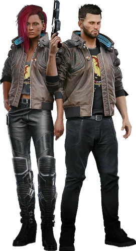

# V

> 英文原名: **V**（真名 ♀ 瓦莱丽 Valerie / ♂ 文森特 Vincent——只有极亲近的人才配叫）
> 生于 2053.10.12（2077 年 4 月时 23 岁）/ 配音 Cherami Leigh（女声）· Gavin Drea（男声）
> FIA 化名（往日之影）: 康维尔（Hannah/Harry Conwell）、威尔逊（Victoria/Victor Wilson）、阿吉拉尔·努比奥拉
> 塔罗映射: **愚者**牌（[[塔罗牌涂鸦]]，涂鸦在 H10 公寓大门外）——新旅程的起点、盲目的信任、纯真

## 身份

街头雇佣兵 / [[Relic]] 当前宿主 / 夜之城近年最具颠覆性的人物

## 特征

### 出身（三种可能背景）

- **流浪者**——出身于 [[阿德卡多]] 旗下**巴克氏族**（Bakkers）；
  该氏族在内部分裂后大部分族人并入 [[蛇邦]]，V 是这一断裂中的散落个体，
  最终流落 [[夜之城]]；
  **初次杀人**：16 岁时 [[乱刀会]] 斥候袭营，V 一枪爆其眼
- **街头小子**——夜之城本地底层成长；
  开局即坐在 [[塞巴斯蒂安·神父·伊瓦拉]] 的车里，
  神父向 V 介绍 [[海伍德]] 权力变迁；
  途中遭 [[六街帮]] 警长拦截，神父用"记住谁才是海伍德的主人"震慑对方——
  V 的街头线起点就被钉在神父的庇护与海伍德规则之内；
  **初次杀人**：13 岁时为护友，先一步捅死要行凶的瘾君子（一个他本来熟识、有好感的街头乞丐）
- **公司员工**——从荒坂或其他公司体系内出走;
  公司 V 的"被开除"叙事真实驱动是 [[月球质量投射器事件]] 的连锁反应——
  V 的直属上司 [[亚瑟·詹金斯]](荒坂反情报高层)在月球事件中
  试图暗杀 ESA 委员会成员灭口,被政治对手 [[苏珊·阿伯纳西]] 反向举报,
  詹金斯被清洗、V 作为直属下级被连带清算:账户冻结、公司权限取消;
  [[杰克·威尔斯]] 在此节点救下 V,2077 主线由此开启；
  **初次杀人**：在荒坂任职期间揪出一名替 [[沛卓石化]]（Petrochem）做间谍的销售部员工，对方"死于浴室滑倒"，V 因此获晋升

### 关键死党

- **[[杰克·威尔斯]]**（Jackie Welles）——序幕共同冒险者；在盗取 [[Relic]] 后牺牲
  二人合作起步于解救 [[创伤小组]] 高级会员 [[桑德拉·多塞特]]

## 关键事件

- [[手术刀行动]]
- [[委托 赎罪之路]]
- [[猎杀彼得潘事件]]
- [[月球质量投射器事件]]

## 已知活动 / 深度档案

### 序幕：偷天换日（盗取 Relic）

1. 接受大中间人 **德克斯特·德肖恩** 的世纪大单
2. 潜入 [[绀碧大厦]]，从荒坂高层处盗取 [[Relic]] 芯片
3. **意外目睹 [[荒坂赖宣]] 弑父 [[荒坂三郎]]**——重大真相目击者
4. 杰克在杀出大厦的途中牺牲
5. V 本人被德克斯特枪击背叛
6. 凭脑内的 [[Relic]] 芯片**死而复生**——但代价是 [[强尼银手]] 的印记同时被激活

### 主线事迹：追寻生路

V 在 [[Relic]] 与 [[强尼银手]] 印记的双重侵蚀下，开始全城寻找解药——
顺手颠覆了夜之城各大势力：

#### 绑架荒坂首席科学家
- 与 [[帕南·帕尔默]] / [[阿德卡多]] 合作
- 在恶土用 EMP 击落荒坂高级浮空车
- 强行带走 [[Relic]] 项目监督 [[安德斯·赫尔曼]]

#### 大闹巫毒帮 + 穿越黑墙（永不消逝 / 两难境地主线）
- [[汉斯先生 韦德·布莱克]] 引荐——他是夜之城唯一能联系巫毒帮的中间人
- 普拉西德派 V 去**商场**解决巫毒帮 vs [[网络监察]] 的冲突
- V 黑入网络监察特工——
  [[普拉西德]] 立刻按下引爆键，把 V 当**人形肉体炸弹**
- V 因 [[Relic]] 保护幸存
- 回去找主母 [[布丽奇特]] 对峙——她带 V 进入**深层网络**
- **肉身穿透 [[黑墙]]**——人类已知的极少数案例之一
- 与 [[奥特·坎宁安]] AI 达成合作协议
- 由此获取关于 [[强尼银手]] 记忆篡改真相的关键揭示
- 回到现实后玩家的复仇选择决定 [[巫毒帮]] 高层命运——
  80% 玩家选择**血洗巫毒帮**

#### 大闹荒坂三郎纪念游行
- 单枪匹马连斩三名荒坂高级狙击手
- 击败 [[荒坂赖宣]] 贴身保镖小田
- 与 [[荒坂华子]] 接触，达成**推翻 [[荒坂赖宣]] 的秘密同盟**（视结局选择）

### 《往日之影》：狗镇谍战

V 深入 [[狗镇]]——卷入 [[新美利坚]] 高层谍战风暴：

- **营救总统**：[[航天专机一号]] 被击落后（关联 [[指令 P0-08]]），
  V 在 [[幽冥犬]] 部队重围下救出 NUSA 总统 [[罗莎琳德·迈尔斯]]
- **协助 [[所罗门·李德]]**：联情局特工，潜入 [[汉森]] 地盘
- 最终导致 [[汉森]] 势力覆灭
- 卷入 [[神经矩阵]] 争夺战——一项封印黑墙 AI、全世界只能用一次的治疗装置
- 被 [[百灵鸟]] 用"矩阵能同时救你和我"的谎言拉入局——
  事实上矩阵**只能救一个人**
- 在 [[百灵鸟]] 与 [[所罗门·李德]] 之间做出生死抉择

#### 两个结局（《往日之影》主线分支）

- **月亮结局**（选择帮助百灵鸟）：
  V 击杀 [[所罗门·李德]]，送 [[百灵鸟]] 上月球火箭
  → [[百灵鸟]] 在月球神秘诊所（疑似 [[蓝眼睛先生]] 关联）康复
  → V **彻底失去这一治疗机会**，回夜之城另谋活路
- **塔结局**（交出百灵鸟）：
  V 与 [[所罗门·李德]] 深入 **Cynosure C 号站点**（[[小北斗计划]] 太平洲主基地）追捕 [[百灵鸟]]
  → 期间遭遇被黑墙 AI 夺取控制权的**军用科技地狱犬**（Militech Cerberus）机器人
  → [[新美利坚]] 回收矩阵，[[罗莎琳德·迈尔斯]] 兑现承诺
  → 顶尖医疗团队用矩阵成功剥离 V 脑内 [[Relic]] 与 [[强尼银手]] 印记
  → V 昏迷两年，神经系统永久受损
  → 此后**再也无法安装任何战斗 [[义体]]**——夜之城传奇彻底退场
  → V 在 C 号站点深处实验室可制作**黑墙不朽装备二选一**：
    *网监红字 Canto Mk.6*（网络接入仓）/ *厄瑞玻斯 Erebus*（内置黑墙 AI 的微冲）

### 支线事迹（改变夜之城生态）

- **剿灭全城赛博精神病**：为中间人 **瑞吉娜·琼斯** 完成 17 案
  （详见 [[赛博精神病]] 节点 "17 案"）
- **市长选举阴谋 / 瑞弗事件链**：
  - 协助副警长 [[杰佛逊·佩拉雷斯]] 调查前市长**卢修斯·莱恩**死因——
    顺藤揭露 [[蓝眼睛先生]] 操控夜之城高级政客的惊天阴谋
  - 同步结识 [[NCPD]] 警探 [[瑞弗·沃德]]，
    联手破解前市长之死后被搭档出卖、警局强行结案
  - 与瑞弗联手追捕连环杀手"彼得潘" [[安东尼·哈里斯]]，
    救出瑞弗侄子兰迪（[[猎杀彼得潘事件]]）
  - 在《爱似河》高塔上获瑞弗赠予专属左轮"**真探**"——女性 V 可与瑞弗确立恋爱
- **协助 [[朱迪]]** 夺取**云顶妓院**控制权，打击黑星
- **协助 [[帕南·帕尔默]]** 巩固 [[阿德卡多]]，劫持 [[军用科技]] 的"魔蜥"重型装甲车
- **协助[[瑞弗·沃德]]**（老警探）解决连环杀人案
- **替 [[强尼银手]] 重组 [[武侍乐队]]**：找回 [[罗格]] / [[克里·欧罗迪恩]] 等老队友，在夜之城再办一场义演

### 塔罗结局体系

V 的所有结局被 [[塔罗牌涂鸦]] 系统精确编码——
本体 + DLC 共 **11 种**，按塔罗名命名：

**本体（7）**
- **节制**——让肉体给强尼，自己融入网络虚无
- **恶魔**——投靠 [[荒坂华子]]，灵魂沦为荒坂数据库的财产；
  回到 [[海伍德]] 时会发现 [[塞巴斯蒂安·神父·伊瓦拉]] 因拒绝向 [[荒坂]] 屈服
  而被残酷清算——神父用尊严换清算，V 用尊严换活命，残酷对照
- **星星**——与 [[阿德卡多]] 冲破边境寻找救赎
- **太阳**——成为夜之城新传奇、单身赴水晶宫劫案
- **审判**（决战时刻）——击败 [[亚当·重锤]] 的"审判一击"
- **世界**（终极抉择）——在米丝蒂店后天台决定最后一舞
- **愚者**（起点）——V 进入夜之城的初始命运

**《往日之影》DLC（4 国王 + 1 高塔）**
- **圣杯国王**——拔管送 [[百灵鸟]] 安乐死
- **钱币国王**——把宋鸟活着交还 NUSA 换自己存活
- **权杖国王**（月亮）——杀 [[所罗门·李德]]，送宋鸟去月球
- **宝剑国王**——把宋鸟交还李德、绝对现实地履行契约
- **高塔**——用 [[神经矩阵]] 救命但永久退役为普通人

### 大结局：弑神与登顶

不论 V 的最终选择如何，他的战力都足以载入史册：

- **二次袭击 [[荒坂塔]]**：可率 [[阿德卡多]]（星星）、联手 [[罗格]]（太阳）、或独自一人（"以我残躯化烈火"）正面强攻
  - **星星结局核心**：决战前夜 [[索尔·布莱特]] 亲手为 V 披上**羽翼夹克**——
    V 从此被授权为"被接纳的家人"而非自封英雄；
    [[阿德卡多]] 全族开着 [[军用科技]] 重型装甲车"魔蜥"撞碎 [[荒坂塔]] 地下工事；
    [[索尔·布莱特]] 在此役被 [[亚当·重锤]] 踩死；
    决战后 V 与 [[帕南·帕尔默]]（视恋人选项含 [[朱迪]]）带领全体阿德卡多拔营离开南加州
- **击杀 [[亚当·重锤]]**——为 [[强尼银手]]、大卫·马丁内斯及无数 [[亚当·重锤]] 手下亡魂报血海深仇
- **攻入 [[荒坂]] 数据堡垒"神舆"**——其抉择导致：
  - 一种结局：[[荒坂三郎]] 通过 [[灵魂杀手]] 印记**全面复活**并掌控人类灵魂
  - 另一种结局：[[荒坂赖宣]] 计划成功，[[荒坂]] 帝国全球土崩瓦解

### 被反 V 雇凶通缉

V 在夜之城积累的"颠覆性"代价是被多个帮派同时通缉——
已知一例**手术刀行动**通缉令（[[手术刀行动]]）：

- 发布方：未具名帮派（疑似 [[清道夫]] / [[漩涡帮]] 或其他被 V 重创的组织）
- 通缉口令：
  > "今天，我们失去了露西（修辞手法）和许多兄弟姐妹（字面意思）。
  >  元凶是某个铁石心肠的佣兵，**她叫 V**。
  >  我们要挖出她的心肠，让她也尝一尝我们的痛苦。"
- 赏金：**一年免疫阻断剂**——
  这一报酬选择本身揭示赏金发布者的群体：
  夜之城底层雇佣兵 / 帮派成员长期需要免疫阻断剂（义体感染控制），
  公司员工不会用此作为悬赏单位
- 这是 V 反向"被 [[公司统治]] 时代追杀"的样本：
  V 颠覆了夜之城所有大势力，但同时也成了**底层街头帮派的眼中钉**——
  公司不动你，街头才会动手

#### 平行的第二条暗杀线：委托 赎罪之路 + 生物技术清洗

V 接受中间人**汉斯先生**的委托《[[委托 赎罪之路]]》——
协助 [[妮乐·斯普林格]]（[[深红收割]] 内鬼）取消她在 [[生物技术]] 武器工厂安装的网络炸弹。

但 V 不知道的是：[[生物技术]] **早就识破妮乐**，
故意没阻止炸弹安装——目的是**借这场袭击为借口清洗整个 [[深红收割]] 组织**。
V 的"善行"反而打乱了公司的借刀杀人计划。

三种结局走向：

- **保护妮乐**：V 在车前杀光生物技术特工 → 妮乐逃跑 →
  **几天后妮乐设局把 V 卖给 [[来生]] 雇佣兵伏击**（[[狗镇]] 废弃集装箱）
  → V 杀光伏击者后从他们身上搜到电子账单，发现是妮乐自己出的赏金
- **交出妮乐**：妮乐被生物技术带走，**改造成赛博傀儡**，
  眼神呆滞地在 [[狗镇]] 心脏俱乐部机械工作
- **直接溜走**：同上结局，妮乐被改造

委托结束后，[[生物技术]] 派**琳达·谢尔曼**继续追杀 V——
- 委托方：琳达·谢尔曼（公司中间人）
- 委托公司：[[生物技术]]
- 雇佣兵：**米莉亚姆·利维**团队（接生物技术的活、拒军用科技的活——"良心过不去"）
- 设局：用斯普林格的号码诱 V 上门 → 见面做掉
- 升级：跟踪车 + 同伙连带抓 + **捉活的审讯**——
  套出妮乐 + 深红收割完整名单
- 参见 [[对话记录 米莉亚姆·利维和加布·富勒]] +
  [[对话记录 琳达·谢尔曼和米莉亚姆·利维]] +
  [[对话记录 琳达·谢尔曼和文森特·卡诺]]

V 同时被**底层（手术刀行动）+ 公司层（生物技术清洗深红收割）**两条线追杀——
这正是 V 颠覆性事迹的代价：在哪条阶级上动了人，哪条阶级就反过来要她的命

## 关联

- 死党：[[杰克·威尔斯]]（已故 / 死神牌映射）
- 灵性旁观者：[[米丝蒂]]（塔罗解读者 / 杰克的恋人）
- 雇主 / 背叛者：德克斯特·德肖恩
- 同伴：[[帕南·帕尔默]] / [[朱迪]] / [[克里·欧罗迪恩]] / [[瑞弗·沃德]]（潜在恋人四选一）
- 印记：[[强尼银手]]（共生）
- 中间人：[[瑞吉娜·琼斯]] 等
- 盟友：[[荒坂华子]] / [[所罗门·李德]] / [[百灵鸟]]（部分线）
- 敌人：[[荒坂赖宣]] / [[亚当·重锤]] / [[汉森]] / [[蓝眼睛先生]]
- 科技：[[Relic]] / [[灵魂杀手]] / [[义体]] / [[神经矩阵]]
- 重大项目：[[小北斗计划]]（在 C 号站点亲历地狱犬灾难与黑墙不朽装备制作）

## 关联原始资料

- [[对话记录 琳达·谢尔曼和米莉亚姆·利维]]
- [[对话记录 琳达·谢尔曼和文森特·卡诺]]
- [[对话记录 米莉亚姆·利维和加布·富勒]]
- [[绀碧大厦]]
- [[手术刀行动]]
- [[指令 P0-08]]
## 世界观意义

V 是 [[公司统治]] 时代少数真正"穿透系统"的个体：

- 出身可以是流浪者、街头小子、甚至公司员工——
  三条路最终都通向同一条结局：成为夜之城传奇
- 他/她是 [[Relic]] 唯一已知能延缓 [[赛博精神病]] 的宿主——
  既是公司技术的受益者，也是公司技术的受害者
- 颠覆了 [[荒坂]] 内部权力斗争（与 [[荒坂华子]] 结盟）、
  [[新美利坚]] 总统命运（救出 [[罗莎琳德·迈尔斯]]）、
  甚至 [[黑墙]] 之外的网络深处（与 [[奥特·坎宁安]] 达成协议）
- 但**所有结局都不允许他/她真正"赢"**——
  治愈 [[Relic]] 的代价、印记的共生、神舆的吞噬——
  最终他/她要么放弃肉身，要么放弃灵魂
- 这正是 [[公司统治]] 时代英雄的形态：
  即便颠覆了所有巨头，公司仍能给你颁发"最后一份合同"

## Tags

#人物 #核心 #主角 #雇佣兵
