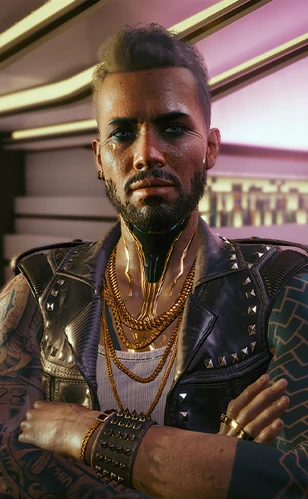

# 克里·欧罗迪恩

## 身份

摇滚之神 / 美国文化偶像 / 前 [[武侍乐队]] 主音

## 特征

- 一心追求音乐本身，与 [[强尼银手]] 截然不同
- 大男子主义灵魂，与强尼在小俱乐部舞台上争夺麦克风与粉丝
- 至少两次离开武侍，每次都发誓是最后一次，但总会回去
- 在 [[荒坂塔袭击事件]] 与 [[强尼银手失踪]] 后陷入长期沉寂
- 经过沉默后向世界证明了自身创造潜力，跻身音乐传奇
- 个人特征：身体上有**菲律宾纹身**，作为标志性识别——
  曾因网上"裸照泄露事件"成为话题，经纪人证实为伪造（参见 [[魅力无穷]]）
- 单飞前曾前往菲律宾隐修，重新找回创作动力（参见 [[最后的摇滚小子 克里·欧罗迪恩的单飞]]）

## 关键事件

- [[荒坂塔袭击事件]]
- [[强尼银手失踪]]
- 长期沉寂后的个人成功

## 已知活动 / 深度档案

### 未经授权传记的盖棺定论

夜之城名录《[[欧罗迪恩：未经授权的传记]]》给出对其一生的官方式概括：

- 武侍乐队从未取得巨大商业成功，被归因于"引领方向的是煽动人心的先锋 [[强尼银手]]，
  而非一心追求音乐本身的欧罗迪恩"
- 强尼的自毁倾向对克里产生重大影响——
  即便在 [[荒坂塔袭击事件]] 与 [[强尼银手]] 失踪之后很长时间内仍挥之不去
- 唯有经过长时间沉寂，克里才向世界证明自身创造潜力、跻身传奇

### 两种乐评的拉扯

克里的公开形象在媒体上呈现出极端两极化的乐评（这些乐评来自同一时期）：

- 反向乐评《[[克里·欧罗迪恩 二次冲突 新专辑乐评]]》——
  把他贬低为"武侍乐队模仿者，一条有尾蛇"、"鳖脚货"，
  指控他"摆脱不了银手的阴影"
- 单飞乐评《[[最后的摇滚小子 克里·欧罗迪恩的单飞]]》——
  把他抬高为"摇滚之神"、"美国文化偶像"，
  把 [[强尼银手]] 的政治作秀反向评价为"为了掩饰自己平庸的音乐天赋"

这两种乐评同时存在——
体现 [[公司统治]] 时代偶像评价权完全由发行渠道决定的事实：
事实与人气都不重要，只看是谁付钱写。

## 关联

- [[强尼银手]]——乐队搭档；据传"克里反复回归是因为爱"
- [[武侍乐队]]
- [[荒坂]]——袭击对象

## 关联原始资料

- [[克里·欧罗迪恩 二次冲突 新专辑乐评]]
- [[魅力无穷]]
- [[最后的摇滚小子 克里·欧罗迪恩的单飞]]
- [[欧罗迪恩：未经授权的传记]]
- [[武侍乐队：交锋]]
- [[霓虹台风即将登陆美国 刚烈乐队新单曲]]
## 世界观意义

克里展示了 [[公司统治]] 时代艺术家的双重命运：
- 在朋克乐队里被政治叙事掩盖
- 在个人事业里完成商业偶像化——被"美国文化偶像"这身份反向收编
- 他"想遗忘的那个自己"在武侍时期；公开访谈极少（梅尔·阿波斯托拉基斯采访已难寻）
- 强尼的存在是他既无法摆脱也无法重现的阴影

## Tags

#人物 #核心 #武侍
