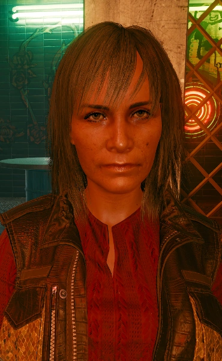

# 威尔斯妈妈

> 英文名: **Guadalupe Alejandra Welles**
> 别名: Mamá Welles（威尔斯妈妈）/ Lupe / 曾在电话中自称 Montserrat Welles
> 生于 [[海伍德]] / 2077 年仍在世 / 配音 Krizia Bajos

## 身份

野狼酒吧（El Coyote Cojo）老板娘与食物商贩 / [[杰克·威尔斯]] 的母亲 / [[海伍德]] 社区中备受敬重的长辈。她把照料、倾听和保护街坊视作理所当然，即使强硬的 [[瓦伦蒂诺帮]] 成员见到她也会表示尊敬。

## 特征

- 性格热情而强悍，家门向亲友敞开，也总愿意给来客一顿饭
- 经营位于 [[谷地区]] 的野狼酒吧；这里既是本地人的社区据点，也是威尔斯家的生活中心
- [[塞巴斯蒂安·神父·伊瓦拉]] 评价她心地善良，却比区里任何帮派分子都更强硬
- 极重视家庭，对儿子加入瓦伦蒂诺帮及其与 [[米丝蒂]] 的恋情都有鲜明立场

### 家庭

- 与瓦伦蒂诺帮成员劳尔·威尔斯成婚并生下杰克；劳尔长期酗酒并殴打妻儿
- 杰克长大后将劳尔打至住院，警告他若再回家就杀了他；劳尔此后离开，二人的婚姻是否正式解除不明
- 杰克 19 岁在与 [[漩涡帮]] 的火并中险些丧命，随后为了母亲退出 [[瓦伦蒂诺帮]]
- 不认同杰克与米丝蒂交往，更中意他的前女友卡米拉；杰克去世后，这层隔阂可在 V 的劝说下缓和

## 关键事件

- 杰克与 [[V]] 开始搭档后，让 V 搬进威尔斯家；约六个月后 V 才找到自己的住处
- [[绀碧大厦]] 劫案后，依据 V 对杰克遗体的安排，主持亡灵祭或在未能安葬儿子的情况下独自哀悼
- 无论是否举行亡灵祭，最终都会把杰克心爱的 ARCH 摩托留给 V

## 已知活动 / 深度档案

### 野狼酒吧与社区地位

威尔斯妈妈不是帮派首领或中间人，却是海伍德少数仅凭照料街坊、经营家庭空间便获得广泛敬意的人。野狼酒吧悬有瓦伦蒂诺帮标志，也常有帮派成员出入，但酒吧的核心功能并非帮派据点，而是让本地人吃饭、喝酒、交换消息并维系关系的社区客厅。

她对 V 的接纳尤其体现这种“扩展家庭”：V 与杰克刚开始合作时尚未在夜之城站稳脚跟，她允许 V 住进家中，直到 V 能够独立生活。杰克死后，她依然把 V 视作家人，并把儿子的摩托交给 V。

### 《英雄》与杰克的亡灵祭

若 V 让德拉曼把杰克的遗体送回家，或让德拉曼原地等候，威尔斯妈妈会在野狼酒吧举办传统亡灵祭（ofrenda），并邀请 V 参加。她交出杰克车库的钥匙，让 V 从儿子的遗物中挑选一件供品；仪式上，亲友和瓦伦蒂诺帮成员共同讲述杰克的往事。

若 V 劝 [[米丝蒂]] 参加仪式，还可说服威尔斯妈妈放下成见、邀请米丝蒂回家吃饭。仪式结束后，她把杰克的 ARCH 摩托钥匙赠给 V。

若 V 把遗体送往 [[维克多]] 的诊所，荒坂会夺走遗体，亡灵祭无法举行。威尔斯妈妈会在通话中因无法安葬儿子而崩溃，但仍把摩托钥匙寄到 V 的公寓。这一分支将她的礼物从仪式传承变成了失去遗体后仅存的告别。

### V 的结局留言

完成《英雄》后，她会依据 V 的结局留下不同讯息：当 V 在夜之城声名大噪时，她提醒 V 别忘记自己从哪里出发；当 V 随流浪者离开夜之城时，她则无法理解 V 为何放弃在城里建立的一切。这些反应延续了她一贯的价值观——家、社区与扎根海伍德，比抽象的传奇更可靠。

## 关联

- [[杰克·威尔斯]]——儿子；她保护、牵挂并最终为之送别的人
- [[V]]——曾借住家中的杰克搭档，后来被她继续视作家人
- [[米丝蒂]]——杰克恋人；起初不受她认可，亡灵祭后可和解
- 劳尔·威尔斯——长期家暴妻儿、后来被杰克赶走的丈夫
- [[塞巴斯蒂安·神父·伊瓦拉]]——尊敬她的海伍德中间人，也是杰克亡灵祭的参加者
- [[瓦伦蒂诺帮]]——与威尔斯家关系密切、对她保持敬意的本地帮派
- [[谷地区]] / [[海伍德]]——野狼酒吧与威尔斯家的所在地
- [[维克多]]——杰克的朋友；一条分支中接收杰克遗体的义体医生

## 关联原始资料

(暂无关联原始资料)

## 世界观意义

威尔斯妈妈代表 [[公司统治]] 之外仍能运作的社区权威：她没有公司职位、武装组织或雇佣兵名号，却靠食物、住处、记忆与日常照料维系一张真实的人际网络。

- 与掌握暴力和委托的神父不同，她的影响力来自接纳与照顾
- 她既反对杰克的帮派生活，又能获得瓦伦蒂诺帮尊敬，说明海伍德的社区关系并不等同于帮派隶属
- 她为杰克举办的亡灵祭，把夜之城惯常被统计为损耗的雇佣兵死亡重新变成一场有姓名、有亲友、有传统的告别
- 她收留 V、又把杰克的摩托交给 V，使“家庭”不再只由血缘决定，而由共同生活和承担失去构成

## Tags

#人物 #海伍德 #家庭 #野狼酒吧
