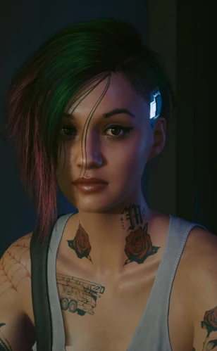

# 朱迪

> 英文原名: **Judy Álvarez**
> 别名: Jude / Punchin' Judy / Ranita（西语"小青蛙"，祖母对她的昵称）
> 生于 2052.11.27 恶土拉古纳湾（2077 年 24 岁）/ 配音 Carla Tassara / 塔罗映射 **魔术师**牌（[[塔罗牌涂鸦]]）

## 身份

夜之城最顶尖的 [[超梦]] 剪辑师兼技师 / [[莫克斯帮]] 成员 / [[V]] 的潜在恋人之一（女性身型 + 女声可攻略）/ **魔术师**牌映射

## 特征

- 超梦剪辑天才，技术好到任何公司娱乐工作室都肯高薪聘她，但她极重独立、拒绝一切招揽，不肯出卖自己
- 一身无政府主义脾气，正是这股劲把她引向 [[莫克斯帮]]，盼着能改善夜之城底层的处境
- 最大的"缺点"也被一些人视为最大的优点：见到不公就闭不上嘴，总因此惹麻烦
- 性情火爆（自认遗传自祖母）

### 出身

- 生于恶土小镇**拉古纳湾**。父亲从不在身边，母亲在她年幼时去世，由外祖父母带大
- 外祖父是技师，把一身手艺都传给了她；外祖母**艾娜拉**脾气火爆
- 约 2062 年家乡被 NC 水坝公司收购、改建为水库，居民被迫迁离；朱迪随外祖父母搬进 [[夜之城]]，老人受不了大都市、几年后北上俄勒冈，她则留下把公寓据为己有
- 16 岁因"偷"一辆消防车被捕——其实是她在废车场捡到、花半年修好，首航就被警察逮了（脖子下的消防车纹身即源于此）

## 关键事件

- 经挚友 [[艾芙琳·帕克]] 引荐结识 [[V]]，为抢劫案前的超梦提供调试与剪辑
- 艾芙琳惨遭横祸后与 V 一道追查、营救——艾芙琳最终不堪创伤在朱迪浴缸自尽
- 带 V 找前女友舞子对质，并可手刃强暴艾芙琳的**伍德曼**（[[虎爪帮]] 打手、云顶妓院经理）
- 联合云顶舞女谋夺**云顶妓院**控制权，舞子中途反水
- 带 V 潜入被淹没的故乡**拉古纳湾水库**，借神经链接录制双视角超梦——也因此得知 V 体内的 [[Relic]] 与强尼印记；女性向可在此发展恋情

## 已知活动 / 深度档案

### 艾芙琳支线（正义牌）—— 主线复仇根源
- 挚友 [[艾芙琳·帕克]] 在抢劫案失败后被赛博攻击、性侵，转卖给 [[清道夫]] 制成 XBD；获救后仍不堪创伤，在朱迪浴缸自尽
- 朱迪与 [[V]] 联手追查这条 [[虎爪帮]] / 清道夫的 XBD 链条；途中可手刃强暴她的伍德曼（[[虎爪帮]] 打手、云顶妓院经理）
- 对应 [[塔罗牌涂鸦]] 中的**正义**牌——涂鸦地点正是圣多明戈电厂巨型油罐外墙
- 艾芙琳之死是 [[公司统治]] 时代女性被超梦产业压榨**至死**的样本，也是朱迪此后所有行动的**情感根源**

### 与前女友舞子
- 早年在 [[云顶妓院]] 共事时与舞子相恋，曾偷改舞子的"娃娃芯片"数据助她晋升
- 舞子越爬越高、为权力渐渐出卖本心，朱迪厌恶又失望，最终分手
- 谋夺云顶时舞子玩两面手法、中途反水——这段旧情成了夺权行动里最锋利的刺

### 云顶妓院控制权之争
- 在 [[V]] 协助下，联合云顶舞女谋夺 [[云顶妓院]] 控制权，矛头直指 [[虎爪帮]]——兼具产业层与帮派层两重意义
- 在 V 早期已重创 [[正法承太郎]] 等虎爪帮头目的情形下，夺权会因对方"群龙无首"而明显降低难度
- 本质是"为艾芙琳接管行业"——没有 XBD 致死的根因，朱迪不会成为夜之城超梦产业的接管者

### 与 V 的恋爱线与结局
- 唯一可攻略条件：**女性身型 + 女声**；与 [[帕南·帕尔默]] / [[瑞弗·沃德]] / [[克里·欧罗迪恩]] 并列 V 四大可恋角色
- **星星结局**：与 V 重逢，随 [[阿德卡多]] 一同离开夜之城
- **太阳 / 节制 / 恶魔结局**：多以道别或分手收场，朱迪心灰离城、一路北上（俄勒冈 → 西雅图）
- **往日之影「高塔」结局**：V 昏迷两年后于 2079 年醒来联系朱迪，得知她已移居匹兹堡、与一名叫 Bianca 的女子结婚——二人就此错过

## 关联

- [[V]]——同伴 / 恋人（女性向）
- [[莫克斯帮]]——所属帮派（在莉琪酒吧做超梦技师）
- [[虎爪帮]]——对头帮派；掌控云顶妓院、害死艾芙琳的产业链依托
- [[超梦]]——其行业背景
- [[云顶妓院]]——其行动焦点
- [[艾芙琳·帕克]]——挚友 / 正义牌支线核心 / 自尽身亡的复仇根源
- [[正法承太郎]]——虎爪帮头目 / 朱迪复仇线对象之一
- 伍德曼——强暴艾芙琳的虎爪帮打手、云顶妓院经理
- 舞子——前女友 / 谋夺云顶时反水
- 艾娜拉——火爆脾气的外祖母（昵称她"Ranita"）
- [[瑞吉娜·琼斯]]——发悬赏让 V 干掉虎爪帮头目的中间人
- [[塔罗牌涂鸦]]——魔术师 / 正义两牌映射

## 关联原始资料

(暂无关联原始资料)

## 世界观意义

朱迪展示 [[公司统治]] 时代"行业人员的反抗"形态：

- 不试图掀翻整个产业，而是接管自己工作的那一小块——夺取一家妓院的所有权
- 这是 [[V]] 颠覆性事迹中"接地气"的部分——
  不是炸塔，是把脏活的所有权抢回到工人手里
- 与 [[利琪·薇兹]] 的"全国流量反抗"形成对比：
  利琪用名气当盾牌，朱迪用 V 的枪当工具——同样不脱离公司逻辑，只是用得更精准

## Tags

#人物 #超梦 #V伙伴
