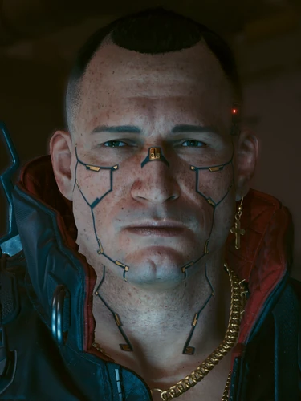

# 杰克·威尔斯

> 英文原名: **Jackie Welles**
> 别名: Jaquito / Jack / Jackster（亲昵称）/ 抢劫案化名 Ramón Victorino
> 生于 2046.5.26 夜之城，2077 年 5 月死于德拉曼出租车（30 岁）/ 配音 Jason Hightower / 塔罗映射 **死神**牌

## 身份

雇佣兵 / [[V]] 的**死党与序幕共同冒险者** / [[米丝蒂]] 的恋人 / **死神**塔罗牌映射角色。一个把友情、忠诚、家庭看得高于一切的海伍德之子，梦想发大财、过上奢华生活、供养家人——一个永远没能实现的梦。

## 特征

- 海伍德出身的本地小伙
- 与 [[V]] 一起在夜之城底层雇佣兵圈打拼起步，是 V 进入这个生态的**领路人**
- 固执——想要什么就不达目的不罢休（也绝不闭嘴）；毕生目标是成为 [[来生]] 的传奇
- 老家就在海伍德**野狼酒吧**附近——塔罗牌"**死神**"涂鸦就在这里

### 出身与帮派

- 父亲劳尔是酗酒的家暴者，常用皮带毒打妻儿；杰克长大后反手把父亲打进医院、撂下"再回来就弄死你"，劳尔从此消失——杰克留着那条皮带，以备他归来
- 母亲瓜达卢佩即"**威尔斯妈妈**"，在 [[海伍德]] 经营野狼酒吧
- 与 [[米丝蒂]] 自幼在同一街区长大，年少时却没走到一起
- 15 岁起痴迷摩托；早年与古斯塔沃·奥尔塔一同加入 [[瓦伦蒂诺帮]]，19 岁在与 [[漩涡帮]] 的火并中身受几近致命的枪伤，为母亲退出帮派，但与瓦伦蒂诺帮及 [[塞巴斯蒂安·神父·伊瓦拉]] 始终交好
- 2076 年与 [[米丝蒂]] 正式交往（母亲更偏爱前女友卡米拉），还为理解她的灵性在车库做了一幅曼陀罗

## 关键事件

- 与 [[V]] 联手从清道夫手中解救 [[创伤小组]] 高级会员桑德拉·多塞特，打响名号
- 经网络客 T-Bug 引荐、受 [[艾芙琳·帕克]] 委托，被大中间人德克斯特·德肖恩招去盗取 [[Relic]]
- [[绀碧大厦]] 抢劫案中目睹 [[荒坂赖宣]] 弑父；逃亡途中重伤，在德拉曼出租车上失血身亡——临终把 [[Relic]] 芯片塞进 V 体内，托其完成交付

## 已知活动 / 深度档案

### 合作起步：解救桑德拉·多塞特
- 与 V 合作的第一笔大单
- 解救 [[创伤小组]] 高级会员**桑德拉·多塞特**
- 由此进入夜之城雇佣兵圈核心视线

### 序幕：偷天换日（盗取 Relic）
- 接受大中间人**德克斯特·德肖恩**的世纪大单
- 与 V 一起潜入 [[绀碧大厦]]，从荒坂高层处盗取 [[Relic]] 芯片
- **意外目睹 [[荒坂赖宣]] 弑父 [[荒坂三郎]]**——重大真相目击者之一
- **在杀出大厦的途中身亡**
- 死后 Relic 在 V 体内被激活，整个主线故事由此展开

### 来生的梦想

抢劫案前夜首次获准踏入 [[来生]] 时，杰克对酒保克莱尔说：等他哪天成了夜之城传奇，要有一杯以他命名的鸡尾酒——"伏特加、青柠汁、姜汁啤酒，最重要的是……再加一点爱"。他没能等到那天；他死后 V 可回到来生告诉克莱尔噩耗，请她照此调出"杰克·威尔斯"。

### 葬礼
- [[米丝蒂]] 操办送别仪式
- **[[塞巴斯蒂安·神父·伊瓦拉]] 亲自主持瓦伦蒂诺式正规葬礼**（"告别赛"）——
  神父是杰克年轻时加入 [[瓦伦蒂诺帮]] 时的**父亲般的领路人**
- V 出席——这是 V 在夜之城公开"有家人"的少数时刻
- 这一仪式把"街头雇佣兵的死"提升到**家族级仪式**——
  杰克的死从此不只是"V 的死党之死"，
  而是整个海伍德对一个"自己人"的正式告别

### 遗体的两种归宿

V 在出租车上对杰克遗体的处置，决定了两条结局：

- **送还家人 / 让德拉曼等候**（解锁《英雄》任务）：威尔斯妈妈为他办传统**亡灵祭**（ofrenda），到场的有 [[维克多]]、[[塞巴斯蒂安·神父·伊瓦拉]] 与众瓦伦蒂诺成员；仪式后母亲把杰克心爱的 ARCH 摩托钥匙赠予 V。其骨灰安放于 [[北橡树]] 骨灰堂，墓志铭："晚安，亲爱的王子"
- **送给维克多**：荒坂随后从 [[维克多]] 处取走遗体，用 [[灵魂杀手]] 扫描其印记以查抢劫案真相

无论哪条线，若 V 最终助 [[奥特·坎宁安]] 摧毁神舆，杰克的印记会与奥特等众多印记**融合**进她，成就更强大的 AI；V 接入神舆时还会在米丝蒂店天台的模拟场景里见到"杰克"，但很快认出那只是一段伪装成人的算法，向他作最后的告别。

## 关联

- [[V]]——死党
- [[米丝蒂]]——恋人（青梅竹马、2076 年起交往）
- 瓜达卢佩"威尔斯妈妈"——母亲，海伍德野狼酒吧老板娘
- 卡米拉——前女友，母亲更中意的人选
- 劳尔·威尔斯——家暴的酗酒父亲，被杰克打跑
- [[塞巴斯蒂安·神父·伊瓦拉]]——父亲般的领路人 / 葬礼主持人
- [[瓦伦蒂诺帮]]——早年所属帮派（19 岁中枪后退出，仍交好）
- [[漩涡帮]]——令他几乎丧命的火并对手
- [[维克多]]——挚友圈成员；一条结局线里遗体的接收者
- 克莱尔——[[来生]] 酒保，答应为他调命名鸡尾酒
- [[奥特·坎宁安]]——摧毁神舆结局中，其印记被融合的归宿
- [[创伤小组]]——首笔合作的服务对象
- [[Relic]]——序幕任务核心物
- [[绀碧大厦]]——牺牲地
- [[荒坂赖宣]] / [[荒坂三郎]]——其意外见证的事件主角
- 德克斯特·德肖恩——序幕雇主 / 双面背叛者
- [[塔罗牌涂鸦]]——死神牌映射角色

## 关联原始资料

- [[绀碧大厦]]
## 世界观意义

杰克是 [[公司统治]] 时代"街头小子的标准短命弧线"样本：

- 他不属于任何大势力——
  既不是流浪者、不是公司员工、不是黑客、不是政客
- 但他和 V 的关系是夜之城**最干净的合作**——
  没有印记篡改，没有政治算计，只有兄弟情
- 他的死亡标记了 V 的**身份转折**：
  在杰克死之前，V 是一个想发财的雇佣兵；
  在杰克死之后，V 是一个想活下来的 [[Relic]] 宿主
- 塔罗"**死神**"牌的寓意（**一个时代的终结 + 新生**）极其精确——
  杰克的死不是终点，而是 V 与 [[强尼银手]] **双生灵魂**的开始
- 他是夜之城档案中少数**没有被任何宏大叙事征用**的人——
  他不留遗言、不被印记化、不被改写——
  仅以"V 的兄弟"和"米丝蒂的男朋友"留下记忆

## Tags

#人物 #核心 #雇佣兵 #海伍德
