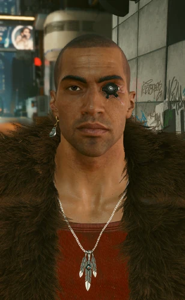

# 瑞弗·沃德

> 英文名: River Ward

## 身份

[[NCPD]] 警探（已停职 / 离职）/ [[V]] 的潜在恋人之一 / 良心型警察的样本

## 特征

- NCPD 内部少数仍然认真办案的警探
- 长期被边缘化、被搭档出卖、最终被强行结案
- 性格内敛、责任感重，重视家庭——是 [[公司统治]] 时代少有的"正直警察"画像
- 与妹妹乔斯、侄子兰迪和侄女们关系亲密
- 异性恋——只与女性 V 触发浪漫亲密剧情

## 关键事件

- [[猎杀彼得潘事件]]

## 已知活动 / 深度档案

### 1. 向法律宣战（I Fought the Law）

- 起因：副警长 [[杰佛逊·佩拉雷斯]] 夫妇委托 V 调查前市长 **卢修斯·莱恩** 的神秘死因
- V 在调查中结识被边缘化的瑞弗
- 二人通过 [[超梦]] + 现场调查发现：
  - 莱恩的死因**并不单纯**
  - 背后是复杂的政治阴谋 + [[NCPD]] 内部极度腐败
- 结果：瑞弗的搭档出卖了他，警局强行结案
- 瑞弗对 NCPD 彻底失望，**被停职 / 离职**
- 这条线上承 [[蓝眼睛先生]] 操控政客的阴谋链

### 2. 猎杀（The Hunt）—— 详见 [[猎杀彼得潘事件]]

- 妹妹乔斯求助：儿子（瑞弗的侄子）**兰迪**失踪
- 瑞弗怀疑是夜之城臭名昭著的连环杀手"**彼得潘**"（[[安东尼·哈里斯]]）所为
- 与 V 潜入警局实验室 + 兰迪家电脑获取线索——
  电脑中找到了**彼得潘用来诱骗年轻人的工具**
  （即 [[操纵 其实没有那么难]] / [[影响力的快乐 简单五原则]] 这类心理操纵手册）
- 通过进入凶手潜意识 [[超梦]] 拼凑出**童年记忆 + 藏匿地点**
- 最终锁定废弃**林边农场**——彼得潘在那里把年轻人**像牲畜一样**用支架+毒气圈养
- V + 瑞弗解地雷、拔输毒管、救出奄奄一息的兰迪
- 若超梦解读错误或行动太迟，**兰迪会死亡**

### 3. 爱似河（Following the River）

- 救出兰迪一段时间后，离开警局的瑞弗邀请 V 去妹妹家吃晚饭
- V 与瑞弗一起做饭，陪侄子侄女玩 VR 射击
- 妹妹乔斯疯狂"助攻"撮合
- 晚饭后瑞弗带 V 来**俯瞰夜之城的高塔**上
- 向 V 吐露心声，**赠送专属动能左轮手枪"真探"**
- **女性 V**：可触发亲吻 + 浪漫亲密剧情；第二天可正式确立恋爱
- **男性 V**：塔顶举杯畅饮，瑞弗视 V 为"最好的过命兄弟"

## 关联

- [[V]]——同伴 / 潜在恋人
- [[NCPD]]——前雇主 / 抛弃他的体制
- [[杰佛逊·佩拉雷斯]]——委托人（向法律宣战）
- 卢修斯·莱恩（前市长）——其调查目标
- [[蓝眼睛先生]]——其调查指向的最深层阴谋
- [[安东尼·哈里斯]] / 彼得潘——其追捕的连环杀手
- 妹妹**乔斯** / 侄子**兰迪** / 侄女们——其家庭
- "真探"左轮手枪——其情感信物
- [[操纵 其实没有那么难]] / [[影响力的快乐 简单五原则]]——
  在猎杀任务中被发现的彼得潘诱拐工具

## 关联原始资料

- [[操纵 其实没有那么难]]
- [[影响力的快乐 简单五原则]]
## 世界观意义

瑞弗是 [[公司统治]] 时代**"被体制吐出来的正直警察"**样本：

- 与 [[NCPD]] 节点中"奥尔蒂斯 / 借身份办私案"的腐败警察形成完整对照——
  NCPD 内部不是没有正直人，只是正直人会被搭档出卖、被警局结案、被停职
- 他的三段故事线分别对应 [[公司统治]] 时代的三种失败：
  - **法律失败**：警局强行结案，政治阴谋无法被法律追究
  - **保护失败**：连环杀手在城市里圈养年轻人多年无人察觉，靠一个**已被开除的前警探**和一个**雇佣兵**才能阻止
  - **关系失败**：他能给 V 的"家"不在体制里——
    而在妹妹的厨房、侄子的游戏、高塔上的左轮手枪
- "真探"作为信物极具象征性：
  瑞弗已经不再是警察——
  他能交给 V 的不是警徽，而是**一把会跟你过日子的枪**

## Tags

#人物 #核心 #警察 #V伙伴
