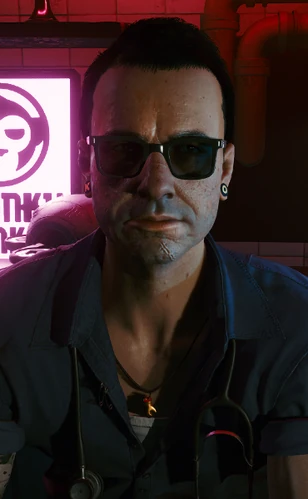

# 维克多

> 英文原名: **Viktor Vektor**
> 别名: 老维（Vik）
> 职业: 义体医生（Ripperdoc）/ 前重量级拳击手

## 身份

[[小唐人街]] 最好的义体医生，V 的私人医生兼挚友。诊所藏在 [[米丝蒂]] 的玄学店「神秘玄异」后巷，是 V 在 [[夜之城]] 为数不多真心相待的人之一。

## 特征

- 老派街头硬汉，原则、荣誉与道德感都是在拳击馆里淬炼出来的
- 沉稳、耐心、专业，被称作小唐人街手艺最好的义体医生
- 多次为 V 赊账垫付手术费，从不抱怨
- 实为夜之城在世传奇之一——他本人却多年来试图让所有人忘掉这件事

### 出身

曾是 [[沃森]] 的重量级拳击手、"夜城恶魔"拳击俱乐部成员，打进过沃森拳击大奖赛决赛、屈居亚军。后来洗手不干，宁愿过相对简单的后巷义体医生生活，但仍嗜看拳赛。他的荣誉与道德观正是在"夜城恶魔"俱乐部成型的。

## 关键事件

- 为 V 植入 [[Relic]]——抢劫案后从重伤的 V 颅内取出芯片、又被迫将其重新接入，是 V 体内印记危机的第一见证人与诊断者
- 全程为 V 提供义体维护与病情判断，是 V 了解自身倒计时的医疗窗口

## 已知活动 / 深度档案

### 诊所

向 [[米丝蒂]] 租下其店铺的地下室与车库改建成诊所；二人既是房东租客，也是 V 在小唐人街的两位至交。诊所是 V 故事的固定锚点之一。

### 隐去的传奇

维克多刻意把自己"在世传奇"的拳击过往埋了起来，选择一个不被注意的后巷身份。这一自我隐匿，与夜之城其他人拼命想成为传奇形成尖锐反差。

## 关联

- [[V]]——病人兼挚友，长期为其赊账
- [[米丝蒂]]——房东、邻居、共同的朋友
- [[杰克·威尔斯]]——同属一个朋友圈
- [[小唐人街]] / [[沃森]]——诊所与拳击生涯所在地
- [[Relic]]——他亲手处理的危险芯片
- [[义体]]——其本行

## 关联原始资料

(暂无关联原始资料)

## 世界观意义

维克多是 [[公司统治]] 缝隙里"体面"的稀有样本：

- 在一个把传奇当商品贩卖的城市里，他偏偏把自己的传奇藏起来——这本身就是一种反抗姿态
- 义体医生处在合法医疗与黑市改造的灰色地带，他却守着拳击馆传下来的荣誉与原则行医
- 反复为 V 赊账，说明在彻底交易化的夜之城，人与人之间仍可能存在不计价的情义——哪怕只是少数

## Tags

#人物 #同伴 #义体 #小唐人街
