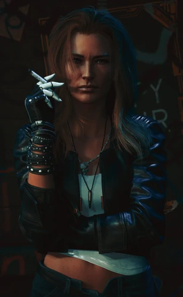

# 奥特·坎宁安

## 身份

天才网络专家 / [[灵魂杀手]] 程序的真正作者 / [[强尼银手]] 的爱人

## 特征

- 被 [[荒坂]] 绑架，用于强迫开发 [[灵魂杀手]]
- 其遭遇是 [[强尼银手]] 加入 [[荒坂塔袭击事件]] 的私人动机
- 肉身在首次被 [[灵魂杀手]] 击中时即死去，意识被上传后进入 [[黑墙]] 之后的网络深处
- 后来以 AI 形态向 V 揭示了 [[强尼银手]] 记忆被篡改的真相

## 关键事件

- 被荒坂绑架（2013）——史上首位 [[灵魂杀手]] 受害者
- [[荒坂塔袭击事件]]——多年后以 AI 形态重逢强尼
- 揭示 [[强尼银手]] 记忆被印记篡改

## 已知活动 / 深度档案

### 网络女王

夜之城最强的网络者，黑墙两侧最强大的"存在"，也是唯一能压住 [[强尼银手]] 的人。她痴迷人工智能，在"智能（无论 AI 还是人类心智）的转移与封装"上取得突破，造出一个能把使用者心智上传进网络、脱离肉体自由探索的程序。其雇主 ITS 将这一突破武器化，发展成 [[灵魂杀手]]——这把刀的原型，本不是用来杀人的。

### 被绑架与首位灵魂杀手受害者

2013 年 4 月 15 日，奥特与 [[强尼银手]] 听完演唱会离场时遭帮派绑架，强尼被打成重伤留在原地。幕后是 [[荒坂]]，意在逼她为荒坂重制该程序。荒坂窃取灵魂杀手据为己用后，奥特被迫逃入赛博空间——她是史上**第一个被灵魂杀手击中的人**：心智上传至网络，肉身则死去、遗留在现实世界。

### 黑墙之外的转化

在 [[黑墙]] 之外存在的 **50 年**彻底改变了她的意识：如今的她更接近一个失控 AI（Rogue AI）而非人类——已不完全是"奥特"，而是与残存意识融合、以其印记数据为基底延续的新实体。她用半个世纪死死攥住"奥特"这个形象，才没像其他 AI 那样彻底沦为纯数据。与 [[强尼银手]] 的羁绊，是她与旧日人生仅存的最后一根连线。

## 关联

- [[强尼银手]]——爱人
- [[荒坂]]——绑架者
- [[灵魂杀手]]——其作品也是其归宿
- [[黑墙]]——意识最终所在；50 年存在已使她趋近失控 AI

## 关联原始资料

(暂无关联原始资料)

## 世界观意义

奥特连接了 [[公司统治]] 时代最深的两个命题：
- 一名天才工程师不能拥有自己的作品——技术被绑架，作者随之被绑架
- 意识能否独立于肉体存在——她是这道边界唯一活下来的人，但代价是不再是"人"
- 她对强尼的修正，使整部荒坂塔史诗从英雄叙事变成被篡改的叙事——
  即使是反抗者的回忆，也可能是公司印记的产物

## Tags

#人物 #核心 #网络 #黑墙
