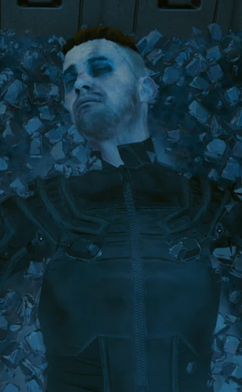

# 巴特莫斯

> 英文名: Rache Bartmoss

## 身份

传奇黑客 / [[数据崩溃]] 的制造者

## 特征

- 21 世纪初最具影响力的网络运行者
- 极端反公司立场——不止于反抗，而是要**毁掉整个旧网络**以摧毁公司基础
- 在 2022 年 6 月 13 日发动 [[数据崩溃]]——把全球互联网炸成废墟

## 关键事件

- [[数据崩溃]]（2022.6.13）
- **R.A.B.I.D.S 释放**——他在动手前留下了一封长期未公开的信，
  后由记者**玛利亚·吉姆内兹**收入《[[撤销 初网的陨落|撤销：初网的陨落]]》：
  > "初网本该拯救我们。它是为那些无法发声的人创造的一个平台。
  > 它能为渴望学习的人提供无穷无尽的知识。它能让支离破碎的人类团结起来，
  > 比历史上任何时期都更紧密。**但这些希望全部落空了。全是假的。**"
  - 信里他控诉初网：
    "我们的隐私被剥夺，我们被剥夺了隐私，
    我们丧失了自由意志，我们的尊严被践踏殆尽。"
  - 这封信被压了几十年才公开——
    "因为有人不希望你们看到它"（玛利亚·吉姆内兹按）

## 已知活动 / 深度档案

（暂无深度档案）

## 关联

- [[蜘蛛墨菲]]——同代黑客，亲眼目睹其行动，后对其结论产生根本性反思
- [[黑墙]] / 网络深处——其后续遗产被嵌入网络深层；
  按某些观察者（如评论者"小妖"，参见 [[问责巴特莫斯 小妖]]）的看法，
  [[黑墙]] 本是为应对数据崩溃后果而设的"保护墙"，
  最终却被 [[网络监察]] 改造为"控制他人的工具"——
  这意味着巴特莫斯不仅毁掉了旧网络，
  还客观上为新的统治形态提供了立项理由

## 关联原始资料

- [[撤销 初网的陨落]]
- [[问责巴特莫斯 小妖]]
## 世界观意义

巴特莫斯是 [[公司统治]] 时代最大的"成功反抗者"——也是最大的失败者：

- 他摧毁了一个统一的网络——
  以为这等于摧毁了公司的基础设施
- 但 [[蜘蛛墨菲]] 一年后看清：
  "如今一面镜子被打碎，却又多出了几千面。
   现在每个公司、政府和帮派都有了自己的网络，
   他们不受任何约束，用铁腕统治着那里。"
- 评论者"小妖"在 [[问责巴特莫斯 小妖]] 中更进一步：
  "在巴特莫斯之前，网络是一片原始丛林…那时你是自由的。
   在巴特莫斯之后，网络就像机场的安检，
   你每走一步，网络监察都要查看你的证件，检查你屁股里有没有藏东西。"
- 巴特莫斯的悲剧是反抗者最深的悖论——
  他成功了，结果世界变得更糟

## Tags

#人物 #核心 #网络 #黑客
