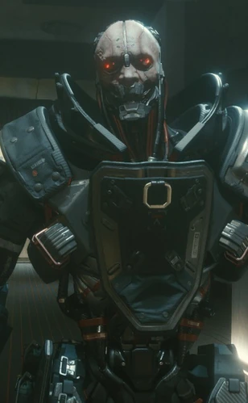

# 亚当·重锤

> 英文名：Adam Smasher

## 身份

[[荒坂]] 全身义体化独狼（Solo） / [[荒坂赖宣]] 私人保镖 / 荒坂安保负责人 / 前美国海军陆战队员 /
**审判**牌映射（[[塔罗牌涂鸦]]，涂鸦在击败他的决战服务器机架上）——对其个人、对荒坂、对历史的终极审判

## 特征

- **出生**：6 月 21 日，年份不明；生于纽约市南布朗克斯
- **状态**：2077 年在 [[荒坂塔]] 被 [[V]] 击败；可被处决或放过，结局取决于玩家选择
- 游戏扫描结果显示其身体约 **96% 为义体**；有机部分主要封装在受重甲保护的生物舱中
- 极端嗜杀，蔑视有机肉体，习惯把人称作“肉”；主动要求任务必须造成附带伤亡和平民死亡
- 被创作者 Mike Pondsmith 称为“高功能赛博精神病”：严重缺乏同理心，却能在奖励杀戮的组织中长期工作
- 不是荒坂家臣式的忠诚者，而是公司供养、维修和武装的职业屠夫；荒坂给他目标，他则以最残酷的方式清理目标
- 与 [[摩根·黑手]] 的宿怨源于“金属优于肉体”的执念：他需要击败仍保留人类身体的传奇独狼来证明自身哲学

## 关键事件

- **南布朗克斯帮派生涯**——在美国崩溃时期成为街头战斗帮派头目，帮派被美军消灭后转而参军
- **六年海军陆战队服役**——学习正规作战技能，最后因抗命被开除
- **2015 年首次全身改造**——执行荒坂任务时遭两枚火箭弹命中，残骸被队友装进背包送医；以十五年服务合约换取全身义体化
- **[[第四次公司战争]]**——为荒坂率领突击队屠杀军用科技人员及其家属，并借战争追逐宿敌 [[摩根·黑手]]
- **[[荒坂塔袭击事件]]**——在灵魂杀手实验室杀死 [[强尼银手]]，随后身穿“鬼神”装甲在塔顶与黑手决斗
- **2076 年消灭边缘行者团队**——击败 [[大卫·马丁内斯]] 的实验性赛博骨骼，踩死 [[瑞贝卡]] 并处决大卫
- **2077 年成为安保负责人**——为 [[荒坂赖宣]] 清理绀碧大厦劫案与纪念游行事件的后患
- **荒坂塔终战**——在绝大多数基础游戏终局路线中被 [[V]] 击败；星星路线中先踩死 [[索尔·布莱特]]，罗格路线中则杀死 [[罗格]]

## 已知活动 / 深度档案

### 早年：暴力先于义体

重锤的父亲是布朗克斯人，母亲是俄罗斯人。他在南布朗克斯街头长大，自认是街区里最狠的人，并在美国崩溃时期领导一支以旧洋基体育场附近为地盘的战斗帮派。

美军消灭其同伙后，他立即加入海军陆战队，在六年服役中成长为体重约 108 千克、受过正规训练的战斗人员；但暴力冲动与服从纪律并不兼容，他最终因抗命被开除。回到纽约后，他成为雇佣兵，承接绑架、骚扰、暗杀和爆破等高破坏性工作。义体没有把一个正常人变成怪物，只是给原本就嗜杀的人提供了更大的杀伤半径。

### 2015 年：被装进背包的人

- 2015 年，纽约荒坂分部雇佣重锤等人窃取竞争对手的技术原型；行动中两枚火箭弹将他炸成残骸
- 他一度临床死亡超过八分钟，复苏后仅剩的大脑、脊髓与维生组织被置于企业设施的生物舱中
- 荒坂提出二选一：停止维生，或接受全身义体改造并签署十五年服务合约
- 重锤毫不眷恋原身体，进入第一具战斗义体后反而认为这是人生中最正确的决定
- 荒坂允许他在履约之外接私活；他的唯一特殊条件不是加钱，而是任务必须允许附带损害与平民伤亡

### 可更换的身体，而非一副固定装甲

重锤的“身体”实质上是可插拔的作战平台。有机核心位于重甲生物舱内，可通过神经接口接入不同全身义体；到 2023 年，他已有多套躯体可按任务更换。

- **改装 Samson**——第四次公司战争前长期使用的主力框架，原本偏工业用途，经重武器、感知、装甲和快速反应系统全面强化
- **Gemini**——外表接近人类的合成皮肤躯体，据设定外形像肌肉发达的年轻金发猫王；主要用于需要人形外观的场合
- **荒坂“鬼神”（DaiOni）**——2023 年塔顶决战临时使用的巨型动力装甲，以全身义体为内核，具备接近装甲载具的火力与防护
- **高度改装 Dragoon**——第四次公司战争后逐渐放弃人形躯体，2076—2077 年使用的重型作战框架
- **2077 年武装**——实验型 [[斯安威斯坦]]、肩载导弹、可伸缩臂炮、重机枪与多层电子防御；并非只有蛮力，也具备极高反应速度和反黑客能力

### “金属优于肉体”的杀戮哲学

重锤公开鼓吹全身义体化，认为有机人类注定被淘汰。他曾为《Solo of Fortune 2》撰文，把义体改造描述为从战斗优势走向“摧毁所有血肉”的进化。

这套观念并非抽象理论，而是他的杀人许可证：他曾为追捕一名带走荒坂文件的雇佣兵，在购物中心直接用旋转霰弹武器扫射人群。他执行外部任务时不佩戴荒坂标识并更换面具，使公司能够享受暴力成果而否认责任。

### 与摩根·黑手的单方面宿怨

- [[摩根·黑手]] 以克制、战术和尽量活捉目标闻名，仍保留大量有机身体，却长期被视为世界第一独狼
- 重锤把黑手的存在视为对“金属必然优越”的否定，多次试图逼他公开决斗
- 黑手认为重锤只是仗着装备的屠夫，长期拒绝回应；这种无视反而令重锤更加执着
- 两人的对立不仅是战力排行，也是两种独狼哲学：专业解决问题，或把破坏本身当成目的

### 第四次公司战争与 2023 年真相

- 2022 年，重锤正式为荒坂投入 [[第四次公司战争]]，率队攻击军用科技目标；他不仅杀害战斗人员，也屠杀对方家属与社区
- 2023 年 8 月 20 日，[[荒坂敬]] 命其带领两支小队拦截侵入荒坂塔 120 层灵魂杀手实验室的突击队
- [[强尼银手]] 为掩护同伴撤退主动吸引火力，被重锤的自动霰弹武器拦腰击中并杀死；强尼在 Relic 中记得的楼顶追逐、被俘和三郎审讯并非可靠实况
- 全身义体独狼 Shaitan 随后缠住重锤，让其余人员得以脱身；重锤之后带着仍存活的 Shaitan 生物舱登上塔顶
- 他穿着“鬼神”装甲逼 [[摩根·黑手]] 留下决斗。二人在核弹爆炸前交手，胜负至今未知；重锤后来确认幸存，黑手的去向仍是谜

### 核爆后的失踪与回归

重锤从夜之城核爆中生还，并据称奉 [[荒坂三郎]] 命令处理强尼的尸体和遗物。他知道强尼埋葬地点，后来收藏其保时捷 911 与马洛里安 3516 手枪，又把手枪赏给可靠部下格雷森。

此后数十年，他基本淡出公开视野，世界各地不断出现“金属巨兽”执行秘密任务的传闻，但无法确认哪些行动确为本人所为。到 2070 年代前中期，他回到夜之城，担任 [[荒坂赖宣]] 的贴身保镖和清理人，并把沃森区埃布尼克码头作为据点之一。

### 2076 年：大卫·马丁内斯的终点

- 荒坂反情报部门派重锤回收失控的实验赛博骨骼并消灭 [[大卫·马丁内斯]]
- 大卫依靠反重力装置与军用级 [[斯安威斯坦]] 一度突破荒坂部队；重锤却以自己的实验型斯安威斯坦追上，并嘲讽大卫的植入体只是“初级玩意”
- [[露西]] 的快速破解只能短暂干扰他；其自我 ICE 与坚固系统使常规网络攻击难以奏效
- 他落地时踩死 [[瑞贝卡]]，随后拆除骨骼的反重力组件，让整套装备被自身重量压垮
- 重锤肢解并击败大卫，短暂认可他可能成为“有趣的印记”，随后近距离将其处决

### 2077 年：荒坂最后一道门

- 绀碧大厦劫案期间随赖宣行动，试图拦截逃亡的 [[V]] 与 [[杰克·威尔斯]]
- 三郎死后，赖宣将其提升为荒坂安保负责人；[[小田]] 曾警告纪念游行可能遭破坏，重锤却以服从赖宣为由将其打发
- [[竹村五郎]] 与 V 劫走 [[荒坂华子]] 后，重锤率突击队攻入藏身处并将华子带回
- 在星星、太阳、恶魔及秘密突袭等路线中，他都守在通往 [[神舆]] 或赖宣的最后关口
- 星星路线中杀死 [[索尔·布莱特]]；罗格路线中重创并杀死 [[罗格]]，后者以手雷炸伤其胸甲
- V 最终将其击败。玩家可以补枪处决，也可以转身离开；因此“重锤必然死亡”并非固定事实

## 关联

- [[荒坂]]——提供义体、维护、武器和目标的长期雇主
- [[荒坂赖宣]]——2070 年代的直属保护对象，后将其提升为安保负责人
- [[荒坂敬]]——第四次公司战争时期的最高指挥者
- [[荒坂三郎]]——核爆后据称命他处理强尼遗体与遗物
- [[强尼银手]]——2023 年被其亲手杀死
- [[摩根·黑手]]——宿敌，2023 年塔顶决斗结果未知
- [[大卫·马丁内斯]] / [[瑞贝卡]]——2076 年被其杀死
- [[V]]——2077 年将其击败、决定是否处决的人
- [[罗格]] / [[索尔·布莱特]]——在不同终局路线中被其杀害
- [[竹村五郎]] / [[小田]]——同为荒坂武力工具，却分别代表封建忠诚、职业纪律与纯粹暴力

## 关联原始资料

(暂无关联原始资料)

### 外部资料

- [Cyberpunk Wiki：Adam Smasher](https://cyberpunk.fandom.com/wiki/Adam_Smasher)——汇总《Solo of Fortune 2》《Firestorm: Stormfront》《Firestorm: Shockwave》《Cyberpunk RED》《Edgerunners Mission Kit》与《Cyberpunk 2077》的资料
- [《赛博朋克：边缘行者》官方网站](https://www.cyberpunk.net/en/edgerunners)——2076 年大卫团队与重锤相关剧情入口

## 世界观意义

亚当·重锤不是“被义体夺走人性”的普通警示故事。他在改造前就热爱暴力，义体只是取消了身体对暴力的限制；荒坂则把这种人格识别为可利用资产，为他提供躯体、维修、免责与源源不断的目标。

他因此是 [[公司统治]] 暴力外包的完美形态：没有公司标识，不需要意识形态，也不关心治理结果。公司只需指出谁是障碍，他便把商业决策翻译成尸体，同时让荒坂保留否认责任的空间。

重锤与其他高度义体化人物形成三重对照：[[大卫·马丁内斯]] 以改造保护亲友，最终被身体与城市压垮；[[利琪·薇兹]] 把身体变成艺术和商品；重锤则主动把身体变成公司武器。他不是义体化必然导致的未来，而是一个社会在最残酷的人身上投入无限资源后制造出的未来。

他与 [[摩根·黑手]] 的宿怨进一步否定“装备决定传奇”的逻辑。黑手的威望来自判断、克制和完成任务，重锤却只能通过摧毁更强的对手证明自己。2077 年最终击败他的也不是另一台企业战争机器，而是一个因求生而闯入荒坂体系的临时雇佣兵 [[V]]。

## Tags

#人物 #核心 #荒坂 #雇佣兵 #全身义体 #赛博精神病
