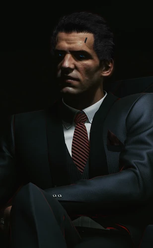

# 亚瑟·詹金斯

> 英文原名: **Arthur Jenkins**
> 职位: [[荒坂]] **反情报部门**资深成员 / 夜之城分部主管
> 生卒: 2033 — 2076（享年 43；黑发蓝眼）
> 配音: Alec Newman

## 身份

[[荒坂]] **反情报部门(Counter Intelligence)资深成员、夜之城分部主管** /
**公司 [[V]] 开局的直属上司** /
公司鼠辈 中**反被宿敌 [[苏珊·阿伯纳西]] 灭门**的核心责任人。
被荒坂下属称为"**一个极有能力的精神变态**"，这也正是他作为领导者高效的原因。

## 特征

- 荒坂夜之城分部反情报部门主管
- 在 [[V]] 公司开局阶段，是 V 的**直接上司 + 任务委派人**——
  据称他曾把 V 从远为艰难的人生里拉出来，V 因此对他负有恩情；
  同僚因此嫉妒，称 V 为"**詹金斯的人**"
- 与上司兼宿敌 [[苏珊·阿伯纳西]] 不共戴天——
  据他自称，两人当年在 大阪 共事时她背叛了他，
  并在调来夜之城前于董事会抹黑他、抢走他觊觎的主管升职，他始终无法释怀
- 危机处理上表现出**致命的失控**——
  面对许可被吊销的风险，第一反应是黑客攻击与暗杀，而非合规善后

## 关键事件

- 大阪时期被 [[苏珊·阿伯纳西]] 抹黑、抢走主管升职，结下死仇
- **2076 黑客攻击 [[欧洲航天局|欧洲太空理事会]]**——为保住月球云海许可而瘫痪投票
- 命 [[V]] 除掉阿伯纳西，并交付其私生活把柄数据芯片
- 计划被卡特·史密斯泄露 → **本人与反情报部门大部被阿伯纳西处决**
- 其倒台连带 [[V]] 被开除、清算，2077 主线开始
- 骨灰存放于 [[北橡树|骨灰堂]]（无论 V 出身如何皆可见其纪念位）

## 已知活动 / 深度档案

### 公司鼠辈：杀阿伯纳西的失败豪赌（2076）

#### 起因：法兰克福丑闻

一桩有关 法兰克福（德国）的破坏性泄露，
让 [[荒坂]] 面临失去 [[月球]] 云海(Sea of Clouds)设施许可的风险——
起因正是荒坂间谍在当地从事秘密活动被揭穿。

#### 詹金斯的决定：黑客攻击 + 暗杀

- 他下令对 [[欧洲航天局|欧洲太空理事会]] 发动**黑客攻击**，
  在吊销许可的投票通过前瘫痪委员会，为荒坂**拖延一周**
- 上司 [[苏珊·阿伯纳西]] 在线上看着投票，致电斥其手法太乱、善后费钱；
  积怨已深的詹金斯遂借机命 [[V]]"不惜一切手段"除掉阿伯纳西，
  并交给 V 一张满载她私生活（通奸、勒索等）把柄的数据芯片——
  **V 公司开局接到的真正任务，是刺杀阿伯纳西，而非攻击太空理事会**

#### 失败：早已被告密

- 他的部下、反情报特工 **卡特·史密斯**(Carter Smith) 早把阴谋透露给了阿伯纳西
- [[V]] 组织行动、在 莉琪酒吧(Lizzie's Bar) 与 [[杰克·威尔斯]] 谈合同时，
  突遭阿伯纳西的荒坂安保承包商袭击与审讯
- 把柄数据芯片被夺回；**詹金斯与反情报部门大部被处决**

### 詹金斯倒台的连带后果：V 被清算

- [[V]] 仅因 [[瓦伦蒂诺帮]] 与 [[莫克斯帮]] 同伴在 莉琪酒吧 维持秩序而幸免
- 虽被开除、近乎一无所有，却用詹金斯先前给的 **1 万欧元**重新起步
- [[杰克·威尔斯]] 成为其搭档，**2077 主线正式开始**

V 不是因犯错被开除——
V 是**被一场自己完全不知情的高层内斗连带牺牲**的下级。

## 关联

- [[荒坂]]——所属公司（反情报部门）
- [[V]]——直属下级 / 被他派去杀阿伯纳西、最终连带牺牲的人
- [[杰克·威尔斯]]——詹金斯倒台后与 V 搭档的雇佣兵
- [[苏珊·阿伯纳西]]——上司兼宿敌 / 反杀他全部门的胜者
- 卡特·史密斯(Carter Smith)——其部下，却向阿伯纳西告密
- 公司鼠辈——以他下令杀阿伯纳西为核心的 V 公司开局任务
- [[欧洲航天局|欧洲太空理事会]]——其黑客攻击的对象
- [[月球]]——云海许可危机的物理起点
- [[瓦伦蒂诺帮]] / [[莫克斯帮]]——莉琪酒吧维持秩序、间接救下 V 的帮派
- [[北橡树]]——其骨灰堂纪念位所在
- [[荒坂三郎]]——荒坂最高权力来源

## 关联原始资料

(暂无关联原始资料)

## 世界观意义

詹金斯是 [[公司统治]] 时代**公司中层政治失败者**的标本:

- 他不是反派,也不是受害者——
  他只是**被一次错误决策击穿的中层管理者**
- 面对许可危机，他的第一反应不是善后、不是政治周旋，
  而是**黑客攻击 + 暗杀宿敌**——
  这是公司化思维的极端表现:**所有问题都可以用消除目标来解决**
- 但他败给了两件事——
  一是**私怨压倒判断**：他借危机之机假公济私去杀阿伯纳西，
  把组织危机变成了个人复仇；
  二是**祸起萧墙**：泄密的不是敌人，而是他自己的部下卡特·史密斯——
  在 [[公司统治]] 时代，最危险的从来不是对面的公司，而是你以为忠于你的人
- 他倒台**直接决定了 [[V]] 的命运**——
  公司 V 的"被开除"叙事的真实驱动:
  > 不是 V 做错了什么,
  > 是 V 的上司输掉了一场她完全不知情的内部政治
- 詹金斯的案例同样揭示 [[公司统治]] 时代员工命运的本质:
  你随时可能因为上司的一次失败被清算,
  而你甚至不会知道清算自己的真正原因

## Tags

#人物 #荒坂 #公司开局 #反派 #失败者
