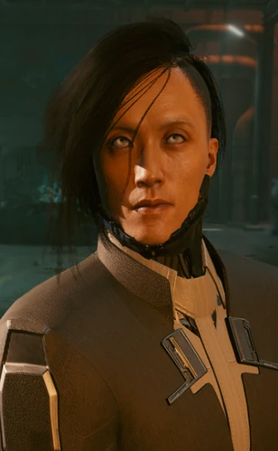

# 小田

> 英文原名: **Sandayu Oda**（小田 三太夫）
> 别名: 小田三太夫
> 身份: 荒坂赛博忍者 / [[荒坂华子]] 贴身护卫
> 家乡: 日本东京 / 卒于 2077 年夜之城日本街（视结局）
> 配音: Noshir Dalal

## 身份

受雇于 [[荒坂]] 的独狼兼赛博忍者，[[荒坂华子]] 的私人护卫。由 [[竹村五郎]] 亲手训练，精于近身格斗，擅用荒坂制式螳螂刀。

## 特征

- 纯粹的职业护卫——只忠于"保护华子"这一职责本身，刻意置身荒坂家族的权斗戏码之外
- 武艺高强，以荒坂螳螂刀近身作战
- 恪守武人信义，言出必行

## 关键事件

- 2077 年随 [[荒坂华子]] 乘荒坂巨型航母「鲸」（Kujira）抵达 [[夜之城]]——
  三郎遇害让游行被迫改为悼念基调,令本就对筹办方式存疑的小田更加警觉
- **码头密会**:应已背负"弑主同谋"嫌疑的 [[竹村五郎]] 之请,小田**独自驾车、未隐形**前来赴会以示信任;
  听完 V 关于 [[绀碧大厦]] 真相的陈述后,确认 V 确实是目击者,随即叫停谈话;
  临走撂下第二次也是最后一次警告——下次相遇绝不留情
- 撞破 V 正在瘫痪荒坂网络者的行动,与 V 交手
- **游行之夜**:他就安保漏洞向 [[荒坂赖宣]] 的安保头目 [[亚当·重锤]] 当面发难、质疑赖宣的决定,
  被重锤打发;他遂离开华子身边亲自处置乱局,正撞见 V 瘫痪荒坂网络者
- [[荒坂三郎]] 纪念游行中与 V 决斗（可被 V 击杀或放过），兑现"再相遇绝不留情"的承诺——
  战败后生死交由 V 裁决,[[竹村五郎]] 恳求 V 饶过这位昔日弟子

## 已知活动 / 深度档案

### 师承竹村

入荒坂后由 [[竹村五郎]] 训练成顶尖战士。二人在并肩作战中结下相互敬重与"荣誉之债"——这笔债约定在需要时被唤起，最终却以师徒在夜之城各为其主、兵戎相见的形式清算。

### 职业的边界

明知华子此行牵涉荒坂家族的暗流（[[荒坂三郎之死]] 后的继承清算），小田仍坚持只做"保住华子安全"这一件事，不站队、不介入。这份职业洁癖，让他成为家族戏码里少有的"干净"角色。

### 决斗结局(「保险起见」)

战败后小田的命运由 [[V]] 决定:

- **V 击杀小田**:[[竹村五郎]] 对此决定大为光火,扬言会记住 V 的所作所为
- **V 放过小田**:小田被送去接受治疗,皮肉伤易愈,但战败的自尊需要更久才能复原
- 无论生死,[[亚当·重锤]] 都会在后续结局战中评论:
  - 若放过——"你放过了小田。真是……有人性!恶心。慈悲令人作呕。"
  - 若击杀——"你杀了小田?好!他没用。"

### 荒坂塔之围(若 V 接受华子提议 + 竹村幸存)

- 若 [[竹村五郎]] 在游行后成功脱身,他会召集盟友强攻荒坂塔,小田即在其中
- 小田对 V 跟着华子走出电梯感到意外,但遵华子之命勉强接受这一安排
- [[荒坂三郎]] 的印记揭穿赖宣的背叛后,武装政变爆发;
  小田与竹村、V 一道杀回电梯、清场,随后**留下护卫华子与 [[荒坂美知子]]**,
  由竹村与 V 继续攻向荒坂塔高层
- 若竹村未能在游行中幸存,小田便不会出现在荒坂塔

### 装备

- 义体:荒坂螳螂刀、光学迷彩(纳米投影近乎隐形)、轻型皮下装甲
- 能力:战斗兴奋剂、闪光弹
- 武器:TKI-20 信玄(Shingen)、沉钟丸(Jinchu-Maru,曾持有)

## 关联

- [[荒坂华子]]——护卫对象
- [[竹村五郎]]——授业恩师，后成对手
- [[荒坂]]——雇主
- [[V]]——交手对手 / 决定其生死的人
- [[亚当·重锤]]——同为荒坂的武力工具，路数迥异;游行夜曾被其打发,亦会评论其生死
- [[荒坂美知子]]——荒坂塔政变中与华子一同被小田护卫
- [[荒坂赖宣]]——其安保安排被小田当面质疑

## 关联原始资料

(暂无关联原始资料)

## 世界观意义

小田是 [[公司统治]] 时代"纯粹职业性"的极端样本：

- 他把"忠诚"压缩到最小单位——只忠于职责，不忠于家族政治，以此保住一份洁净
- 但在公司逻辑里，再纯粹的职业操守也无法独立存在：他终究要为荒坂的权斗挡刀，与恩师为敌
- 师徒在敌对阵营相残，是荒坂"以人为刃"的缩影——它收编每一个有本事的人，再让他们彼此消耗

## Tags

#人物 #荒坂 #忍者 #武士
