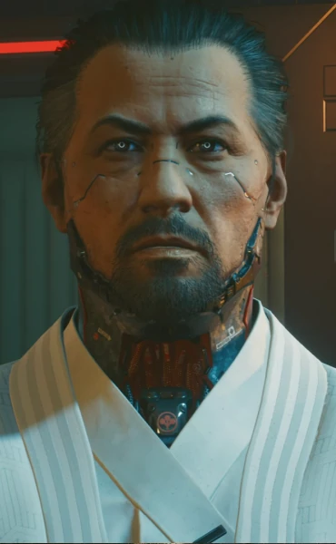

# 竹村五郎

> 英文原名: **Goro Takemura**（竹村 五郎）
> 别名: 老竹 / 荒坂头号通缉逃犯
> 出身: 东京千叶-11 / 荒坂三郎贴身护卫（前）
> 生日: 10 月 23 日 / 家乡: 日本关东
> 配音: Rome Kanda（神田ローム）

## 身份

[[荒坂三郎]] 的前贴身护卫，一名固守荣誉与忠诚的老派武士型保镖。三郎遇害后被荒坂集团反咬替罪、通缉追杀，沦为流落 [[夜之城]] 的流亡者，最终成为 V 在主线中最重要的盟友之一。

## 特征

### 出身

生于 [[东京]] 杀人率最高的贫民窟千叶-11。母亲下落不明，父亲在厨房全职劳作，由祖母带大——祖母讲述的妖怪故事是他童年仅有的温情。荒坂军用运输队会定期穿过千叶-11，从街区挑选孩童征召入伍；孩子们听信"只有最干净的孩子才会被选中"的传言，跑到污染的运河里洗衬衫。他被选中，将这一刻形容为"中了彩票"——从此脱离贫困。

### 经历

作为荒坂士兵历经无数武装冲突，以学院第一名毕业，最终被三郎钦点为贴身护卫，这是他从东京阴沟一路爬升的终点。三郎为他配备了包括**内骨骼**在内的专属义体。

### 性格

体现传统日本的荣誉本位价值观，对三郎近乎父辈般的崇敬。一双标志性的白色义眼。设定上是个"美食家"，坚持传统烹饪、对现代科技笨手笨脚——这些生活化细节被刻意用来软化他僵硬的公司忠诚形象。

## 关键事件

- [[荒坂三郎之死]]——在 [[绀碧大厦]] 顶层目睹 [[荒坂赖宣]] 弑父，事发前数秒被三郎支开房间，差点撞破躲藏的 V 与 [[杰克·威尔斯]]
- 被赖宣构陷"未能阻止主君遇害"，遭剥夺一切头衔、被赏金猎人追杀，关闭植入体重新流落街头
- 追查盗窃团伙,逼迫 [[德克斯特·德肖恩]] 带他找到被弃尸垃圾场的 V——把 V 从垃圾堆里拖出救活,随后一枪处决德肖恩;之后两人遭赖宣派出的摩托杀手伏击,竹村受伤、V 濒死
- 与 V 结盟，追查 [[Relic]] 与逃亡的 [[安德斯·赫尔曼]]
- **梦幻祭游行**:为接近来夜之城巡游的 [[荒坂华子]],竹村带 V 上花车揭露真相,
  华子拒听并欲逃,竹村用麻醉枪将其击晕**劫走**
- 「搜寻与毁灭」——荒坂部队攻入藏身处用身体替华子挡枪,华子被 [[亚当·重锤]] 带走;
  此役决定竹村生死(见下方结局分支),其间与徒弟 [[小田]] 对决

## 已知活动 / 深度档案

### 与赫尔曼的追猎

流亡期间，竹村锁定了荒坂生物芯片专家 [[安德斯·赫尔曼]] 作为破解 V 体内 [[Relic]] 的关键，与 V 联手将其从 [[军用科技]] 的护送车队中劫走。这条线把竹村的"复仇"与 V 的"求生"绑在了一起。

### 与华子的押注

竹村始终相信荒坂内部仍存正义，把希望寄托在三郎之女 [[荒坂华子]] 身上，劝说 V 走"联系华子、揭发赖宣"的路线。这条路通向荒坂家族内部的清算。

### 「搜寻与毁灭」的生死分支

竹村的存亡取决于 V 在「搜寻与毁灭」中的选择:

- **抛下竹村**:V 独自逃离藏身处,竹村独力抵抗荒坂部队直至阵亡
- **折返救他**:V 无视 [[强尼银手]] 的劝告返回,与被压制在卧室的竹村并肩杀出公寓;
  脱险后竹村坚持与 V 分头逃命,随后被 [[荒坂华子]] 接走安置到安全地点,
  并发短信向 V 致谢、表达关切

### 结局分支(竹村幸存的前提下)

- **V 不站队华子(任意非荒坂结局)**:目睹 V 突袭荒坂塔、荒坂衰落后,
  竹村承认自己未能为三郎复仇;最后留言谈及"辞世"(jisei)——
  他觉得古代武士的辞世诗很美,但自认配不上,于是只给 V 留下一句**"下地狱去吧"**的临别诅咒
- **V 接受华子提议(夜想曲)**:竹村与 [[安德斯·赫尔曼]] 在 [[米丝蒂]] 的店与 V 会合,
  护送华子杀入荒坂塔向董事会摊牌,途中击败 [[亚当·重锤]];
  在通往赖宣办公室前,竹村选择**留下**——因为他若进门必会杀掉赖宣、违背华子"不许伤其分毫"的命令
  - 一个月后竹村到荒坂轨道空间站探望 V,透露自己已被调任香川县高松、不再担任护卫;
    带来的真正消息是手术失败、V 仍将死去,代表华子提出最后活路——
    把 V 卖给赫尔曼、加入"灵魂保险"计划,作为印记进入神舆(Mikoshi)等待相容躯体
    - **V 拒绝交易**:V 说想要自由——那是竹村从未拥有过的东西——转身离去
    - **V 接受交易**:竹村称这是好选择,邀 V 病愈后到香川做客、请 V 吃"真正的食物"
- **V 求助 [[所罗门·李德]] / NUSA(往日之影交叉)**:NUSA 外科手术虽成功却令 V 昏迷两年;
  与此同时竹村与华子强攻荒坂塔的政变失败、**华子被杀**,
  赖宣反诬竹村"谋杀其妹",令他再度沦为通缉逃犯、对荒坂的信仰彻底崩塌;
  两年后他得知苏醒的 V 已回夜之城并成功摘除 [[Relic]],发来一条苦涩的祝贺——
  引一句武士古谚"良药苦口",称 V 对他而言正是一剂极苦的良药

### 师徒

亲手训练了赛博忍者 [[小田]]，二人在并肩作战中结下武人之间的相互敬重与"荣誉之债"——这笔债在二人于夜之城兵戎相见时被清算。

### 装备

- 义体:赛博光眼(标志性白色义眼,曾配专属内骨骼,流亡后多数被移除或停用)、轻型皮下装甲、Kerenzikov 神经增强
- 能力:战斗兴奋剂、闪光弹
- 武器:JKE-X2 剑信(Kenshin)、TKI-20 信玄(Shingen)、HJSH-18 正宗(Masamune)
- 载具:水谷 Shion Targa MZT(曾)、哥伦布 V340-F 货运车

### 趣闻:被认成喜剧明星"秀志日野"

「街头巡游」任务中,若孔子大妈店门口的老人会把竹村错认成过气深夜喜剧演员**秀志日野**(Hideshi Hino),解锁一系列幽默对话。这条支线在《往日之影》主线「你知我名」中可延续——派对上一个"竹村替身"正是秀志日野本人,他在找替身演员。

## 关联

- [[荒坂三郎]]——崇敬如父的主君
- [[荒坂赖宣]]——弑父者，构陷竹村的人
- [[荒坂华子]]——竹村押注的"荒坂正义"
- [[小田]]——亲手训练的徒弟，后成对手
- [[荒坂]]——曾奉献一生、最终将他通缉的组织
- [[亚当·重锤]]——荒坂的另一把利刃，与竹村的"武士"形成镜像反差
- [[V]]——流亡期间最重要的盟友
- [[德克斯特·德肖恩]]——劫案策划者,被竹村处决于垃圾场
- [[安德斯·赫尔曼]]——与 V 联手劫走的荒坂生物芯片专家
- [[所罗门·李德]]——若 V 求助 NUSA 摘除印记,竹村线将走向政变失败、华子被杀、再度被通缉
- [[绀碧大厦]]——三郎遇害、竹村人生转折之地

## 关联原始资料

(暂无关联原始资料)

## 世界观意义

竹村是 [[公司统治]] 时代"忠诚"这一命题的活体标本：

- 他把一生献给荒坂，把主君当父亲，把公司当家族——而公司回报他的是构陷与通缉。忠诚在公司逻辑里不是美德，只是可消耗的资产
- 他坚信组织内部存在"正义"（华子），这份信念既是他最动人的地方，也是他最大的盲区
- 美食、笨拙、妖怪故事——这些"人味"细节恰恰说明：在荒坂体系里，越是有人性的人，越无法生存
- 他与 [[亚当·重锤]] 构成同一家公司的两极：一个被荣誉所困而出局，一个抛弃人性而升迁——公司奖励的是后者

## Tags

#人物 #荒坂 #武士 #流亡 #同伴
