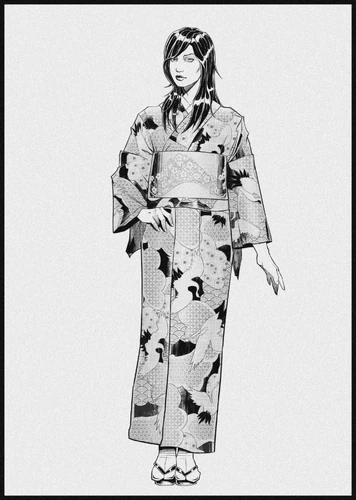

# 美智子

> 英文原名: **Michiko Arasaka**（荒坂 美智子）
> 生于 1954 年 12 月 10 日,京都 / 卒于 1999 年 3 月 2 日,东京
> 注意:勿与 [[荒坂美知子]]([[荒坂敬]] 之女、Danger Gal CEO)混淆——本条目是三郎之妻

## 身份

[[荒坂三郎]] 第三任也是最后一任妻子 / [[荒坂赖宣]] 与 [[荒坂华子]] 之母 /
旧时代日本贵族女性

## 特征

- 出身京都豪门,曾就读日本顶尖大学,以**优雅美貌**闻名京都
- 几乎从不关心国门之外的世界,**一生从未离开过日本**——
  她深爱日本,渴望看到它在二战创伤后重新强大
- 经人引荐结识 [[荒坂三郎]] 时,他已年逾八旬;
  她被三郎"让日本强大"的激情与决心打动,虽不了解 [[荒坂]] 集团的具体内情,
  仍认定三郎是高尚之人,相识一年后便嫁给他
- 与三郎长子(继子)[[荒坂敬]] 始终不亲近——敬常年在外,二人几乎不相熟
- 从未在荒坂家族生意中出任任何重要职位

## 关键事件

- **1995 年**:生下长子 [[荒坂赖宣]]
- **1999 年 3 月**:生下三郎唯一的女儿 [[荒坂华子]],
  随即因分娩并发症去世——华子的出生与母亲的死亡几乎同时发生
- 她死后三郎**终生未再娶**:在三郎心中,美智子是他最钟爱的妻子,无人能及
- 赖宣与华子姐弟感情极深,即便日后被分隔两地仍彼此扶持——
  这份纽带可追溯到二人共同失去母亲的童年

## 已知活动 / 深度档案

(暂无更深档案)

## 关联

- 丈夫:[[荒坂三郎]]——年逾八旬时迎娶她,她死后他终生未再娶
- 长子:[[荒坂赖宣]]——1995 年所生;
  其与父亲的对抗在很多年里以母亲为"中间情感支点"
- 女儿:[[荒坂华子]]——1999 年所生,母亲难产去世;
  童年与母亲极度亲近(参见 [[无言花。荒坂华子传记。]])
- 继子:[[荒坂敬]]——非美智子所生,二人不亲近
- 孙女(继子之女):[[荒坂美知子]]——荒坂敬之女、Danger Gal CEO(同名不同人)

## 关联原始资料

- [[无言花。荒坂华子传记。]]

## 世界观意义

美智子是 [[公司统治]] 时代**"超企业家族中的隐形女性"**的样本:

- 与 [[荒坂华子]] 同样代表"被家族传统隔离的女性"——
  但华子最终走出深闺,美智子终生没有,甚至连国门都未曾迈出
- 她的"几乎不出门"不是个人选择,而是 [[荒坂]] 家族
  对**配偶政治价值**的极致定义:不需要她做事,只需要她生
- 她因生育华子而死,却也因此被三郎奉为"最钟爱的妻子"永远供奉——
  这是日本贵族传统在 21 世纪企业帝国中最冷酷的延续:
  女性的价值被压缩为"诞下继承人"这一个动作,完成即可被神圣化、也可被消耗
- 公司战争之后,荒坂的家庭结构反而比商业结构更接近"旧世界"

## Tags

#人物 #荒坂 #家族
