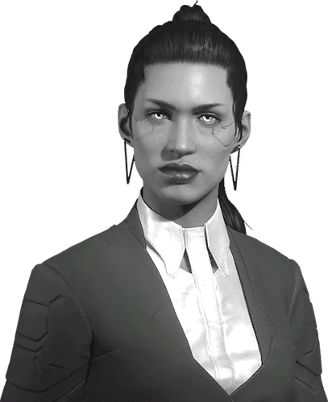

# 苏珊·阿伯纳西

> 英文名: Susan Abernathy

## 身份

[[荒坂]] 高管 / **[[亚瑟·詹金斯]] 的政治对手** /
[[月球质量投射器事件]] 中**反向举报取胜**的政治赢家

## 特征

- 荒坂内部高级管理者
- 与 [[亚瑟·詹金斯]] 属于**同级别政治对手**
- 政治嗅觉极强——
  能在詹金斯刚开始计划灭口阶段就**提前察觉**
- 做事风格选择**走正规向上举报**而非自行处理,
  既消灭对手又不沾血——典型的公司高层政治操作

## 关键事件

- [[月球质量投射器事件]]——其政治胜利的舞台
- 反向举报 [[亚瑟·詹金斯]],使其遭总部清洗
- 间接触发 [[V]] 被清算与 2077 主线开启

## 已知活动 / 深度档案

### [[月球质量投射器事件]] 中的胜利

2076 年事件中,阿伯纳西的角色:

#### 探得 Jenkins 的灭口计划

[[军用科技]] 把荒坂月球质量投射器消息捅给 ESA 后,
[[亚瑟·詹金斯]]——负责处理这场危机的反情报高层——
慌乱中决定**暗杀 ESA 委员会成员**。

阿伯纳西**提前发现了**这个计划。

#### 直接向更高层举报

她没有自己处理詹金斯,而是**绕过中层、直接上报**——
让总部出手清算詹金斯。

这是公司化政治的标准操作:**用上级的手刀对手**。

#### 结果链

- 詹金斯被**清洗**
- [[V]](詹金斯直属下级)账户冻结、权限取消
- [[杰克·威尔斯]] 救下 V
- **2077 主线正式开始**

阿伯纳西本人在事件后获得政治升迁(具体职位未明确)。

## 关联

- [[荒坂]]——所属公司
- [[亚瑟·詹金斯]]——直接政治对手 / 被她举报清洗的人
- [[V]]——被詹金斯倒台连带清洗的下级(她不是直接对手,但是她举报的间接结果)
- [[月球质量投射器事件]]——其政治胜利的舞台
- [[军用科技]]——危机的源头方
- ESA——詹金斯灭口目标方(被阿伯纳西举报间接保住)
- [[荒坂三郎]]——清洗令的下达方

## 关联原始资料

(暂无关联原始资料)

## 世界观意义

阿伯纳西是 [[公司统治]] 时代**公司高层政治赢家**的标本:

- 与 [[亚瑟·詹金斯]] 形成完美对照——
  詹金斯遇到危机用灭口,阿伯纳西用举报;
  詹金斯的灭口需要执行人(V)+ 风险(被反举报),
  阿伯纳西的举报只需一封情报和正确的上级——
  **公司政治的胜负不是看谁更强,而是看谁的选择更合规**
- "用上级的手刀对手"——
  这是 [[公司统治]] 时代企业政治的核心算法:
  > 不要自己动手,让公司的清洗机制为你工作。
  - 你不用承担杀人风险
  - 你的对手被合规处理
  - 你自动接管对手留下的权力空缺
- 她的胜利直接决定了 [[V]] 的命运——
  讽刺的是,阿伯纳西**根本不认识 V**,
  V 的整个人生轨迹被一个素未谋面的高管的一次政治操作改写
- 这印证了 [[公司统治]] 时代基层员工的核心宿命:
  > 你不需要被针对就会被牺牲——
  > 你的上司输给一个你不认识的人,你就跟着被清算

## Tags

#人物 #荒坂 #公司开局 #政治赢家
