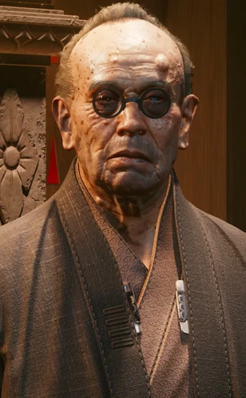

# 荒坂三郎

> 英文名: Saburo Arasaka

## 身份

[[荒坂]] CEO、董事长与家主 / 前日本帝国海军航空兵中尉 / 肉体已死亡、意识印记状态取决于结局 /
**皇帝**牌映射（[[塔罗牌涂鸦]]，涂鸦位于 [[绀碧大厦]] 大门外）——绝对统治、法律秩序、威严父权

## 特征

- **生卒**：1919 年生于 [[东京]]；2077 年 5 月在 [[绀碧大厦]] 被杀，享年 158 岁
- **外号**："皇帝"（The Emperor）；被视为 21 世纪最有权势的人物之一
- 极端自律、固执而冷酷，以传统、家族荣誉与服从为最高准则
- 强烈的日本民族主义者；把公司的商业扩张视为恢复日本世界地位的手段
- 三段婚姻；长子 [[荒坂敬]] 来自第一段婚姻，第三任妻子 [[美智子]] 育有 [[荒坂赖宣]]、[[荒坂华子]]
- 二战重伤造成左眼失明、左臂残废；后来接受多次义体与延寿治疗

## 关键事件

- **1942 年瓜达尔卡纳尔空战**——座机遭美军战斗机击中，重伤后仍独自飞回拉包尔，自此无法继续服役
- **1945 年日本投降**——一度准备切腹，临死前转而决定以经济与政治力量重建日本的世界地位
- **1960 年接掌荒坂**——父亲荒坂笹井去世后继任 CEO，把家族制造企业扩展成银行、安保与军工帝国
- **2013 年夺取 [[灵魂杀手]]**——下令绑架 [[奥特·坎宁安]]，要求她为荒坂重制程序，开启公司此后数十年的意识技术路线
- [[荒坂赖宣离家事件]]——在三郎与赖宣的密谈后，赖宣离家
- 宣布与 [[荒坂赖宣]] 断绝关系
- [[第四次公司战争]]——把战争指挥交给 [[荒坂敬]]，自己仍是幕后最高决策者；战败后失去长子与北美业务
- [[荒坂家和解事件]]——在敬的葬礼上与赖宣和解
- [[荒坂三郎之死]]——2077 年亲赴夜之城追回 Relic，在绀碧大厦被赖宣扼死

## 已知活动 / 深度档案

### 从海军飞行员到企业民族主义者（1919—1960）

- 出生于 [[荒坂]] 创始人荒坂笹井与荒坂由衣之家，自幼在东京郊外的家族宅邸接触公司事务；荒坂家自称拥有武士血统
- 二战期间加入日本帝国海军航空兵，23 岁已升为中尉，并有超过 20 次确认击坠记录
- 1942 年护航九六式陆上攻击机轰炸瓜达尔卡纳尔岛时遭伏击，左眼与左臂受到永久性损伤；他在重伤、近乎失去意识的情况下仍完成约 560 英里的返航
- 1945 年 8 月 15 日听到日本投降广播后准备切腹，却在最后一刻意识到父亲已把大量战时财富藏在海外；此后把"军事征服"改写为以资本、依赖和政治渗透完成的经济征服
- 战后系统研习经济、政治与历史，为继承公司作准备；此后几乎不再谈论自己的战争经历

### 建造荒坂帝国（1960—2020）

- 1960 年，41 岁的三郎在父亲去世后接任 CEO；他不是公司的创始人，却是把荒坂塑造成跨国帝国的人
- 在原有制造业外建立**荒坂银行**，并于 1970 年创设**荒坂安保**，形成制造、金融与安保三大支柱
- 商业体系同时服务于隐蔽政治控制：安保部门从客户处收集情报，银行向陷入困境的企业提供带条件的资金，黑色行动则通过贿赂、勒索、绑架与暗杀换取影响力
- 预判 1994 年全球市场崩盘与 1996 年美国解体并从中扩张，使荒坂升至世界级企业前列；在日本国内扶植政客、推动防卫机构扩权，也让企业警务接管多座城市的治安
- 对外塑造"国家建设者"与就业提供者形象，对内则以家主身份保留最终决定权。即使 2020 年把 CEO 职务交给长子 [[荒坂敬]]，仍通过董事长地位在幕后控制重大决策

### 家族即继承机器

- 三郎直到六十多岁才有长子 [[荒坂敬]]，并从小将其培养为企业继承人；敬对父亲的认可极度依赖
- 赖宣从东京大学毕业后，三郎向他揭示荒坂真正的长期目标，反而促使赖宣出走并组织 [[钢铁之龙]]；三郎虽痛苦，最终仍接受敬提出的"必须消灭威胁"
- 他把华子长期留在家族宅邸、隔绝于外部世界，并让她成为自己在公司内部鸽派中的代理人。这种保护也是一种控制
- 2040 年代以后，荒坂内部形成华子的雉派、赖宣的鹰派与孙女 [[荒坂美知子]] 的鸽派；三郎并无真正交权意愿，派系竞争反而维持了他的最终仲裁权

### 灵魂杀手、神舆与永生

- 2013 年获知 [[奥特·坎宁安]] 创造的 [[灵魂杀手]] 后，下令美国分部将她绑走并重制程序；荒坂由此取得复制、囚禁人格意识的能力
- 在红色时代以后长期投资生物工程、组织再生和意识保存，并使用医疗舱延缓衰老
- 晚年已把自己的意识制成印记，储存在东京荒坂总部的 [[神舆]] 中；[[Relic]] 2.0 则把目标从"保存死者"推进到"让印记覆盖并接管活体"

### 直接掌控的核心项目

- **[[Relic]] 2.0**——亲笔批准人（参见 [[RELIC 2.0 原型规格说明]]）
  - 项目代号 M-AH-76/-38272/SA
  - 监督人 [[安德斯·赫尔曼]]
  - 这一签批意味着意识 / 印记 / [[灵魂杀手]] 等核心技术线由家主亲自决策
  - 荒坂家族的"神舆"印记库由此具有最高政治位阶

### 2077 年的最后航程

- [[荒坂赖宣]] 从东京实验室盗走装有 [[强尼银手]] 印记的 Relic 原型后，[[安德斯·赫尔曼]] 向三郎报告；三郎与华子乘"鲸号"来到夜之城
- 其私人日记显示，他甚至考虑过动用质量投射器毁灭夜之城，以免 Relic 落入敌手，但因华子也在城中而放弃
- 三郎拒绝让华子代为劝说赖宣，独自进入绀碧大厦套房对质。赖宣在争执中将他扼死，随后谎称父亲遭到毒杀
- 肉体死亡并未终结他的政治存在：华子仍能通过已保存的印记与他交谈，并将其作为揭露赖宣的最高权威

### 结局分歧

- **《恶魔》路线**：华子清除赖宣的意识，让三郎的印记接管其身体。三郎以"儿子自愿献身"包装事实，成为数字永生公开化的第一个统治者
- **袭击荒坂塔的路线**：[[神舆]] 被毁，其印记与其他囚禁意识一起被 [[奥特·坎宁安]] 吸收；赖宣继续从内部瓦解荒坂
- 因而，"三郎复活"不是全局固定事实；固定事实只有他的肉体死亡，以及死前已完成意识备份

## 关联

- 长子 [[荒坂敬]]——已故
- 次子 [[荒坂赖宣]]——曾被断绝父子关系，后和解
- 女儿 [[荒坂华子]]
- 第三任妻子 [[美智子]]
- 孙女 [[荒坂美知子]]——敬之女，荒坂内部鸽派代表
- [[竹村五郎]]——贴身护卫，对三郎怀有近似封建家臣式的忠诚
- [[安德斯·赫尔曼]]——Relic 项目负责人
- [[奥特·坎宁安]]——被荒坂绑架、其发明遭三郎武器化
- [[唐纳德·伦迪]]——军用科技领袖，三郎在第四次公司战争中的宿敌

## 关联原始资料

- [[RELIC 2.0 原型规格说明]]
- [[绀碧大厦]]

### 外部资料

- [Cyberpunk Wiki：Saburo Arasaka](https://cyberpunk.fandom.com/wiki/Saburo_Arasaka)——汇总《Corporation Report 2020 Vol. 1》《Firestorm》系列、《Cyberpunk RED》与《Cyberpunk 2077》的生平资料
- [Cyberpunk Wiki：Arasaka](https://cyberpunk.fandom.com/wiki/Arasaka)——公司沿革与三郎掌权时期

## 世界观意义

三郎是 [[公司统治]] 中"家族 = 公司"逻辑的人格化身：
继承权之争即公司继承之争，断绝父子关系即等同于政治判决。
他的死亡同时是企业事件、家族事件、地缘政治事件——
继任问题（[[荒坂华子]] vs [[荒坂赖宣]]）因此具有跨国冲击力。

由他亲自签批的 [[Relic]] 2.0 进一步揭示他的统治维度：
不仅控制公司、家族、城市，还试图握有**死亡之后的入口**——
意识技术是他最个人化的政治资产。

他在 1945 年的转变揭示了荒坂帝国最核心的历史逻辑：三郎并未放弃征服，只是把战斗机与军舰换成了银行贷款、安保合同、基础设施和数据垄断。客户越依赖荒坂，越难反抗荒坂；商业服务因此成为没有宣战书的占领。

他与赖宣的冲突也不只是"严父与逆子"。三郎相信家族、国家与公司可以由同一个意志永久统治，赖宣则认定只有摧毁整个集团才能终止这种统治。最终三郎甚至把儿子的肉体视为可继承资产，令父权、企业兼并和数字殖民在同一具身体上合流。

## Tags

#人物 #核心 #荒坂
