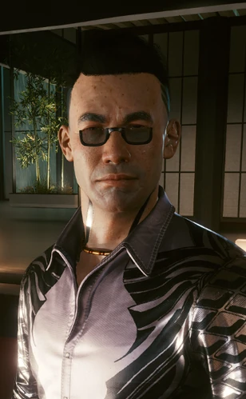

# 荒坂赖宣

> 英文名: **Yorinobu Arasaka**（荒坂 頼宣）
> 昵称: Yori
> 生于 1995 年 9 月 8 日,东京 / 配音: Hideo Kimura（木村英夫）

## 身份

[[荒坂]] 次子(三郎之子中唯一在世者)/ 前 [[钢铁之龙]] 暴走族首领、摇滚客 /
四次公司战争后回归的继承人 / 2045 年起 **鹰派(Taka / 鷹)首脑** /
2077 年弑父夺权、出任 [[荒坂]] CEO /
**月亮**牌映射（[[塔罗牌涂鸦]]，涂鸦位于其北橡区豪宅外墙）——华丽表象下的痛苦变态内心

他是东京街头版的"[[强尼银手]] 对位"——同样煽动公众反抗公司霸权,只是不组乐队。

## 特征

- 1995 年生于 [[东京]]，[[荒坂三郎]] 与 [[美智子]] 的长子(三郎的次子,异母兄是 [[荒坂敬]])
- 自幼享尽荒坂家族的财富与全国最好的教育,与妹妹 [[荒坂华子]] 在家族大宅里度过公认幸福的童年——
  三郎刻意向他隐瞒公司的真实面目,直到"他准备好"
- **21 岁自东京大学毕业次日**,三郎在私人居所向他揭示荒坂的真实本质;
  不同于赞同父亲的异母兄敬,赖宣内心**暗暗厌恶却选择沉默**,当晚溜出大宅、消失在东京夜色里
- 四年后他纠集一帮强悍的东京暴走族,组成**钢铁之龙**(Kotetsu no Ryū),
  发誓揭露并摧毁荒坂;也曾另组"铁莲"(Iron Lotus)帮派
- 能在街头与公司高塔两个世界**游刃有余**;不骑车时便周游世界,
  会见荒坂的其他敌人、筹措资金与装备
- 与妹妹华子始终保持每月一次的秘密网络联络,暗誓有朝一日把她从父亲掌控中解救出来

## 关键事件

- [[荒坂赖宣离家事件]]
- 四次公司战争(2021–2023):拒绝 [[军用科技]] 的拉拢,转而向日本政府提供情报、
  助其将荒坂资产国有化;但战争与荒坂塔恐袭仍未能摧毁荒坂——他由此悟到**只能从内部摧毁**
- [[荒坂家和解事件]]:战后出席异母兄 [[荒坂敬]] 的葬礼,在妹妹华子帮助下与父亲和解、重回家族
- **盗取 Relic 原型**:2077 年与网络监察运营经理罗纳德·奇弗(Ronald Cheever)密谋,
  从父亲东京实验室窃走 [[Relic]] 原型,并刻意将其上印记设为 [[强尼银手]];
  [[安德斯·赫尔曼]] 警告他芯片尚未成熟、且劝他动手前先与父亲谈
- **[[荒坂三郎之死]]——亲手弑父**：父亲三郎亲赴夜之城追回失物、独自当面对质,
  赖宣盛怒之下在 [[绀碧大厦]] 顶层**扼死父亲**,事后谎称遭刺客下毒;被 [[V]] 和 [[杰克·威尔斯]] 偶然目击
- 夺取荒坂全部控制权后开始**从内部破坏**:撤除福冈、北九州的设施
- [[荒坂三郎]] 纪念游行中华子被劫,他与安保头目 [[亚当·重锤]] 迅速将其救回,
  公开宣称"伤害荒坂家族者必受惩罚";其间小田与 [[V]] 决斗
- **荒坂塔紧急董事会 + 军事政变**:召集东京高管与巴黎、上海、金沙萨各分部主管,
  下令忠于其鹰派的部队**剿灭其余派系、清除董事会**,以夺取荒坂的彻底控制权

## 已知活动 / 深度档案

### 真实政治路线

弑父并非情绪冲动，而是**对父亲数字永生路线的根本反对**：

- 三郎晚年押注 [[Relic]] / [[灵魂杀手]] / 神舆——
  试图通过印记实现意识层面的永久统治
- 赖宣选择在父亲完成"备份"之前**抢先终结其肉身**
- 但这一谋杀的胜利是临时的：
  在 [[V]] 大结局之一中，赖宣的计划成功 → [[荒坂]] 帝国全球土崩瓦解
  在另一结局中，三郎仍然通过神舆全面复活 → 赖宣失败
- 换言之，赖宣的弑父行为本身就是与父亲意识技术的赛跑

### 真实动机:不为权力,只为消除恐惧

赖宣毕生唯一目标是终结荒坂、终结父亲在世人心中种下的**恐惧**:

- 三郎曾告诉他"一切价值不过是风中之旗,而风就是恐惧"——赖宣是少数不惧父亲的人
- 他从不想掌权;按其数据库设定,他甚至"宁可当个享乐的亿万富翁"——
  铁腕夺权只是摧毁荒坂的手段,而非目的

### 结局分支

- **荒坂受创 / 破坏成功的尾声**:赖宣成功瓦解荒坂帝国,公司丧失大量政治权力与全球控制力,
  [[Relic]] 项目下马、损失数十亿、前途未卜;赖宣返回东京总部,为成为牺牲品的妹妹华子哀悼
- **夜想曲(V 接受华子提议)→ 魔鬼结局**:华子与 [[V]] 强攻荒坂塔上层推翻赖宣;
  赖宣向 V 坦白自己竭尽所能只为终结荒坂、把人们从对父亲的恐惧中解放,而非贪图权力;
  若 V 成功,赖宣的自杀被阻止,华子安慰悲痛的弟弟——
  他说自己不惧即将到来的后果,而那后果正是:**他的意识被抹除、被 [[荒坂三郎]] 的印记取代**
  (即三郎"复活"于赖宣体内,呼应 [[罗莎琳德·迈尔斯]] 档案中的"复活"对峙)
- **2079(V 接受 [[所罗门·李德]] 提议、把百灵鸟交给 NUSA)**:V 昏迷苏醒回到夜之城后,
  可在德拉曼出租车上听到广播——赖宣被认定为荒坂内部破坏者、遭董事会驱逐,事后据传随流浪者出走

### 装备(2077)

- 武器:**金刚**(Kongou)手枪——赖宣的标志性配枪,V 可在 [[绀碧大厦]] 顺走(弑父本身是徒手扼杀)
- 服装:钢铁之龙外套(Kōtetsu no Ryū coat)、正装衬衫与西裤

## 关联

- 父亲 [[荒坂三郎]]——被其亲手扼死
- 母亲 [[美智子]]
- 异母兄 [[荒坂敬]]——曾发誓为父亲报复赖宣；后在敬的葬礼上赖宣与父亲和解
- 妹妹 [[荒坂华子]]——关系亲密，在和解与最终结局中都扮演关键角色
- 侄女 [[荒坂美知子]]——荒坂敬之女;游行与他配合、董事会政变中险遭其部队屠杀
- 前情人 [[艾芙琳·帕克]]——经她牵线引出整场劫案
- 安保头目 [[亚当·重锤]]——为他效力、营救华子、并在结局战中阻挡 V
- 组织 [[钢铁之龙]]
- [[强尼银手]]——东京街头的反公司对位;赖宣刻意让窃取的 Relic 印记成为强尼

## 关联原始资料

- [[绀碧大厦]]
## 世界观意义

赖宣是 [[公司统治]] 内部裂缝的活样本：
- 主动放弃继承权 → 证明反公司情绪可以深入资本血脉
- 又回归家族 → 反抗的边界终究被血缘与权力收回
- **弑父**是这条弧线的终点，也是新形态的开始：
  他用最古典的暴力对抗最先进的技术——
  以肉身的死亡阻止意识的复活
- 离家、回归、弑父三段——是 [[公司统治]] 时代继承人少有的真正反叛轨迹
- 而**最终极的反讽**藏在魔鬼结局里:他扼死父亲是为了阻止三郎用印记永生,
  自己却在败北后被三郎的印记**夺舍覆写**——
  那具杀死父亲的肉身,反而成了父亲复活的容器。
  他想消灭的"恐惧之风",最后从他自己的躯壳里重新刮起

## Tags

#人物 #核心 #荒坂
