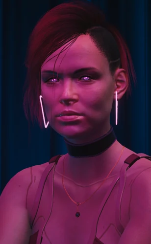

# 天光

> 英文名: Skylight
> 真身: 卡塞尔双胞胎姐弟 奥萝尔 (Aurore) + 艾默里克 (Aymeric) Cassel
> 出身: 法国 / 欧共体 · 生于 5 月 21 日 · 2077 年 6 月双双死于夜之城狗镇

## 身份

夜之城**冉冉升起的赛博犯罪新星** / 顶级网络客二人组的**共用网名** /
多家超级企业服务器被攻破的罪魁祸首。

**两层身份**:
- **公众层（媒体只知网名）**：在《[[天光 冉冉升起的网络新星]]》等报道里,
  天光"身份未明"——没人知道是男是女、是团体还是单人,
  这是夜之城档案中**匿名度最高的反公司样本**
- **真相层（《往日之影》揭穿）**：天光其实是一对法国**双胞胎网络客**——
  姐姐**奥萝尔·卡塞尔**(Aurore Cassel) 与弟弟**艾默里克·卡塞尔**(Aymeric Cassel)。
  讽刺的是,这对"最匿名的黑客"最终被 [[V]] 与卧底特工**盗走身份**、双双被处决

- 在网络上,天光是一个**身份未知**的传奇:没人知道是男是女、是团体还是单人——
  "我们唯一掌握的只有它的网名"
- 这是夜之城档案中**身份匿名度最高的反公司样本**
- 实为一对**形影不离的双胞胎**,极少分开行动;为最高出价者服务,游走于
  法国及西欧的高端客户、黑帮组织"**集团**"(Le Collectif) 与公司机密行动之间

### 姐姐:奥萝尔·卡塞尔（火爆的一半）

- 铜红色头发、金黄色眼睛;出身相对优渥、受过正规教育,却**永不知足**——
  渴望冒险、刺激与非凡体验,这把她推向法国犯罪组织"集团",也让她与之反目
- 曾在巴黎高度戒备的**桑泰监狱**(La Santé) VIP 区服刑五年,并被一个法国犯罪集团**悬赏追杀**
- 价值观:"道德是没钱的人才操心的小事";热爱时装秀,是 [[克里·欧罗迪恩]] 风格的拥趸
- 天生 GJB2 听力障碍,后经基因治疗矫正;最爱波本威士忌
- 在《往日之影》中被卧底特工 [[艾利克斯·谢纳基斯]] 处决

### 弟弟:艾默里克·卡塞尔（沉稳的一半）

- 红发、淡褐色眼睛;科班出身的软件工程师,酷爱冥想与昂贵跑车,
  奉行他所谓的"**精神洁癖**":远离一切成瘾物、滴酒不沾、对草莓严重过敏
- 曾短暂合法接活,但很快认定:与其给欧洲机构当一名量化分析师,
  不如为有组织犯罪与隐秘公司行动做黑客
- **定期把记忆转存到外置存储盘**——却也因此被盗走了 2073–2075 年的记忆,
  几乎失去了他为 [[沛卓石化]] 工作那段时间的全部记忆
- 古典车收藏家;来夜之城的目的之一是从杰里迈亚·格雷森手中买下**强尼的保时捷 911**
- 在《往日之影》中被联邦情报局特工 [[所罗门·李德]] 处决

## 关键事件

- **十几次顶级企业服务器入侵**——盗走沛卓石化、[[泽塔科技]]、岐路司、[[生物技术]] 数据
- **生物技术敏感数据公开拍卖**——使 70 人案 / 血腥收割 / 乔安妮·科奇 等机密在黑市流通
- **受雇重启 [[小北斗计划]]（Cynosure）**——为 [[军用科技]] 捕获并驯化 [[黑墙]] 之外的 AI
- **应汉森之邀激活 [[神经矩阵]]**——2077 年被请到狗镇,成为往日之影谍战的导火索之一
- **身份被盗、双双被处决**（2077 年 6 月,狗镇）

## 已知活动 / 深度档案

### 已知战绩

据《[[天光 冉冉升起的网络新星]]》——

天光对全网最安全的服务器发起过**至少十几次**赛博攻击,盗走了:

- **沛卓石化**数据
- **泽塔科技**数据(参见 [[泽塔科技]]——其要塞"恶魔岛"曾被 [[蜘蛛墨菲]] 攻破)
- **岐路司**数据([[刃]] 公司的合作光学植入体伙伴)
- **生物技术**([[生物技术]])数据——**敏感数据失窃后被公开拍卖**

后一条尤其关键:

- 生物技术([[生物技术]])的敏感数据失窃 + **公开拍卖**
- 这意味着 70 人案 / 血腥收割 / 乔安妮·科奇 / 海外士兵免疫实验等
  **任何机密都可能已在黑市流通**
- 这是 [[公司统治]] 时代**公司数据无法被永远封锁**的最直接证明

### 真身揭穿:卷入往日之影的小北斗计划

- 在某个不确定的时间点,卡塞尔姐弟受 [[军用科技]] 雇佣,**重启隐秘的 Cynosure 计划**
  （即本库 [[小北斗计划]]）——目标是**捕获并驯化 [[黑墙]] 之外的强大 AI**
- 弟弟艾默里克还曾于 **2072–2074 年为 [[沛卓石化]] 工作**——
  讽刺的是,沛卓石化也正是天光当年攻破并盗取数据的目标之一:他既替它打工,也偷过它
- **2077 年**,姐弟受雇佣兵军阀 [[汉森]] 之邀来到 [[狗镇]],
  协助激活从狗镇地下出土的 [[神经矩阵]]（军用科技 / 小北斗计划遗产）
- 这正是《往日之影》谍战的关键节点——也成了二人的死局

### 身份被盗与双双被处决

- [[V]] 与联邦情报局(FIA)潜伏特工 [[艾利克斯·谢纳基斯]] **盗走了姐弟的身份**:
  在《折翼之鸟》任务中,V **顶替其中一名双胞胎**潜入汉森的会面
  （女性 V 顶替姐姐奥萝尔,男性 V 顶替弟弟艾默里克）
- 行动过程中,姐姐**奥萝尔**被 [[艾利克斯·谢纳基斯]] 处决,
  弟弟**艾默里克**被另一名 FIA 特工 [[所罗门·李德]] 处决
- 这对"夜之城最匿名的黑客"就此谢幕——
  不是死于被公司反追查,而是死于**自己的身份被别人借去用了一次**

- [[泽塔科技]]——被攻破方
- [[沛卓石化]]——被攻破方,同时也是弟弟艾默里克 2072–2074 年的雇主
- 岐路司([[刃]] 合作伙伴)——被攻破方
- [[生物技术]]——被攻破方,数据被公开拍卖
- [[军用科技]]——雇其重启 Cynosure / [[小北斗计划]] 的公司
- [[小北斗计划]] / [[神经矩阵]]——其受雇重启 / 激活的核心黑墙 AI 技术
- [[黑墙]]——Cynosure 计划所要捕获的 AI 来源
- [[汉森]]——把姐弟请到狗镇激活神经矩阵的雇佣兵军阀
- [[V]] / [[艾利克斯·谢纳基斯]]——盗走姐弟身份的雇佣兵与 FIA 卧底
- [[所罗门·李德]]——处决弟弟艾默里克的 FIA 特工
- [[克里·欧罗迪恩]]——姐姐奥萝尔追捧的时尚偶像
- [[狗镇]]——姐弟丧命之地
- [[巫毒帮]]——夜之城其他顶级黑客势力(可能竞争对手或合作者,目前无证据)
- [[蜘蛛墨菲]]——同一档次的传奇黑客前辈

## 关联原始资料

- [[天光 冉冉升起的网络新星]]——其首篇媒体报道

## 世界观意义

天光是 [[公司统治]] 时代**纯粹的"黑客自由意志"样本**:

- 不像 [[巫毒帮]] 是宗教+族群组织
- 不像 [[蜘蛛墨菲]] 是知名传奇前辈
- 不像 [[V]] 是雇佣兵
- 天光**没有家族、没有组织、没有可被反向追查的身份**——
  只有"**网名**"
- 这一身份策略本身就是 [[公司统治]] 时代反抗的极致简化:
  **不要让公司知道你是谁,就是你最大的武器**
- 公开拍卖被偷数据——
  这不是"为了正义曝光",也不是"为了卖钱"
  这是**让数据在网络上无限复制+无法收回**的处置策略——
  公司花再多钱都无法回收已经流通的副本
- 报道中的预言:"**蜡烛点火,越点越缩。而这支蜡烛,特别亮**"
  - 暗示:所有高调的黑客最终都会被追到
  - 但她/他/他们至少在被追到之前,已经把数据散到了无人能掌控的地步
  - 这正是 [[公司统治]] 时代反抗者的标准悲剧:
    **能造成最大伤害的人,往往也是最快被消灭的人**
- **真身揭穿后的终极反讽**:天光把"匿名"修炼成最强武器——
  没有家族、没有组织、只有网名;然而 [[往日之影]] 揭示,
  击垮他们的不是公司的反追查,而是 [[V]] 与 FIA **直接借走了他们的脸**:
  - 你可以对全世界隐藏身份,却挡不住有人**冒充你本人**走进敌营
  - 最匿名的人,反而最适合被顶替——因为没人知道真正的你长什么样
  - "蜡烛特别亮"的预言由此应验:他们的身份成了别人用过即弃的一次性面具,
    而他们本人则在狗镇被无声处决——**连作为"自己"死去的机会都没有**

## Tags

#人物 #黑客 #匿名 #反公司 #网络客 #往日之影 #双胞胎
