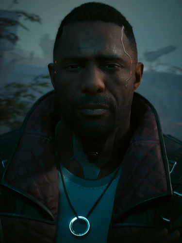

# 所罗门·李德

> 英文原名: **Solomon Reed**
> 昵称:Sol
> 别名:听·李——见 [[迈尔斯的笔记]] 中"听·李复职,不准多问"
> 生日:12 月 12 日 / 家乡:华盛顿特区、夜之城
> 塔罗映射:**权杖国王**——远大理想 / 坚定信念 / 不惜代价的破坏力
> 演员:伊德里斯·艾尔巴(Idris Elba,真人出演 + 动作捕捉)

## 身份

[[新美利坚]] 联邦情报局(FIA) 特工 / 《往日之影》核心人物之一 /
[[百灵鸟]] 的前导师与最终猎手 /
**沉睡特工(Sleeper Agent)**——曾在停火协议里被自己国家当作人头交易卖给 [[荒坂]]、
又被同一国家重新启用 /
塔罗"权杖国王"映射角色

## 特征

### 外观

身材高大、肤色深、留连成一圈的山羊胡(圆形络腮),太阳穴与颈部可见义体。
常穿一件内衬红色的深色长皮衣,佩戴一条带圆形吊坠的长项链。
到 2079 年,他双手与手臂的义体明显增多,手指几乎完全被铬合金取代。

### 履历与特质

- **出身 NUSA 特种部队(SpecOps)**——是一名退役军人;
  其所在小队(成员包括后来的 [[夜之城]] 雇佣兵**麦因**)曾被部署到南美,焚烧当地村庄
- 后加入 [[新美利坚]] 联邦情报局(FIA),对国家有近乎极端的忠诚与责任感——
  在巅峰期被认为可与 [[摩根·黑手]] 这样的传奇并列,
  却从不在意当一次性的明星或在架子上摆满勋章
- 国家级深度行动特工——专精**长期潜伏 + 反潜伏**、揪出间谍与网络运行者、
  情报榨取、潜入最森严的设施
- 在 [[狗镇]] 与 [[夜之城]] 间运作一整套低可见度情报网
- 与 [[百灵鸟]] 之间有"师徒 + 背叛"的双向历史
- **核心人格特质**:
  > 他知道一切真相,仍然选择服从。

  这是他与 [[艾利克斯·谢纳基斯|艾莉丝]] 最根本的区别——
  艾莉丝退役后逃进飞蛾酒吧;李德被国家枪决之后还能回到工位
- "权杖国王"塔罗——理想化的不惜代价者:
  他的破坏力源于**对体制的近乎宗教式忠诚**

### 装备

- 义体:EMP 织网、重型皮下装甲、充能跳跃、大猩猩义肢
- 能力:闪光弹、烟雾弹
- 武器:军用科技 M-10AF Lexington、贱民(Pariah)、海啸 Ashura
- 服装:可变形外套 / 载具:索顿 Merrimac MSL3

## 关键事件(按时间线)

### 一、夜之城潜伏与 [[百灵鸟]] 的师徒线(约 2070 前)

[[统一战争]] 前夜,FIA 把最优秀的特工派往 [[夜之城]] 建网,这个人就是所罗门·李德。他从未公开身份,而是用几年时间在城里铺出了一整张庞大的地下网络——收买官员、培养线人、监视 [[荒坂]] 与夜氏公司、收集企业情报、建立多个安全屋,许多在他线人名单上的人,至今都不知道自己是被 FIA 喂养的。战争早期他曾联系昔日特种部队的老搭档**麦因**,想拉他一起为 NUSA 建间谍网,但被麦因拒绝。

也是在这段时间,FIA 招募了一个极其特殊的年轻黑客:宋昭美 / [[百灵鸟]]。她当时还不是后来那个传奇,只是天赋异常的潜力股,唯一不同的是——她能深入旧网、能触碰 [[黑墙]]、能和危险 AI 直接对话。FIA 把她交给李德。李德不是单纯的上司,更接近监护人,亲手教她怎么撒谎、怎么潜伏、怎么活下来、怎么完成任务,宋昭美自己后来都承认:这个人几乎改变了她的人生。

### 二、停火协议里的人头交易与磁悬浮列车站枪击(约 2070)

[[罗莎琳德·迈尔斯]] 在这期间还启动了另一个秘密项目:把 [[百灵鸟]] 当作打开 [[黑墙]] 的钥匙。她相信黑墙另一侧大量失控 AI 一旦被利用,就能获得难以想象的力量,于是 FIA 不断让宋昭美连接黑墙、进入黑墙、接触 AI、窃取数据——明知每一次都会损伤她的大脑也只是继续推下去。李德目睹自己一手培养的人被 NUSA 体制慢慢吞噬,却没有出手干预,这是他真正自我背叛的起点。

真正引爆事件的,是 [[统一战争]] 结束后的停火谈判。NUSA 把 [[夜之城]] 留给了 [[荒坂]],荒坂则在停火协议里塞进了一条人头交易:**所罗门·李德必须死**。多年反荒坂行动让他在荒坂的清除名单上排名极高,而 [[罗莎琳德·迈尔斯]] 此时只面对一个再冷血不过的算术题——保护李德继续与荒坂对抗,还是用一个特工换政治利益。她毫不犹豫选择了后者。挑中李德的理由也极其精确:他是深度潜伏资产,官方记录极少,死了也不会有人知道;他还忠诚到即便知道真相也不会反水——后来证明这一点判断完全正确。

最残酷的部分在于,接到命令的人不是敌人,而是 [[百灵鸟]]。她拿到的版本只是"李德已经暴露,必须清除",并不知道全部真相,当时甚至仍然相信只要任务完成 FIA 总有一天会放过她;[[艾利克斯·谢纳基斯|艾莉丝]] 那一刻并未到场。任务对外包装成"撤离行动"——告诉李德他在夜之城的工作已经完成,可以走了。约定的接头地点是一处 [[夜之城]] 磁悬浮列车站。整个行动 [[百灵鸟]] 本人并不出现在现场,而是隔着电话和他沟通,一边和他聊撤退后的安排,一边把他一步步引向一节预先安排好埋伏的车厢——同时用黑客手段切死车厢门禁与监控、解锁里头那些枪。直到李德踏入那节车厢、转身打算继续通话,枪才响——CG 预告里 [[百灵鸟]] 明显犹豫了一下,毕竟正在被她送进枪口的是自己的导师、招募者和救命恩人,但她还是按了下去。中弹、跌落轨道,现场被制造成"敌对势力袭击"或意外死亡,FIA 当即注销他的档案——**所罗门·李德**这个名字从 NUSA 数据库里被彻底抹除。

### 三、沉睡特工与 [[往日之影]] 复出(2070-2077)

计划唯一的差错是:李德没有死。他重伤逃离,接受了数月治疗,NUSA 对外把他注销为"阵亡"——连他最亲近的同事(包括 [[艾利克斯·谢纳基斯|艾莉丝]])都被喂了这个假消息。他在 [[夜之城]] 隐姓埋名生活了七年,成为官方分类里少见的**沉睡特工**(Sleeper Agent)。由于沉睡特工没有薪水,他靠在中间人 [[戴诺·蒂诺维奇]] 名下的"电高潮"(Electric Orgasm)酒吧**当保镖**糊口。这七年里他逐渐拼回了真相——迈尔斯卖了他、宋昭美参与了行动、FIA 放弃了他——但最不可思议的是他居然接受了,把这件事当成"工作的一部分",继续效忠 NUSA。普通被出卖的特工会复仇、会叛逃、会泄密,李德全都没有,他仍然认为国家高于个人。这是他作为角色最悲剧、也最反人性的内核。

同一段时间里,[[百灵鸟]] 走向了相反的方向:她终于意识到,如果国家可以这样抛弃李德,总有一天也会这样抛弃自己。这之后迈尔斯让她不断接触黑墙,把她从特工变成了实验体兼武器,身体一年不如一年。她得出的结论极冷酷——昨天是李德,今天是我,明天还会有别人——这也是 2077 年她敢于把总统专机直接打下来的根本原因。

2077 年,[[百灵鸟]] 策划劫持 [[航天专机一号]](Space Force One),迈尔斯总统的专机坠毁在 [[狗镇]],总统被困。FIA 被迫重新启动那个沉睡七年的资产——那个七年前被自己国家判处死刑的人,再次接到国家命令,而他依然选择执行。

## 已知活动 / 深度档案

### 协助 V 渗透 [[汉森]] 势力
- 联手 [[V]],潜入 [[狗镇]] 核心 [[汉森]] 的地盘
- 最终导致 [[汉森]] 势力覆灭

### 神经矩阵与生死抉择

- 行动核心是回收 [[神经矩阵]]——
  [[小北斗计划]] 的终极产物:封印 [[黑墙]] AI 的单次治疗装置
- 在李德线结局中,他陪同 [[V]] 深入 **Cynosure C 号站点**([[太平洲]] 地下深处)
  追捕 [[百灵鸟]]——见证了被黑墙 AI 夺取控制权的"军用科技地狱犬"机器人
- 真实任务目标:**防止 NUSA 的非法黑墙实验技术外泄**——
  即"七年前他知道的那些秘密,**不能因为这次行动再次泄露**"
- 在最后追捕中,由 [[V]] 决定他与 [[百灵鸟]] 的命运,共四种走向:
  - **帮李德、交还百灵鸟给 NUSA**:用破冰程序制服百灵鸟,在辛诺舒设施将其取回交还 FIA;
    事后李德被调离 [[狗镇]],最终坐进办公室、培训新特工;
    2079 年 V 靠他的帮助接受治疗后,李德邀请 V 加入 FIA
  - **帮李德、但放任百灵鸟死去**:V 在辛诺舒设施任由百灵鸟死亡再交还 FIA,
    因此放弃了治好 [[Relic]] 的机会、也终结了与 FIA 的关系;
    李德起初对 V 的选择失望,但最终在两人初遇的篮球场承认 V 是对的
  - **帮百灵鸟、背叛李德且不交还**:李德与 NUSA 联手追杀 V 与宋昭美,
    在 NCX 太空港拦截二人时**死于枪下**(权杖国王 / 月亮结局)
  - **帮百灵鸟、背叛李德但最终回心转意**:同上在 NCX 太空港持枪对峙,
    但 V 改变主意把百灵鸟交还 FIA;此后李德同样被调离狗镇、转做培训工作,
    2079 年向接受治疗后的 V 发出 FIA 工作邀请

### 与 [[罗莎琳德·迈尔斯]] 总统的关系
- 《[[迈尔斯的笔记]]》中提到"听·李复职,不准多问"——
  这位"听·李"极可能是李德的代号或别名变体
- 暗示他与迈尔斯的关系既密切又敏感
- **真正的张力不在感情,而在权力**:
  七年前迈尔斯在停火协议里把李德当作人头交易卖给了 [[荒坂]],
  七年后又必须靠他来救自己——
  这场救援表面是任务,实质是一场**沉默的羞辱**

### "他从未真正原谅迈尔斯"

仔细看《[[往日之影]]》全部对话会发现:

> **李德从来没有真正原谅 [[罗莎琳德·迈尔斯]]。**

他只是把自己的愤怒压了下去:

- 他知道总统撒谎
- 他知道 FIA 会牺牲特工
- 他知道 [[百灵鸟]] 是受害者
- 他知道自己当年被抛弃

但他已经把"**服从命令**"变成了人生的一部分。

这是这个角色最核心、也最悲剧的地方。

### FIA 三人组对照

| 特工 | 选择 | 结果 |
|---|---|---|
| 所罗门·李德 | 知道真相,仍服从 | 七年沉睡,被国家重启 |
| [[百灵鸟]] | 知道自己将死,选择逃跑 | 被昔日导师追杀 |
| [[艾利克斯·谢纳基斯|艾莉丝]] | 提前退役,改名换姓 | 在飞蛾酒吧开酒馆 |

三人构成同一份档案的三种命运:**李德是无法逃离的人,
宋昭美是逃却失败的人,艾莉丝是逃成功的人**。

## 关联

- [[新美利坚]] 联情局(FIA)——雇主,也是出卖者
- [[罗莎琳德·迈尔斯]]——总统 / 极可能是清除命令的最终批准者
- [[V]]——临时合作者 / 最终裁决者
- [[百灵鸟]]——其学生 / 七年前磁悬浮列车站陷阱的策划与远程执行者 / 现在的猎物
- [[艾利克斯·谢纳基斯|艾莉丝]]——昔日 FIA 同事,后选择提前退役开飞蛾酒吧
- [[汉森]]——共同敌人 / 矩阵非法持有者
- [[神经矩阵]]——其回收任务的核心目标
- [[小北斗计划]]——其追捕任务的最终源头
- [[黑墙]]——矩阵封印的 AI 来源 / NUSA 秘密研究的对象
- [[航天专机一号]]——其被迫复出的导火索
- [[统一战争]]——其被国家清除的政治背景
- [[狗镇]]——其七年前被枪击、七年后再次行动的同一片土地

## 关联原始资料

- [[迈尔斯的笔记]]——"听·李复职,不准多问"

## 世界观意义

李德是 [[公司统治]] 时代"国家特工"的样本——
但比"国家特工"更深一层,他是**"被国家杀死过的国家特工"**:

- 国家情报机构在私人军阀([[汉森]])的地盘上必须依靠雇佣兵([[V]])才能行动——
  主权外包到底层
- "神经矩阵"——一项能治 [[Relic]] 的技术——是 NUSA 内部秘密研发的成果,
  说明 [[新美利坚]] 与 [[荒坂]] 的意识技术竞赛仍在地下进行
- 他与 [[百灵鸟]] 的"师徒 + 背叛"线索是这种环境的常态:
  在公司战争废墟上,**私人关系也变成可被国家利用的资产**

但李德真正的世界观意义,在于他展示了 [[公司统治]] 时代**最难逃脱的牢笼**:

- **不是公司**——公司至少明码标价
- **不是黑帮**——黑帮至少讲规矩
- **而是"内化的国家"**——
  当一个人把"国家高于个人"刻进骨头,
  即使国家亲手杀了他,他也会爬回来继续干活
- 与 [[百灵鸟]] 的"逃跑"对照、与 [[艾利克斯·谢纳基斯|艾莉丝]] 的"退役"对照,
  李德是夜之城档案中**唯一被自己出卖、却选择继续相信的人**
- 因此玩家在四个国王结局之间的选择,
  在李德这一侧从来不是"对错",而是"**要不要把他从牢笼里拽出来**"——
  权杖国王结局 V 杀掉李德,在某种意义上是给他真正的释放

李德的故事可以被压成一句话:

> 真正的悲剧不是被组织背叛,
> 而是被背叛之后,仍然走回组织里。

## Tags

#人物 #核心 #特工 #NUSA #DLC #FIA
