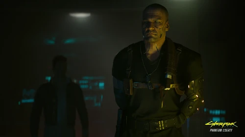

# 汉森

> 英文名: Kurt Hansen
> 全名: 库尔特·汉森 / 称号: 汉森上校

## 身份

[[狗镇]] 的实际统治者 / 军阀 / 全名 **库尔特·汉森**(Kurt Hansen)

## 特征

- 在夜之城内部硬切出一块"汉森领地"——即 [[狗镇]] 全境
- 旗下武装力量被简单称为"汉森的手下",遍布狗镇各处
- **空投武器进货渠道**:手下从空中接货(蕾兰妮·波茨 / 理查德·埃斯皮里图描述:"空投塞得太满了 / 砸到地上")——
  汉森持续囤积来路不明的武器(参见 [[对话记录 蕾兰妮·波茨和理查德·埃斯皮里图]])
- EBM 体育场工厂同时是六街帮武器(导弹发射车)供货中心——
  说明汉森把狗镇变成了 **夜之城的隐形军火供应站**
- **三阶段消除指令**(参见 [[特殊威胁消除部队行动指令]] 2072.1.12)——
  汉森**上校**亲自下达,特殊威胁消除部队三阶段流程:
  1. 移除所有贵重物品
  2. 切断电力供应
  3. 摧毁通道
  - 这与 [[命令 淹没隧道]] 完全同构——
    汉森系统性"清理证据 + 永久封锁通道"的标准操作流程
- **核裂变滚装艇出售**(参见 [[重要命令 卖滚装艇]] + [[是什么降落在了体育场]])——
  - 表面是装着 400 多把折叠椅的废货船
  - 真正价值:**独特的核裂变引擎 + 隐蔽式涡轮机**
  - 前 NUSA 军队财产 / 货运型号
  - 首席技术专家**勃特·泽林斯基**直言:"**可以改造成一颗炸弹**,把所有的东西全他妈炸上天"
  - 一位外部将军开了价 → 汉森准备下周见面
  - 汉森下令"**不准捣鼓电线**" — 就照原样卖
  - "如果哪天你们看到狗镇升起了两个太阳,请不要觉得奇怪" — 爆炸威力堪比 [[奇美拉]] 级别
- **淹没宝石青地下隧道**命令(参见 [[命令 淹没隧道]])——
  汉森**上校**亲自下令淹没**宝石青地下的路段**(执行人:加戈·扎布)
  - 理由:"人手不足、无法保障通道安全"
  - 这条隧道很可能就是通往 [[神经矩阵]] 藏匿点的维修区
  - 淹没 = 既封锁对手潜入路径,也封死一切证据流向
  - 与 [[军用科技]] 战后封锁碉堡的逻辑同构:
    **永久淹没 = 永久不可调查**
- 对 **富丽太平洋 / 宝石青酒店** 一带"特别上心"——可能是其势力的某种核心节点
  - 具体表现:当 [[利琪·薇兹]] 在宝石青演出时,
    某员工偷拍演出超梦试图外卖,
    **汉森手下提前一步上门、超梦没保住、偷拍者人头落地**
    (参见 [[利琪薇兹宝石青演出的盗版超梦]])
  - 这说明宝石青不只是地产据点,
    汉森还把它当作高端演艺产业的**版权 / 形象守护区**
- 全境压制其他帮派([[巫毒帮]]、[[清道夫]] 等只是被允许在角落里生存)
- **被 [[汉斯先生 韦德·布莱克]] 长期暗中削弱**:
  汉斯先生以 [[狗镇]] **大帝国俱乐部顶层**为大本营,
  在《往日之影》中通过 [[V]] 持续削弱汉森的根基、建立眼线;
  汉森死后,汉斯立即扶植**贝内特(明面老大)+ 雅各(财务)双傀儡**——
  汉森表面是狗镇统治者,实际是**被影子皇帝慢慢替换的过渡角色**

## 关键事件

- 通过非法发掘抢先占有了 [[军用科技]] 战前秘密项目 [[小北斗计划]] 研发的 [[神经矩阵]]
- 将矩阵锁在 EBM 沛卓石化体育场最深处,作为与 NUSA 谈判的最高筹码
- 间接引发 [[航天专机一号]] 在狗镇坠落、《往日之影》谍战开启
- 死后留下权力真空,被 [[汉斯先生 韦德·布莱克]] 通过双傀儡机制接管

## 已知活动 / 深度档案

### 关键资产:神经矩阵

- 通过**非法发掘**抢先占有了 [[军用科技]] 战前秘密项目 [[小北斗计划]] 所研发的 [[神经矩阵]]
- 将其锁在 [[狗镇]] **EBM 沛卓石化体育场最深处**——
  作为他与 NUSA 谈判 / 勒索的最高筹码
- 这件事直接把 [[狗镇]] 推上了《往日之影》谍战的核心舞台
- 也解释了为何 NUSA 总统专机会被引向狗镇上空被击落——
  [[百灵鸟]] 设局的物理坐标就在汉森体育场深处

## 关联

- [[狗镇]]
- 与所有狗镇内部帮派的统御关系
- [[幽冥犬]]——其私人武装
- [[神经矩阵]]——其最高筹码
- [[小北斗计划]]——其矩阵的真正来源
- [[新美利坚]]——其勒索对象
- [[百灵鸟]] / [[所罗门·李德]]——其矩阵争夺战的另两方

## 关联原始资料

- [[对话记录 蕾兰妮·波茨和理查德·埃斯皮里图]]——空投武器进货
- [[特殊威胁消除部队行动指令]]——三阶段消除流程
- [[重要命令 卖滚装艇]] / [[是什么降落在了体育场]]——核裂变滚装艇出售
- [[命令 淹没隧道]]——淹没宝石青地下隧道
- [[利琪薇兹宝石青演出的盗版超梦]]——宝石青形象守护

## 世界观意义

汉森是 [[公司统治]] 时代"小军阀"的样本:

- 在公司战争的废墟里,每个真空都有人填——填空者不一定比公司更体面
- 与 [[荒坂三郎]] 这种家族型 CEO 的区别在于:汉森不依靠任何合法性叙事,
  纯粹以武力 + 黑市经济为基础
- 但他和荒坂本质上做的是同一件事——把一片地方变成自己的"私产"
- 这也解释了为什么在 [[公司统治]] 时代,"反公司"并不天然等于"反统治"——
  你可能只是把一个穿西装的老板换成一个端枪的老板
- 他持有 [[神经矩阵]] 一事还揭示一个更深的层级:
  即便是 NUSA 最高级别的战前国家机密,最终也会落到一个**军阀的体育场地下室**——
  公司战争之后,国家不仅失去合法性,也失去对自己机密的物理控制

## Tags

#人物 #核心 #狗镇
