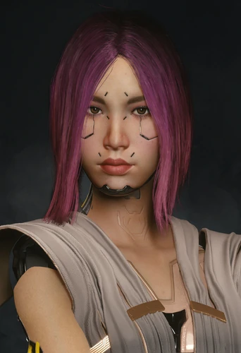

# 百灵鸟

> 英文名: **Songbird**
> 原名: 宋昭美(Song So Mi / 송소미)
> 生于 2045 年 12 月 29 日,纽约市布鲁克林 / 享年 31 岁(2077)
> 塔罗映射:**圣杯国王**([[塔罗牌涂鸦]])——感性、创造力、情绪剧烈起伏、表面平静下的疯狂绝境
> 配音:Minji Chang(张敏智)

## 身份

顶尖网络运行者(网络黑客) / [[新美利坚]] 联邦情报局(FIA) 情报分析师 /
**罗莎琳德·迈尔斯总统的左膀右臂** / 《往日之影》核心人物 /
**圣杯国王**牌映射角色

## 特征

- 韩裔身份,原名宋昭美——"百灵鸟"是 FIA 给她的行动代号
- **自由网络运行者出身**:13 岁时说服一名街头医生卖给她一台老旧赛博躲灵,
  自此终日潜入网络;专挑别人嫌"高薪但等于自杀"的活干,独来独往
- 顶尖网络运行能力,足以处理 [[Relic]] / [[黑墙]] 级别的技术——
  企业数据堡垒在她面前如同虚设,很快成了圈内活着的传奇
- 装载军用科技(Militech)定制的**第五级(Tier 5)网络运行赛博**——
  无需冰浴或颅插即可深潜网络,身体本身就是一台自循环网络运行站
- 脸上有独特的 EMP 织网纹路;紫红渐黑的网络运行者套装是其经典造型
- 与 [[所罗门·李德]] 之间有"师徒 + 背叛"的复杂往事——
  既是她的招募者、师父,也是她亲手出卖过的人

## 关键事件

- 因被 NUSA 强迫频繁入侵 [[黑墙]] 而被流窜 AI 侵蚀,命不久矣
- 精心策划 [[航天专机一号]] 坠毁事件,把总统引向 [[狗镇]]、把 [[V]] 拉入局
- 用"矩阵能救两人"的谎言骗取 [[V]] 信任,目的是夺走 [[神经矩阵]]
- 在 V 最终追捕中触发"她与 [[所罗门·李德]] 的二选一生死抉择"
- 多结局命运:逃往月球 / 被交还 NUSA / 堕入赛博精神病并请求 V 结束其生命

## 已知活动 / 深度档案

### 生平年表

- **2045 年**生于纽约市,与母亲在布鲁克林长大,无父亲记载
- **2063 / 2064 年**:入侵俄勒冈州一座 [[生物技术]](Biotechnica)发酵厂
- **19 岁**:借安卡拉(Ankara)基地作跳板攻破军用科技数据堡垒,引来 FIA 注意;
  [[网络监察]](NetWatch)将她抓住,她险些被处刑——
  [[所罗门·李德]] 力排众议,提议**招募而非格式化她**
- 李德赴纽约游说,她最初拒绝;李德以"网络监察会连她在乎的人一起追杀,
  只有 FIA 能保护他们"相要挟,她视之为勒索,但最终接受,离开布鲁克林
- 向 [[罗莎琳德·迈尔斯]] 总统宣誓,正式成为 FIA 特工,获代号"百灵鸟";
  随后被**对外宣告死亡**,纽约 Calvary 公墓立有她的假墓碑
- **首次任务在哥伦比亚**,与 [[所罗门·李德]]、[[艾利克斯·谢纳基斯]] 同行;
  迈尔斯授她荣誉勋章,她转手把勋章送给街头一名流浪汉
- 多年间她的天赋稳固了"迈尔斯总统左膀右臂"的地位

### 统一战争与对李德的背叛(2069–2070)

- 统一战争期间,百灵鸟、李德等 FIA 特工被派往夜之城卧底——
  她在赛宁沙地(Serenisands)、靠近**宁静台**(Tranquil Terrace)处有一间公寓,
  常在露台俯瞰城市,怀念布鲁克林的旧居
- **2070 年**战争尾声,她与李德最后一项任务是清除荒坂海军上将村田大鹤(Murata Ozuru);
  迈尔斯总统临时叫停、命二人撤回 NUSA
- 撤离期间村田一家死于 AV 破坏;李德坚持先撤走最后一名特工乔纳斯·柯林森
- 李德自己无路可走,联系百灵鸟求援,她提供了搭乘磁悬浮列车南下的逃生方案
- 但当李德按计划登上列车后,百灵鸟**锁死了车门**——
  把师父连同一车荒坂打手与黑帮困在车厢里;
  她虽曾犹豫、也为这决定动摇,最终仍背叛了恩师

### 神经矩阵 + 设局 + 生死抉择(2077)

- 2071–2076 年她持续为联盟入侵 [[黑墙]],身体因此急速恶化——
  感觉自己正一点点被"别的东西"取代;2076 年 12 月 22 日网络监察侦测到一次入侵(未查出是她)
- 苏珊·别尔教授的医疗意见(参见 [[苏珊·别尔教授 医疗意见 百灵鸟]])证实——
  她已出现 **不易察觉的人格转换** + **空虚恍惚的状态** + **以肉眼可见速度增加的恐慌发作**;
  教授结论:**必须暂停职务**送入实验室全面诊断;但 NUSA 高层未执行
- 2077 年她濒死,决定自救并逃出迈尔斯掌控——
  知道 [[小北斗计划]] 残留的 [[神经矩阵]](封印黑墙之外 AI、能彻底重写神经通络、**全世界只能用一次**)
- **她精心策划了 [[航天专机一号]] 坠毁事件**——
  与持有矩阵的军阀 [[汉森]] 做交易:用迈尔斯总统当人质,换取神经矩阵
- 坠机后 NUSA 立即下达狙击手紧急命令(参见 [[紧急 新命令]]):
  "决不允许携带敏感资料的目标离开狗镇地区"——正是要拦截百灵鸟这条线
- 她借 [[Relic]] 联系上夜之城雇佣兵 [[V]],引导其前往 EBM 沛卓石化体育场,
  又在坠机后操控一台报废的奇美拉(Chimera)保护 V 与总统,随后被 [[汉森]] 俘获
- 迈尔斯雇 V 与李德营救她,真相是她早与汉森联手、却又计划背叛汉森夺取矩阵
- 她从一开始就**知道矩阵只能救一个人**——
  却用"能同时治好你和我"的谎言骗取 [[V]] 的信任与卖命
- 在 [[V]] 的最终追捕中,V 必须做出**她与 [[所罗门·李德]] 的二选一生死抉择**

### 结局分支

**① 月亮结局(V 帮助她、背叛李德)**
- V 与她穿过球场下水道脱身;数日后她在市中心小巷约见 V,坦白自己也骗了 V——
  神经矩阵**只能用一次**
- 二人潜入 NCX 太空港,遭 FIA 与 NUSA 黑色行动队追杀;
  她要搭乘飞往月球**第谷殖民地(Tycho)**的班车与接应人会合做手术
- 接应人她并不认识,只知道对方有一双独特的**蓝眼睛**(疑似 [[蓝眼睛先生]] 势力)

**② 交还结局(V 把她交给李德)**
- V 抱着虚弱的她交给 [[所罗门·李德]];因可活捉,李德承诺不处决她
- 她将接受能保命的治疗,但因背叛会被囚禁、并可能再次被迫为迈尔斯效命
- 两年后李德告诉 V:她还活着,但之后音讯被彻底切断

**③ 飞天结局(V 帮助她、且与李德生死相搏后仍送她上月球)**
- 尽管她撒了谎,V 仍在与李德的生死局后帮她抵达月球
- 事后 V 收到她的匿名讯息,确认治疗成功;
  她在她所珍视的**宁静台**为 V 留下量子调谐器与一枚金属别针

**④ 赛博精神病结局(V 帮助李德、背叛她)**
- V 用高科技破冰程序瘫痪她,激怒了她;她独自冲出满是巴格斯特士兵的球场,
  为此再次接入 [[黑墙]],**坠入赛博精神病**,引来夜城支援队(MaxTac)将她抓走
- 李德与 V 伏击押送车队,她又靠黑客手段第二次逃脱,逃入**辛诺舒(Cynosure)设施**接入黑墙,
  同时被黑墙之外的 AI 一点点吞噬
- V 深入设施时不断经历她的过往幻象;V 最终在**辛诺舒核心**找到与之相连的她,
  她说自己回不去了,**恳求 V 结束她的生命**
  - **若 V 拒绝、带她回 NUSA**:她活着被带回接受治疗,但精神状态成谜,
    李德认为她已不再是她自己、很可能仍在为旧雇主效力
  - **若 V 遂其所愿**:V 结束了她的生命,稍后赶到的李德将这一结果归咎于 V 与自己,
    遗体被运回 NUSA

### 其他细节

- 尽管对 V 说不喜欢 [[强尼银手]] 的音乐,她其实是个朋克,公寓里藏着一张《Never Fade Away》黑胶
- 当被问及为何透过 [[Relic]] 呈现的样貌不同时,她会带着遗憾承认——
  那是被黑墙损坏之前、过去的自己的残影

## 关联

- [[小北斗计划]]——NUSA 强迫她执行其重启任务的项目
- [[所罗门·李德]]——招募她的师父 / 被她背叛的恩师 / 最终对头
- [[艾利克斯·谢纳基斯]]——同期 FIA 特工,首次任务即与之同行
- [[罗莎琳德·迈尔斯]]——她效忠并最终想逃离的总统
- [[V]]——最终决定她生死的人
- [[Relic]]——她"声称"能治的目标,也是联系 V 的媒介
- [[神经矩阵]]——她设局争夺的真正物件
- [[黑墙]]——侵蚀她、也是她力量来源的存在
- [[新美利坚]] 联情局——其雇主与围捕方
- [[汉森]]——交易对手(持有矩阵的军阀)
- [[蓝眼睛先生]]——月亮结局之后她可能落入的更高一层势力
- [[月球]]——月亮 / 飞天结局的目的地

## 关联原始资料

- [[苏珊·别尔教授 医疗意见 百灵鸟]]——其医疗状况评估
- [[紧急 新命令]]——NUSA 针对其设局的反阻击命令

## 世界观意义

百灵鸟是 [[公司统治]] 时代"被国家追捕的技术天才"样本,也是**用谎言操控同伴**的样本:

- 她的人生轨迹是一条"自由黑客 → 国家武器"的单行道:
  19 岁时被 [[所罗门·李德]] 以"保护你在乎的人"为名招募,
  实则是用威胁换来的服从——从此她失去自主权与个性,只能按 FIA 剧本演出
- 拥有 [[神经矩阵]] 的去向决定权意味着她能改写"印记可不可逆"——
  这相当于动了 [[荒坂]] 神舆和 [[新美利坚]] 国家级意识技术的根基;
  一个人想要这种技术,本身就是被各方追杀的理由
- 她对 [[V]] 撒下"矩阵能救两个人"的谎——
  不是个人道德问题,而是 [[公司统治]] 时代信息不对称的极致体现:
  在唯一一次救命机会面前,被骗者甚至无法验证自己是否被骗
- 她对李德的背叛与对 V 的背叛形成镜像——
  说明在这套体系里,连"师徒情"与"战友情"都只是可被牺牲的资源
- 她的命运由一个临时雇佣兵 ([[V]]) 决定——
  这是 [[公司统治]] 时代权力流向最戏剧化的瞬间:
  关键技术的去留不在国家手里,而在某个为了治病四处奔波的街头人手里
- 代号"百灵鸟"与本名"宋昭美"的分裂,
  也是这个时代专业人士的写照——
  你要么被作为代号使用,要么被作为本名追捕,没有第三种状态
- 她的多重结局把同一个人推向"被治愈却失去自我""被囚禁""逃向更高牢笼""求死解脱"——
  没有任何一条通向真正的自由,这正是 [[黑墙]] 与国家意志双重碾压下个体的全部可能

## Tags

#人物 #核心 #黑客 #DLC #FIA
