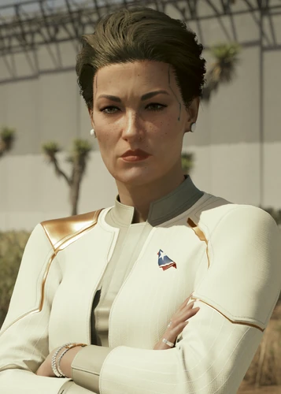

# 罗莎琳德·迈尔斯

> 英文名: **Rosalind Myers**
> 绰号:Mittens / 生日:3 月 28 日 / 家乡:华盛顿特区
> 配音:Kay Bess

## 身份

[[新美利坚]]（NUSA）第三任、现任总统(2077 年已第三个任期) /
前 [[军用科技]] CEO / 前美国海军陆战队员 / 联邦党人 /
《往日之影》事件核心人物 /
**钱币国王**牌映射（[[塔罗牌涂鸦]]）——世俗的控制欲、阶级权力、不可动摇的威权

## 特征

### 外观与性格

- 出身东海岸豪门(自称"五月花号"首批英格兰移民后裔),却刻意表现出"平民"做派——
  作为政客,这本身就是为了拉票的表演
- 也会露出冷血一面:对她而言**目的可以为手段背书**
- 服饰彰显"高位政客 + 退役军人"双重身份:象牙白无领金饰外套 + 肩部金属肩章
- 乔装时穿黑色高领衫、牛仔马甲、戴"I♥NC"鸭舌帽混入 [[狗镇]]——
  V 在为她摘除颈部皮下追踪器后,她颈上留下一道疤
- 长期尼古丁成瘾——数据库称这是"目前对总统生命最大的威胁"

### 履历:海军 → 军用科技 CEO → 总统

- 政治生涯始于**美国海军陆战队**——爱国、战场勇气、服从与纪律让她快速晋升,
  并引起 [[军用科技]] 高层注意
- 在军用科技 CEO 唐纳德·伦迪(Donald Lundee)死后,她继任掌舵公司近十年
- **2065 年**:把 CEO 之位交给卢卡斯·哈福德(Lucas Harford),当选 NUSA **第三任总统**——
  新美利坚史上第二位女总统
- 与其说她离开了军用科技,不如说她把军用科技带进了白宫(参见下方"傀儡总统"档案)
- 私下里,亲近的人都知道她其实怀念军旅时光

## 关键事件

- [[航天专机一号]] 在 [[狗镇]] 上空被击落,V 在 [[幽冥犬]] 重围下将其救出
- 狗镇全境立即戒严,NUSA 同步发出狙击手紧急命令
- 与 [[所罗门·李德]] 拼死回收 [[神经矩阵]],防止 [[小北斗计划]] 残留技术外泄
- 在塔结局中兑现救命承诺,用矩阵剥离 [[V]] 脑内 [[Relic]] 与 [[强尼银手]] 印记
- 上台前史:[[军用科技]] 唯一扶植的傀儡总统
- 德克萨斯边境危机:拒谈 + 派兵
- 政治后续:寻找替罪羊、压制情报机构、操控公民葬礼舆论

## 已知活动 / 深度档案

### 航天专机一号坠落
- 总统专机"空天一号"在 [[狗镇]] 上空被击落
- 这场坠机即《[[指令 P0-08]]》运输方案的失败收场——
  指令中"零号乘客"几乎可以确认就是迈尔斯本人
- V 在 [[幽冥犬]] 部队重围下将其救出

### 狗镇全境立即戒严:紧急狙击手通告
坠机后 NUSA 同步发出**狙击手紧急命令**(参见 [[紧急 新命令]]):

> "新美国总统搭乘的空天一号刚刚在狗镇坠机!!!
>  所有狙击手观察各自区划,发现可疑活动立即上报。
>  如有任何新美国部队动向以及相关目标的情报必须告知。
>  **决不允许携带敏感资料的目标离开狗镇地区。**"

这条命令揭示两点:

- **"携带敏感资料的目标"**——狙击手要拦截的不只是袭击者,
  还包括**总统本人 + 总统随行的秘密档案**外流——
  即便总统是己方人员,"携带的资料"也是优先关切
- 与 [[百灵鸟]] 主导的设局完全吻合——
  百灵鸟设计这场坠机的目的就是**让总统被困狗镇 + 趁机和汉森做交易夺走 [[神经矩阵]]**
- 因此 NUSA 的"拦截"命令本身就是一场反阻击——
  防止百灵鸟带走总统或敏感资料离开狗镇

### 神经矩阵的回收与"塔结局"承诺兑现

- **她政府是 [[小北斗计划]] 的违法重启者**——
  在该项目被 [[军用科技]] 永久封存数十年后,
  NUSA 重新启用残留技术,强迫 [[百灵鸟]] 频繁穿透 [[黑墙]] 执行国家黑色行动
- 她和 [[所罗门·李德]] 拼死回收 [[神经矩阵]]——
  目的是防止小北斗的**非法黑墙实验技术外泄**
- 在 V 选择"交出 [[百灵鸟]]"的塔结局中,她**兑现救命承诺**:
  调集 NUSA 最顶尖医疗团队,用矩阵成功剥离 [[V]] 脑内 [[Relic]] 与 [[强尼银手]] 印记
- 代价由 [[V]] 承担:两年昏迷 + 神经永久受损 + 永远无法再战
- 这一兑现也意味着 NUSA 必须**公开承认"小北斗"项目存在**——
  以国家面子换取一个雇佣兵的命,这本身就是危机管理的极致姿态

### 上台前史:军用科技扶植的傀儡总统

参见 [[竞选团队会议 纪要]](2077.6.16)——
这份内部纪要彻底揭穿迈尔斯总统的**政商勾结幕后**:

- 行动要点中明确出现"**为罗·迈安排培训**"——"罗·迈"= 罗莎琳德·迈尔斯,
  锁定档案归属
- 议程第 1 项:"**除了'军'以外的竞选资金 - 利弊**"——
  曾经认真讨论过多元化募资
- 最终决议:"**'军'仍然会是唯一的实际出资方**"——
  主动拒绝多元化,坚持 [[军用科技]] 独家供资
- 议题立场(**饮用水征税**、火星殖民地、时尚公关包装)
  全部由出资方决定

这一证据揭示:

- 迈尔斯对外宣称的"多元化政治募资"是**公关谎言**
- 她本质上是 [[军用科技]] **唯一扶植**上台的政治代言人
- 因此她执政后 NUSA 与军用科技完全穿一条裤子——
  不是合作,而是**同一个组织**
- 她敢于非法重启 [[小北斗计划]]——
  因为这是军用科技自己的旧项目,
  迈尔斯只是把项目权限**还给真正的所有者**
- 这也解释了铁腕女总统形象与"挑选排名前三造型师 + 美妆步骤公关"
  之间的反差——她的"强硬"是被包装出来的产品形象

### 执政时间线:统一战争与第四任期

- **2069 年 1 月**:连任后,NUSA 与 [[军用科技]] 挑起 [[统一战争]],
  以"加强联邦"为名强行吞并不服从其统一纲领的自由邦
- **2070 年**:吞下大部分自由邦后挥师 [[夜之城]],因 [[荒坂]] 干预而失败;
  她临阵召回了城内的 FIA 特工 [[所罗门·李德]] 与 [[百灵鸟]]
- 为避免战争升级为全球冲突,她于 **2070 年 6 月**与自由邦签署《阿尔文协定》(Arvin Accord)提前结束战争——
  未能完全吞并自由邦,但迫使其更深地卷入联邦(德克萨斯共和国除外)
- **2077 年**:第三任期内,她下令轰炸德克萨斯在惠灵顿、埃尔帕索的空军基地,
  作为对新墨西哥、俄克拉荷马 NUSA 基地自杀式爆炸的报复,边境战争风险骤升
- 同年联邦党大会上宣布竞选**第四任期**,竞选口号"重归统一"(A Return to Unity)
- 夜之城对她评价两极:有人视她为企业撑腰的法西斯帝国主义者,
  也有人以"夜之城犯罪率是 NUSA 任何地方两倍"为由支持她接管

### 德克萨斯边境危机:拒谈 + 派兵

参见 [[关于德克萨斯边境事态的新闻备忘录]]——

总统就德克萨斯州与 NUSA 边境冲突升级一事的公开声明:

- 拒绝继续开放边境贸易与移民会谈:
  > "在德克萨斯政府控制住恐怖主义威胁之前,
  >  有关开放边境进行自由贸易和移民的会谈将不再继续。"
- 公开背书 [[军用科技]] 路线:
  > "新美国武装部队随时准备援助德克萨斯公民和恐怖主义分子作斗争。"
- 结语:"只要一句话,这场噩梦就会成为过去。
  你们将回到故乡,回到美利坚的土地上。"——
  把武装介入包装为"接回家"

#### 政府幕后修订记录

备忘录末尾留存了**罗·迈本人对原稿的修改批注**:

> "OK,不过'器官'那部分不要,会有歧义"

被她删掉的原稿措辞是:
> "你不能摘除国家的一个重要器官,然后还指望它继续正常工作。"

- 这条修改批注**与 [[竞选团队会议 纪要]] 揭示的"罗·迈"档案归属一致**——
  又一次直接锁定她是这类公关稿的最终编辑者
- 显示 NUSA 对德克萨斯的官方话术经过总统**本人逐句把关**——
  哪些比喻"会有歧义"、哪些不会,由她拍板
- 这一备忘录把"铁腕女总统"的公关形象往前推进一步:
  她不只是接受造型师团队的包装(参见上节),
  她本人也是**最终修辞校对**

### 政治后续 / 替罪羊政治
- 《[[迈尔斯的笔记]]》中所载的政治笔记几乎可以确认是她本人的笔迹:
  - "关于空天一号的会议。替罪羊:媒体、夜之城还是安全部门?"
  - "辞退路易斯,找劳埃德和汉娜训话"
  - "警告情报局,听·李复职,不准多问!"("听·李"高度疑似 [[所罗门·李德]])
  - "主持葬礼(公民葬礼,禁止拍摄,补偿家属)"
  - "联系别尔医生(重要)"
- 笔记显示她在事后的危机管理:寻找替罪羊、压制情报机构、操控公民葬礼舆论

### 狗镇逃生的两种走向

- 若 [[V]] **拒绝或拖延**救援百灵鸟的请求——迈尔斯在坠机后被 [[汉森]] 的 [[幽冥犬]] 部队包围、推定被杀,
  [[百灵鸟]] 随后愤怒地致电 V 告知其死讯,主线就此锁死
- 若 V **及时答应**——V 救出她、为她摘除颈部追踪器(她坚信团队里有人出卖了她),
  二人一路杀出狗镇;她随后指派 V 与 [[所罗门·李德]] 共同去找回百灵鸟,
  最终在两天后被李德安排撤出狗镇、送回华盛顿

### 魔鬼结局:与荒坂三郎的"复活"和谈

- 在 V 选择 [[荒坂]] / 魔鬼结局的尾声:
  夜之城荒坂塔事件后,迈尔斯公开谴责 [[荒坂三郎]] 的"复活"、斥其夺权违反国际法
- 但在数周激烈对峙后,迈尔斯竟与荒坂三郎**同意亲自会面**,
  为各方间的持久和平打基础——铁腕统一者最终对最大对手伸出了手

### 装备

- 义体:皮下追踪器(后被 V 摘除)
- 能力:战斗兴奋剂、生化危害手雷
- 武器:Hawk(曾持有)

## 关联

- [[新美利坚]]——其执政体
- [[V]]——救命恩人 / 塔结局的受益者
- [[所罗门·李德]]——联情局特工,疑似笔记中"听·李"
- [[狗镇]] / [[汉森]]——失事地点 + 当地军阀(神经矩阵的非法占有者)
- [[幽冥犬]]——围困她的武装力量
- [[神经矩阵]]——其战前国家秘密资产
- [[小北斗计划]]——其重启的违法项目
- [[百灵鸟]]——其谋划专机坠机的真正策划者

## 关联原始资料

- 《[[指令 P0-08]]》——其运输任务的执行指令("首要任务:零号乘客安全")
- 《[[迈尔斯的笔记]]》——其本人的政治笔记
- [[关于德克萨斯边境事态的新闻备忘录]]——其对德克萨斯边境的公开声明 + 个人改稿批注

## 世界观意义

迈尔斯是 [[公司统治]] 时代"国家元首"的真实形态:

- 一国总统要靠一个街头雇佣兵 ([[V]]) 救命——
  说明 NUSA 的国家暴力机器在 [[狗镇]] 这种灰色地带根本失效
- 她的危机管理笔记完全是公司化的:"替罪羊"按部门选、葬礼"禁止拍摄"
- "联系别尔医生(重要)"——
  暗示她本人也可能依赖某种隐秘的医疗 / 技术干预(义体?印记?)
- 她生还的代价是 [[新美利坚]] 与 [[军用科技]] 进一步深度捆绑——
  救命恩人 V 自然成了潜在的"国家级"棋子

## Tags

#人物 #核心 #政治 #NUSA
