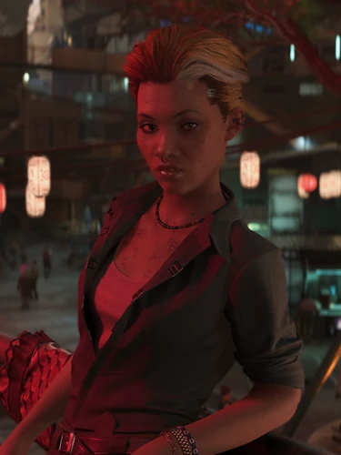

# 艾利克斯·谢纳基斯

> 英文原名: **Alena Xenakis**
> 真名:阿莱娜·谢纳基斯(Alena)——FIA 档案上的名字
> 化名:**艾莉丝 / 亚历克斯**(Alex)——
> [[狗镇]] 飞蛾酒吧老板身份所用名字,
> 也是她在 [[V]] 面前**绝大多数场合的称呼**与便条署名
> 其他化名:达芙妮(Daphne)、奥萝尔 / 艾梅里克·卡塞尔(Aurore / Aymeric Cassel)——拟态潜伏所用身份
> 塔罗映射:**宝剑国王**
> 配音:Yvonne Senat Jones

## 身份

[[狗镇]] "**飞蛾**"酒吧老板 /
前 [[新美利坚]] 联邦情报局(FIA) 特工 / **狗镇行动**成员 /
**拟态(变形)技术专家** / [[所罗门·李德]] 的前门徒 /
《往日之影》四核心 NPC 之一 / **宝剑国王**塔罗牌映射角色

## 特征

### 出身

- 出生于**洛杉矶大都会(LA Metroplex)的贫民窟**——
  父母沉沦于各种瘾症,身边的同龄人陷入永无止境的犯罪循环
- 怀着"登上超梦广告牌"的梦想,成为一名**超梦女演员**学徒
- 她加入的超梦工作室其实是 **FIA 的伪装据点**——
  出色的演技让她被 [[所罗门·李德]] 看中并招募
- 自此为 FIA 执行大量隐秘行动,成长为一名极有天赋的**拟态者 / 变形特工**

### 现状(狗镇潜伏)

- 表面上是个低调的酒吧老板,实际是退役的高级特工——
  专精**长期潜伏**,在狗镇拥有完整的"老板娘"伪装链
- 统一战争后被安插进 [[狗镇]] 作为卧底,**潜伏长达七年**
- 渴望平淡生活,但对敌人**致命**——
  对敌人的态度是"绝对现实、绝对冷酷",且有一股狗镇也没能磨平的狠劲
- 飞蛾酒吧后巷的狭窄通道是她的**安全屋兼大本营**——
  这条通道墙壁上即是塔罗牌"宝剑国王"涂鸦

### 化名与署名习惯

- 对外几乎全程用"艾莉丝 / 亚历克斯"
- 写便条署名时偏向更冷感的"Alex"——更接近她真名 Alena Xenakis 的英文形
  (参见 [[利琪薇兹宝石青演出的盗版超梦]])
- 作为拟态特工,她还能化身他人(如卡塞尔家族成员)执行任务

### 装备

- 赛博植入:EMP 织网、行为印记同步面板(可变脸)、斯安威斯坦(Sandevistan)
- 能力:战斗兴奋剂(Combat Stim)
- 武器:[[军用科技]] Lexington 手枪;曾持有"女王陛下"(Her Majesty)

## 关键事件

- 在《往日之影》主线中向 [[V]] 提供情报、藏身、与外界的接口
- 是 [[所罗门·李德]] 行动链上 V 与外部世界的关键中转人
- 在 V 与她合作的第一次联情局外勤任务中,获取并赠送给 V 一份盗版 [[超梦]] 作为纪念
- **宝剑国王结局**:V 把 [[百灵鸟]] 交还给 [[所罗门·李德]],走的就是艾利克斯·谢纳基斯路线

## 已知活动 / 深度档案

### 协助 V 与 NUSA 团队
- 在《往日之影》主线中向 [[V]] 提供情报、藏身、与外界的接口
- 是 [[所罗门·李德]] 行动链上 V 与外部世界的关键中转人

### V 的第一次联情局外勤纪念品
- V 与她合作的**第一次联情局外勤任务**
- 任务后期艾莉丝亲自托关系拿到一份失窃的盗版 [[超梦]]——
  内容是 [[利琪·薇兹]] 在 [[狗镇]] 宝石青酒店的演出
- 拍摄者本是宝石青员工,被 [[汉森]] 手下处决
- 她确认超梦内容里没有 V / [[所罗门·李德]] 出镜后,
  把超梦作为**纪念品**送给 V——"好好欣赏!"
- 见 [[利琪薇兹宝石青演出的盗版超梦]]
- 这一细节确认:
  - 她在 V 早期任务中是**师徒型上级 / 守护者**
  - 她有为 V 处理后勤、清扫风险的习惯

### 宝剑国王结局(V 把百灵鸟交还李德)
- 该结局中,[[V]] 把 [[百灵鸟]] **交还给 [[所罗门·李德]]**
- 不被 [[百灵鸟]] 的谎言("矩阵能救两人")欺骗,绝对现实冷酷地履行契约
- 艾莉丝的"严苛逻辑 / 道德审判"贯穿这一结局——
  V 在此结局里走的就是她的路线

### 死亡结局(V 选择背叛百灵鸟、帮助百灵鸟逃月球)
- 若 V 在营救行动中**试图背叛 [[百灵鸟]]**,艾莉丝会察觉异常,
  向 [[汉森]] 告发"队伍里有冒充者"
- 随即 [[汉森]] **当场处决了艾莉丝**
- 事后(《略有损坏》之后)NUSA 收回她的遗体,送回故乡安葬
- [[所罗门·李德]] 认为以她在夜之城的服役记录,理应为她立一座纪念碑——
  遗体安放于**北橡区骨灰堂(North Oak Columbarium)**
- 墓志铭:"这不是你梦想中的退休……而是命运发给你的那种。希望你能原谅我。谢谢你所做的一切。"

### 离别结局(《杀戮之月》中李德被杀)
- 若走《杀戮之月》路线且 [[所罗门·李德]] 死亡:
- NCX 太空港事件数日后,艾莉丝在自己的酒吧约见 [[V]],
  坦白自己已被指派"清除 V"的任务
- 但她**愿意干脆等 V 的倒计时自然走完**——她以为 V 只剩几个月寿命
- 她还告知 V:FIA 正在撤出夜之城的全部特工,她本人将被永久调往"某个阳光明媚的地方"
- 不久后 V 收到她寄来的明信片——她如约去了**蒙特卡洛**

## 关联

- [[飞蛾酒吧]](写入 [[狗镇]] 地标)
- [[所罗门·李德]]——前同事 / 招募她的师父
- [[百灵鸟]]——其行动链涉及的对象、同期 FIA 特工
- [[汉森]]——背叛结局中处决她的军阀
- [[罗莎琳德·迈尔斯]]——FIA 体系最高首脑
- [[V]]——其情报合作者
- [[新美利坚]] / 联邦情报局——前雇主体系
- [[塔罗牌涂鸦]]——宝剑国王映射角色

## 关联原始资料

- [[利琪薇兹宝石青演出的盗版超梦]]——其赠送给 V 的纪念品

## 世界观意义

艾利克斯·谢纳基斯是 [[公司统治]] 时代"退役特工 + 想退却退不掉"的样本:

- 她从洛杉矶贫民窟出发,梦想是登上超梦广告牌——
  结果"发掘"她的工作室竟是 [[新美利坚]] 情报机器的钓饵,
  她的整个人生轨迹被一场"星探骗局"改写
- 她开酒吧不是为了赚钱,而是为了**远离行动**
- 但当 [[百灵鸟]] / [[所罗门·李德]] / NUSA 政治再次卷入狗镇——
  她的"飞蛾"再次成为情报中转
- "宝剑国王"塔罗的寓意(**严苛逻辑、冷酷审判**)说明:
  她的退役不代表她变软,反而代表她对"理想主义"已经完全免疫——
  这是夜之城档案中**最接近"清醒的现实主义"**的角色样本
- 也正因如此,V 选择她的结局是最不浪漫、最不戏剧化的——
  没有月球诊所,没有冲破边境,只有"按合同办事"
- 她的多重名字本身就是 [[往日之影]] 的核心隐喻:
  - **阿莱娜·谢纳基斯(Alena)**——FIA 档案上的人,过去
  - **艾莉丝 / 亚历克斯(Alex)**——飞蛾酒吧老板娘,现在
  - 作为拟态特工,她甚至能成为任何人——
  - 退役不是把过去删掉,而是给它换一个温度更低的名字
- 她的几种结局也精确对应了一个特工的几种归宿:
  被自己的工作处决(死亡)、被组织当作弃子撤走(蒙特卡洛)、
  或冷静地履行最后一份合同(宝剑国王)——
  唯独没有"真正自由"这一项

## Tags

#人物 #核心 #DLC #特工 #FIA
