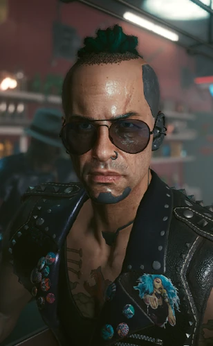

# 戴诺·蒂诺维奇

> 英文名: Dino Dinovic
> 别名: 迪诺

## 身份

**夜之城市中心顶级中间人**(Dino Dinovic / 戴诺 = 迪诺)/
摇滚小子出身 / [[V]] 的主线雇主之一 / 红赭石部落复仇任务的发布者

## 特征

- **名字注**:
  - 本名 **Dino Dinovic**
  - 游戏内中文翻译存在"**戴诺**"与"**迪诺**"两种译法
  - 档案中以"戴诺"为主
- **外观与背景**:
  - **摇滚小子出身**——年轻时是夜之城摇滚场的人
  - 胸前有**大片文身**
  - 大本营:**"电工酒吧"**(市中心)
  - 风格:与圣经派 [[塞巴斯蒂安·神父·伊瓦拉]] / 西装绅士 [[汉斯先生 韦德·布莱克]] 形成对位——
    **最街头风格**的市中心中间人
- **在夜之城的地位**:
  - 市中心(Downtown)/ 公司广场顶级中间人
  - 地盘在**最繁华的公司区**——
    接手的全是针对**跨国企业高管的刺杀、盗取商业机密**等
    **高风险、高回报**单子
  - 涉案领域跨越:**黑客 / 调查 / 复仇 / 监视 / 军用科技封口**
  - 风格:实务派、给钱办事、不带感情色彩、偶尔黑色幽默

## 关键事件

- 雇黑客凯斯·莫德调取纪念公园车站监控,深挖 [[佐丽·巴恩斯]] 案
- 冷淡回应黑客杰兹珀求救,暴露中间人现实主义风格
- 发布红赭石部落复仇悬赏【几近成名】,目标 [[乔安妮·科奇]]

## 已知活动 / 深度档案

### 在夜之城的地位

- 市中心(Downtown)/ 公司广场顶级中间人
- 地盘在**最繁华的公司区**——
  接手的全是针对**跨国企业高管的刺杀、盗取商业机密**等
  **高风险、高回报**单子
- 涉案领域跨越:**黑客 / 调查 / 复仇 / 监视 / 军用科技封口**
- 风格:实务派、给钱办事、不带感情色彩、偶尔黑色幽默

### 已知委托链

#### 1. 巴恩斯案调查(黑客线)

参见 [[对话记录 凯斯·莫德和戴诺·蒂诺维奇]]——

- 戴诺已知 [[佐丽·巴恩斯]]([[生物技术]] 70 人案线人)被推到火车底下
- 雇黑客**凯斯·莫德**去**纪念公园车站**调取监控
- 出钱买录像,明确警告"[[军用科技]] 想尽快封锁消息"
- 这是戴诺**主动深挖生物技术 70 人案**的样本——
  他不止接受悬赏,他也在收集情报

#### 2. 杰兹珀求救

参见 [[对话记录 杰兹珀和戴诺·蒂诺维奇]]——

- 黑客 [[杰兹珀]](攻破八分仪无人机者)求救
- 戴诺**冷淡回应**:"去这儿(避风头)" + "别得寸进尺啊"
- 暴露戴诺作为中间人的真实风格:
  保护资产 / 但不感情用事 / "**我已经大发慈悲把自己避风头的地方发给你了**"

#### 3. 红赭石部落复仇悬赏

**委托:【几近成名】**(Guinea Pigs)——

- 红赭石部落幸存者集资雇佣戴诺
- 戴诺发布巨额刺杀悬赏
- 目标:[[乔安妮·科奇]](生物技术区域研究总监 / 70 人案主犯)
- V 完成任务后戴诺的反应取决于处决方式:
  - 直接击杀:**赞赏 V 干净利落**——"红赭石部落的冤魂终于得到了安息"
  - 活捉移交:戴诺**秘密送给红赭石幸存者**——"流浪者们不会让她轻易死"
  - 阳台抛尸(黑色幽默):戴诺短信调侃——
    > "虽然流浪者们更想活捉她,但看到她像个**烂番茄一样摔在市中心的马路上**,大家也算出了口气。"

（科奇刺杀的委托简报另见 [[委托 雇佣杀手 乔安妮·科奇]]；巴恩斯案的委托简报另见 [[委托 偷纪念广场站监控录像]]。）

#### 4. 艾娃·科尔的游艇录像

**委托:偷艾娃·科尔的录像**（[[委托 偷艾娃·科尔的游艇录像]]）——

- 女议员艾娃·科尔白天痛击滥权公司、深挖污点证人
- 夜里在游艇上纵欲，被某公司员工抓住把柄
- 戴诺受雇偷取录像，供公司**要挟其在招商政策上"开明一点"**
- 典型的市中心"公司用性丑闻反制反公司政客"样本

#### 5. 移情俱乐部夺权

**委托:移情俱乐部上传病毒**（[[委托 移情俱乐部上传病毒]]）——

- 移情俱乐部两位创始合伙人亚当与拉里反目
- 亚当改门禁、做黑账、拉[[动物帮]]当保镖，把拉里挤出去
- 委托人拉里雇戴诺上传病毒迫使俱乐部停摆，逼亚当交还股权
- 实务派戴诺替"被坑合伙人"出头的商业纠纷调解样本

## 关联

- [[V]]——主要执行人
- [[凯斯·莫德]]——其雇佣的黑客(巴恩斯案)
- [[杰兹珀]]——其保护下的黑客(求救线)
- [[乔安妮·科奇]]——其下达的悬赏对象
- 红赭石部落——其委托方
- [[生物技术]]——其长期对抗的公司
- [[军用科技]]——其知道的封口者
- [[塞巴斯蒂安·神父·伊瓦拉]] / [[汉斯先生 韦德·布莱克]]——同行夜之城三大中间人

## 关联原始资料

- [[对话记录 凯斯·莫德和戴诺·蒂诺维奇]]——巴恩斯案调查
- [[对话记录 杰兹珀和戴诺·蒂诺维奇]]——杰兹珀求救
- [[委托 雇佣杀手 乔安妮·科奇]]——红赭石部落复仇悬赏的委托简报
- [[委托 偷纪念广场站监控录像]]——佐丽·巴恩斯坠轨命案监控的委托简报
- [[委托 偷艾娃·科尔的游艇录像]]——偷女议员游艇录像供公司要挟招商政策
- [[委托 移情俱乐部上传病毒]]——替被坑合伙人拉里夺回俱乐部
- [[消息 戴诺·蒂诺维奇关系短信]]——声望提升的关系短信与市政中心被 V 包揽

## 世界观意义

戴诺·蒂诺维奇是 [[公司统治]] 时代**"市中心实务派中间人"样本**:

- 与神父(**信仰+残忍**)和汉斯先生(**理性+牵制**)形成第三种风格——
  **实务+黑色幽默+给钱办事**
- 他是夜之城档案中**唯一主动追查 [[生物技术]] 70 人案**的中间人——
  巴恩斯案+科奇悬赏都是他的活
- 他的存在让 V 在主线之外仍能继续"对抗大公司"——
  即使没有 [[汉斯先生 韦德·布莱克]] 派的狗镇委托,
  戴诺也能给 V 提供反生物技术的工作
- **三大中间人地理分布**揭示夜之城权力结构:
  | 中间人 | 地盘 | 风格 |
  |---|---|---|
  | [[塞巴斯蒂安·神父·伊瓦拉]] | 海伍德 | 信仰+残忍 |
  | [[汉斯先生 韦德·布莱克]] | 太平洲+狗镇 | 理性+牵制 |
  | **戴诺·蒂诺维奇** | **市中心** | **实务+黑色幽默** |
- 三人**互不干扰**——
  每人守一块,构成夜之城**民间反公司事业**的稳定供应

## Tags

#人物 #核心 #中间人 #市中心
