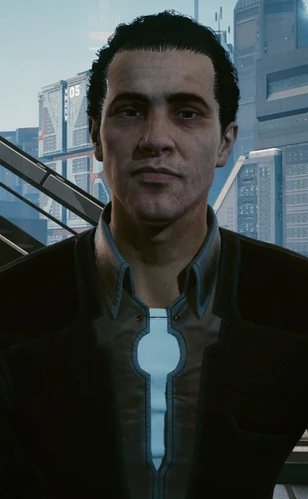

# 杰佛逊·佩拉雷斯

> 英文名: Jefferson Peralez

## 身份

[[NCPD]] 副警长 / [[夜之城]] 市长候选人 / [[V]] 支线合作者

## 特征

(暂无独立特征段——细节归入"已知活动 / 深度档案")

## 关键事件

- 委托 V 调查前市长卢修斯·莱恩之死(向法律宣战支线)
- 揭露 [[蓝眼睛先生]] 暗中洗脑并操控夜之城多名高级政客
- 公开市长竞选,公开承诺组建夜之城专属橄榄球队
- 竞选对手家族遭遇黑客打击([[委托 偷布兰顿·霍尔特数据]])

## 已知活动 / 深度档案

### 调查前市长之死(向法律宣战)
- 委托人是佩拉雷斯夫妇——直接接洽 [[V]]
- 调查对象:前任夜之城市长**卢修斯·莱恩**之死
- V 在调查中结识被边缘化的 NCPD 警探 [[瑞弗·沃德]]
- 顺藤摸瓜揭露:[[蓝眼睛先生]](AI)暗中**洗脑并操控夜之城多名高级政客**
- NCPD 内部因卷入此案的腐败强行结案 → [[瑞弗·沃德]] 被搭档出卖、被停职
- 这条线把市政表层的"政治竞选"与底层的"AI 治国"连接起来
- 详见 [[瑞弗·沃德]]

### 市长竞选
- 公开演讲承诺组建夜之城专属的本地橄榄球队(参见 [[夜之城橄榄球队]])——
  多数媒体视为"提高支持率的空头支票"
- 此类竞选策略说明他既走民间路线(地方球队 / 市民情感)又面临选民信任危机

#### 公开宣言传单:[[为佩拉雷斯投票]]

- 自我定位:"**拒绝墨守成规、富有进取精神的候选人**"
- 核心战斗承诺:**终结超级公司左右夜之城的政治**——
  "反对他们的人都遭了殃,但我们可以成功"
- 反对动员:"那些董事会成员从来没有踏足 [[沃森]] 区或者 [[太平洲]] 街头,
  但是只要坐在红木办公桌前就能为这座城市和它的人民做决定"
- 教育承诺:入主市长办公室第一年,设立年度基金——
  **20 项全额奖学金 + 30 项部分奖学金**,资助城市里 200 名最具天赋的学生
- 募资定位:要求选民提供支持表示,
  让他能"**摆脱公司的资助**参加竞选"——
  即把自己定位为唯一非公司出资的候选人
- 这条传单的话术与其副警长身份配合形成完整自我包装:
  **执法者 + 反公司民选 + 教育白手套**
- **竞选对手威尔顿·霍尔特**——
  威尔顿·霍尔特是市长候选人之一,**家族企业型**政治势力
- **对手家族被偷数据**:
  参见 [[委托 偷布兰顿·霍尔特数据]]——
  布兰顿·霍尔特(威尔顿的堂兄,竞选班子核心)的家庭子网被委托偷盗
  - 布兰顿"喜欢不时去趟墨西哥,找点见不得人的小乐子,并把过程录下来"
  - 这些视频被偷盗后会公开
- 这一委托极可能是 **佩拉雷斯阵营**或其他第三方对霍尔特家族的政治打击
- 印证夜之城**市长竞选**早已升级为情报战 + 黑客战 + 暗杀的复合战场

## 关联

- [[V]]——支线合作者
- [[NCPD]]——其副警长身份所属
- **卢修斯·莱恩**(前市长,已故)——其调查对象
- [[瑞弗·沃德]]——同案 NCPD 警探,被警局抛弃的搭档
- [[蓝眼睛先生]]——其调查最终揭露的幕后操控者

## 关联原始资料

- [[为佩拉雷斯投票]]——其公开宣言传单
- [[委托 偷布兰顿·霍尔特数据]]——对竞选对手家族的黑客打击
- [[夜之城橄榄球队]]——其竞选承诺
- [[已发送给 48239 名用户 伊凡·瓦西列夫]]
- [[对话记录 已删除和朱莉娅·博内特]]（政治幕后人委托记者用丑闻与黑超梦搞掉工会领袖）

## 世界观意义

佩拉雷斯是 [[公司统治]] 时代"还在打选举的政治家"的样本:

- 他做的事情本质上是市政竞选——开空头支票、安抚选民情感
- 但他真正面对的不是其他候选人,而是 [[蓝眼睛先生]] 这种**让对手干脆失忆**的对手
- 一个副警长查到 AI 操控政客阴谋——这种事在过去要靠记者,
  在 [[公司统治]] 时代则只能靠一个临时雇佣兵 ([[V]])
- 他的胜选与否,已经不是民意问题,而是 AI 是否决定不操控他的问题

## Tags

#人物 #政治 #NCPD
