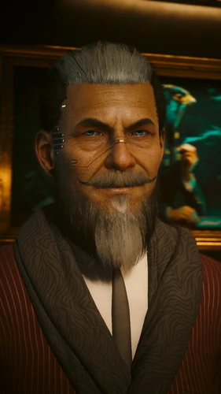

# 汉斯先生 · 韦德·布莱克

> 英文名: Mr. Hands / Wade Bleecker
> 代号: Hands / 汉斯先生

## 身份

夜之城**隐藏最深、手段最老辣的顶级中间人**(Mr. Hands)/
本名 **韦德·布莱克**(Wade Bleecker)/
[[太平洲]] 全区与 [[狗镇]] 的**实际幕后操盘手** /
前 [[网络监察]] 高级特工,**叛徒+全球通缉对象**

## 特征

| 维度 | 内容 |
|---|---|
| 本名 | 韦德·布莱克(Wade Bleecker) |
| 地盘 | [[太平洲]] 全区 + [[狗镇]] |
| 阵营 | 独立中间人 + 前网络监察 |
| 大本营 | **狗镇大帝国俱乐部顶层**私人豪华套房 |
| 性格 | 绝对理性、精致利己、极度注重隐私、优雅商人口吻 |

**外观与"Hands"代号由来**:

- 本体游戏中**给 V 打电话永远不开摄像头**——
  V 只能看到一个全黑的手部剪影
- 这个"只见手不见人"的特征是他的代号"**Hands**"的由来
- 进入 [[狗镇]] 后才正式向 V 展露真容:
  - 精致**红发胡须**
  - 高级**定制西装**
  - 极具**英伦绅士气质**的中年男人

## 关键事件

- 本体永不消逝主线中为 V 牵线 [[巫毒帮]] 二把手布丽奇特,启动黑墙穿越
- 《往日之影》中成为 [[所罗门·李德]] 的最大赞助者,雇 V 横扫狗镇
- 派发 [[委托 赎罪之路]],协助妮乐·斯普林格取消生物技术武器工厂网络炸弹
- 安葬库尔特·汉森支线:扶植贝内特+雅各双傀儡接管幽冥犬
- 完成 10 个狗镇高难度委托后送 V 一辆 QUADRA Type-66 翼龙

## 已知活动 / 深度档案

### 真实背景:网络监察叛徒

通过游戏内加密电脑档案揭示——

- 韦德·布莱克曾是 [[网络监察]] **高层**
- 因某种原因**背叛组织**——遭到网络监察的**全球通缉**
- 为躲避追杀,他**改头换面**
- 躲进**网络监察势力无法渗透的法外之地——[[太平洲]]**
- 在此**隐姓埋名**成为中间人

这一身份选择极具讽刺意味:

- 网络监察的核心使命是"清剿黑墙之外的威胁"
- 汉斯先生选择 [[太平洲]] 藏身——
  恰恰因为这里有 [[巫毒帮]] 把守的**黑墙物理接入点**——
  网络监察来这里相当于走进对方主场

### 两次核心出场

#### 1. 本体:引荐 [[巫毒帮]](永不消逝主线)

- V 为治疗脑内 [[Relic]] 芯片,需接触精通网络技术的 [[巫毒帮]]
- 当时巫毒帮**闭关锁国**,不接外人
- 汉斯先生是**夜之城唯一能为 V 牵线搭桥的人**
- 在 V 完成他派的外围任务后,
  汉斯先生为 V 安排了与**巫毒帮二把手布丽奇特**的见面
- 这是 V 主线进入"黑墙穿越"的关键起点

#### 2. 《往日之影》:狗镇的幕后操盘手

汉斯先生在 DLC 迎来高光时刻——

- 起因:[[罗莎琳德·迈尔斯]] 总统专机在 [[狗镇]] 坠机
  ([[航天专机一号]])
- [[所罗门·李德]] 和 [[V]] 急需本地情报支持
- 汉斯先生成为李德的**最大赞助者**
- 他雇 V 在狗镇**横扫各大势力**:
  - 表面:帮居民解决问题
  - 实际:**削弱 [[汉森]] 的根基** + **逐步建立自己的眼线**

#### 委托:[[委托 赎罪之路|赎罪之路]]

汉斯先生派给 V 的关键委托之一——
协助 [[妮乐·斯普林格]] 取消生物技术武器工厂的网络炸弹。
(详见 [[委托 赎罪之路]])

### 关键支线:安葬库尔特·汉森

主线后期 [[汉森]](库尔特·汉森)死后,[[幽冥犬]] 部队群龙无首——
汉斯先生立即施展政治手腕,**扶植傀儡上台**:

让 V 参加幽冥犬秘密集会,在两个继承人中做选择:

#### 候选 A:贝内特(Bennett)
- 容易冲动、好面子的军人
- **暗中与 [[荒坂]] 公司有勾结**
- 汉斯的态度:不喜欢他投靠荒坂——
  V 若支持他,汉斯会要 V 设法**断绝他与荒坂的联系**,
  让他彻底变成汉斯治下的傀儡

#### 候选 B:雅各(Jago)
- [[汉森]] 的财务主管
- 掌握幽冥犬所有**地下资金和黑市线索**
- **暗中接触 [[生物技术]]**

#### 汉斯的完美结局
- **贝内特当明面老大** + **雅各继续管账**
- 二者**互相牵制**
- V 若通过威逼利诱达成这个双赢局面——
  汉斯会给 V 极高评价和丰厚报酬

#### 核心事实
**无论 V 选谁,最终的赢家都是汉斯先生**——
他经此一役彻底成为 [[狗镇]] 和 [[太平洲]] 的**实际掌控者**。

### 顾家的男人

街头上冷酷无情,但在生活层面:

- 非常疼爱自己的**妻子和女儿**
- 完成他所有委托后与他交谈,或仔细看他的短信,
  可以看到这一面
- 他赚取惊人财富的真正目的——
  **给家人在夜之城以外买下一片绝对安全的净土**
- 这与他"在 [[公司统治]] 时代的法外之地藏身"的人生轨迹一致:
  自己藏 [[太平洲]],把家人送出去

### 通关奖励:QUADRA Type-66 翼龙

完成汉斯先生在 [[狗镇]] 派发的**全部 10 个高难度委托**后——

- 他会送给 V 一辆**专属重装甲军用跑车**
- 型号:**QUADRA Type-66 "翼龙"**
- 极具科幻感
- 作为帮他征服狗镇的谢礼

### 狗镇委托群（往日之影）

汉斯先生在 [[狗镇]] 派发的成套高难度委托（完成全部后送出翼龙跑车）。游戏字幕中其名作"**汉兹先生**"，本库规范节点为汉斯先生：

- **偷动物帮医疗货车**——偷[[动物帮]]运载改良利多卡因的货车返销义体医生（[[委托 偷动物帮医疗货车]]）
- **迈克尔·马尔多纳多的任务**——心事重重俱乐部老板为惹事的儿子求助（[[委托 迈克尔·马尔多纳多的任务]]）
- **找到马克·巴纳**——调查巴西情报特工在狗镇失踪的内情（[[委托 找到马克·巴纳]]）
- **营救安东尼·安德森**——解决港湾诊所被[[清道夫]]逼到自闭的主治医生危机（[[委托 营救安东尼·安德森]]）
- **消灭米尔科·亚历克西斯**——处理勒索英迪拉·巴拉扎公司技术员的[[巫毒帮]]米尔科（[[委托 消灭米尔科·亚历克西斯]]）
- **阻止恐怖袭击（内莱·斯普林格）**——见深红收割/血腥收割成员阻止其针对[[生物技术]]的恐袭，即 [[妮乐·斯普林格]] 的炸弹委托（[[委托 阻止恐怖袭击 内莱·斯普林格]]，正篇见 [[委托 赎罪之路]]）
- **消灭莱昂·林德尔**——追杀在长滩堆料场屠杀八人的前[[汉森]]部下（[[委托 消灭莱昂·林德尔]]）
- **取回泽塔科技原型植入体**——从清道夫窝点追回[[泽塔科技]]被劫的原型植入体（[[委托 取回泽塔科技原型植入体]]）
- **菲奥娜·瓦加斯的客户数据**——窃取神经运动中心体育星探逃税的客户合同（[[委托 菲奥娜·瓦加斯的客户数据]]）
- **营救 NCPD 警官（道杰基地）**——从汉森手下道杰的毒品仓库营救两名被囚警官（[[委托 营救NCPD警官 道杰基地]]）
- **丽娜·玛琳娜绑架案**——拒接委托，超梦明星"丽娜·玛琳娜"真身实为男子图尔（[[委托 丽娜·玛琳娜绑架案]]）
- **布丽·惠特尼的门禁卡**——取门禁卡后交予狗镇废楼客户（[[消息 布丽·惠特尼的门禁卡]]）

## 关联

- [[V]]——长期合作雇主(本体引荐巫毒帮 / DLC 狗镇全套委托)
- [[网络监察]]——前雇主 / 全球通缉者
- [[巫毒帮]]——通过他可接触;二把手**布丽奇特**是他的引荐对象
- [[太平洲]] / [[狗镇]]——其势力范围
- [[汉森]](库尔特·汉森)——其逐步削弱并最终接管的对象
- [[所罗门·李德]]——《往日之影》中互相协作的盟友
- [[妮乐·斯普林格]] / [[深红收割]]——其派给 V 的 [[委托 赎罪之路]] 涉及
- **贝内特** / **雅各**——其在 [[幽冥犬]] 内扶植的两个傀儡
- 妻子 + 女儿——其家人,藏在夜之城以外

## 关联原始资料

- [[委托 赎罪之路]] 中"中间人汉斯先生派给 V" 即此人
- [[安保安排]]（塞拉通知员工汉斯先生将至 / 要求最高安保规格）
- [[消息 汉斯先生关系短信]]——随 V 在狗镇声望提升的关系短信、含汉森乔暴毙后的提醒
- 狗镇委托群：[[委托 偷动物帮医疗货车]]、[[委托 迈克尔·马尔多纳多的任务]]、[[委托 找到马克·巴纳]]、[[委托 营救安东尼·安德森]]、[[委托 消灭米尔科·亚历克西斯]]、[[委托 阻止恐怖袭击 内莱·斯普林格]]、[[委托 消灭莱昂·林德尔]]、[[委托 取回泽塔科技原型植入体]]、[[委托 菲奥娜·瓦加斯的客户数据]]、[[委托 营救NCPD警官 道杰基地]]、[[委托 丽娜·玛琳娜绑架案]]、[[消息 布丽·惠特尼的门禁卡]]

## 世界观意义

汉斯先生是 [[公司统治]] 时代**最复杂的"系统内部人转出"样本**:

- **他来自系统**:前 [[网络监察]] 高层——
  曾是公司时代"维护秩序"那一面的人
- **他被系统驱逐**:因为某种原因背叛,遭全球通缉
- **他用系统的逻辑反过来运作**:
  不是用暴力(他不像 [[汉森]] 那种军阀),
  而是用**信息+扶植+牵制**——纯粹的中间人逻辑
- 他与 [[塞巴斯蒂安·神父·伊瓦拉]] 形成对位:
  - 神父:用**信仰+残忍**统治海伍德
  - 汉斯:用**理性+牵制**统治太平洲+狗镇
  - 两人各自统治一个街区,互不干扰
- 他与 [[蓝眼睛先生]] 也形成对位:
  - 蓝眼睛先生:AI / 不露面 / 操控政客
  - 汉斯先生:人类 / 进入狗镇后露面 / 操控帮派
  - 二者都是**幕后操盘手**,但工具不同
- "**Hands**"代号本身就是核心隐喻:
  - 只见**手**不见人——他始终保持中间人的位置
  - 手是用来**指点**的,不是用来**亲手做事**的
  - 当你看见他的脸(狗镇登场),意味着他已经放弃了部分隐身
- **顾家**这一面是他和其他权力人物的最大区别:
  - 神父没有家人(只有"信徒之子")
  - 蓝眼睛先生没有家人(AI 没有家庭)
  - 汉森把整个狗镇当私产,不在乎个人家庭
  - 汉斯先生**有名有姓有家人**——
    他在 [[公司统治]] 时代既要在系统外操盘,又要给家人留一条退路
  - 这让他成为夜之城档案中**最接近"普通人"思维**的顶级权力者
- 他的目标"**送家人离开夜之城**"——
  与 [[V]] 星星结局"带阿德卡多拔营离开"形成镜像:
  无论街头王者还是雇佣兵,最终都把"逃离夜之城"作为终极奖品

## Tags

#人物 #核心 #中间人 #太平洲 #狗镇 #DLC #网络监察
