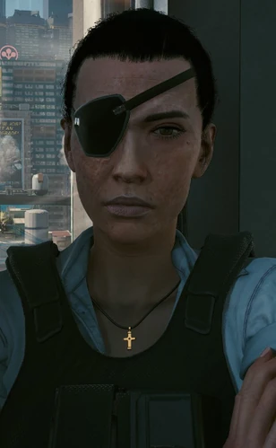

# 瑞吉娜·琼斯

> 英文名: Regina Jones

## 身份

**沃森区中间人**(Regina Jones)/ 前新闻记者 /
游戏前期 [[V]] 接触最多的中间人 / **赛博精神病专攻者**

## 特征

- **地盘**:[[夜之城]] **沃森区**(Watson)
- **背景**:前新闻记者——
  这一身份让她与其他中间人完全不同:
  - 保持着强烈的**正义感**
  - 保持着强烈的**调查欲**
- **委托数量**:游戏全程**发布委托数量第一**(多达 20+ 个)——
  是 V 早期接活的最大来源
- **性格特质 - 关注赛博精神病群体**:
  - 极度关注 [[赛博精神病]] 患者
  - **主张"活捉"**——希望 V 用非致命方式制服爆发期患者
  - 试图**治愈他们**而非清除
  - 这是夜之城档案中**唯一系统性研究赛博精神病并保护患者**的中间人
- **性格特质 - 极度憎恨底层剥削者**:
  - 对剥削底层市民的黑帮**深仇大恨**
  - 派 V 处决 [[正法承太郎]]("**怪物狩猎**"任务)——
    铲除 [[虎爪帮]] XBD 虐杀超梦产业链的主导者
  - 这一委托呼应了她对 [[艾芙琳·帕克]] 等受害者的关切

## 关键事件

- 系统委托 V 调查并以非致命方式制服 17 起赛博精神病爆发("17 案")
- 派 V 处决 [[正法承太郎]],铲除虎爪帮 XBD 产业链主导者

## 已知活动 / 深度档案

### 17 案:完整调查

详见 [[赛博精神病]] 节点"17 案"——
瑞吉娜委托 V 调查的 17 起赛博精神病爆发事件,
所有 17 起最终都由 V 以非致命方式制服并收容,
为攻克该绝症提供了宝贵样本。
17 个案例最终指向:

> **赛博精神病并非个人疾病——
> 而是大公司对底层压榨的产物,
> 用"精神病"的命名来抹掉系统性责任。**

这条结论与瑞吉娜的记者本能完美呼应。

## 关联

- [[V]]——主要执行人(早期最频繁的雇主)
- [[赛博精神病]]——其核心关注领域 / 17 案调查者
- [[正法承太郎]]——其派 V 除掉的虎爪帮 XBD 主导者
- [[艾芙琳·帕克]]——XBD 产业链的代表受害者
- [[沃森|沃森区]] / [[扭扭街]]——其地盘
- 前新闻业——其身份背景

## 关联原始资料

(暂无独立原始资料档案)

## 世界观意义

瑞吉娜是 [[公司统治]] 时代**"记者转型中间人"**的样本:

- 当新闻业被公司化(如 [[新闻54台]]),仍想做调查的记者只剩两条路:
  - 死([[佐丽·巴恩斯]] / [[加布里埃尔·阿巴坦杰洛]] 等)
  - 转行成为中间人——
    继续派活给雇佣兵,但**用赏金的形式做以前的报道**
- 她的赛博精神病 17 案是夜之城档案中**最完整的"长期调查项目"**——
  每一起委托不只是杀人/救人,
  而是为**一个未解的社会病提供样本**
- 她证明 [[公司统治]] 时代**最有效的反抗者不一定持枪**——
  她持续 20 多个委托,每个都改善一点街头生态,
  比一次性反抗更接近"实际改变"

## Tags

#人物 #核心 #中间人 #沃森 #记者
