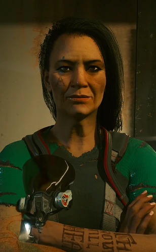

# 达科塔·史密斯

> 英文名: Dakota Smith

## 身份

恶土最著名的中间人(Dakota Smith)/ 前 [[阿德卡多]] 部落成员

## 特征

- 已脱离阿德卡多的**日常移动编制**——不再随部落迁徙
- 在恶土固定一处运营**中间人据点**——是夜之城和恶土之间的关键转译者
- 仍**暗中帮衬** [[阿德卡多]] 家族——派活、传情报、走货时优先照顾旧部落
- 是夜之城最稳定的"恶土活源"之一——
  从荒坂浮空车情报到军用科技装甲车情报都能拿到

## 关键事件

(暂无独立关键事件档案——以长期常态运营为主)

## 已知活动 / 深度档案

### 运作模式

- 接受夜之城雇主的活源,分派给恶土雇佣兵 / 流浪者执行
- 维护中立人设:不公开为 [[阿德卡多]] 站台,
  但部落出事时她从不缺席
- 用"前部落人 + 现独立商人"的双重身份做生意:
  对夜之城是中间人,对部落是默契后盾

## 关联

- [[阿德卡多]]——其原部落 / 暗中接济对象
- [[帕南·帕尔默]]——同部落老相识
- [[索尔·布莱特]]——同部落老相识
- [[V]]——多次合作的雇佣兵
- 瑞吉娜·琼斯——夜之城同行(17 案中间人,参见 [[赛博精神病]])

## 关联原始资料

(暂无独立原始资料档案)

## 世界观意义

达科塔是 [[公司统治]] 时代"半脱离"流浪者的样本:

- 一个人可以离开部落的车队生活,但无法离开部落的人情网络
- 她的中间人身份恰好嵌在城市与恶土的接缝里——
  这是流浪者经济能持续运行的隐形机制
- "前部落人"的标签反而让她比纯夜之城中间人更受信任——
  她代表了一种"在公司体系外仍能稳定运转的小型经济"
- 她的存在也证明:
  [[阿德卡多]] 即使在主体部落式微时,
  也通过这种**离散个体**保持着对夜之城的影响力

## Tags

#人物 #流浪者 #中间人 #恶土
