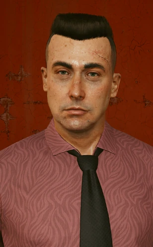

# 安东尼·哈里斯

> 英文名: Anthony Harris
> 代号: 彼得潘 (Peter Pan) / 别名: 食人魔 (Meatman) / 网名: Anthony34

## 身份

夜之城臭名昭著的连环杀手 / NCPD 代号"**彼得潘**"、媒体绰号"**食人魔**"。
表面是四十多岁、毫无前科的普通市民,直到一次例行路检揭开其多年的诱拐杀人生涯。

- 长期诱拐**年轻人**(青少年 + 年轻成人)
- 在废弃农场**像牲畜一样圈养**受害者——
  用支架固定 + 毒气慢性投毒,让人**奄奄一息但不死**
- 用**屠牛枪**(击穿头部)处决受害者,尸体带有**烙铁灼烧**的疤痕
- 拥有扭曲的童年记忆——可通过 [[超梦]] 进入其潜意识拼凑
- 在 NCPD 案卷中长期未破——直到 [[瑞弗·沃德]] 与 [[V]] 锁定其

### 出身

- 2030 年代生于荒坡平原的小镇**拉古纳湾**(Laguna Bend),在当地公立学校就读
- 童年在荒坡平原的**埃奇伍德农场**(Edgewood Farm)度过,帮父亲打理养牛家业
- 母亲早逝,只剩**严苛而暴虐的父亲**——以管教农场雇工的方式管教他,
  出错即施以体罚,反复将母亲的死归咎于他
- 一场牛瘟拖垮农场生产,公司趁机吞并土地,父亲陷入抑郁后离世
- 父亲死后哈里斯被一对**养父母**收养——但童年创伤已定型为**病态固着**

### 现状

在 7 街与 15 大道交叉口的例行路检中,哈里斯被发现违停车内,
车上载着最新受害者**勒瓦·马丁内斯**。他企图逃跑时头部中弹,
此后陷入**植物人状态**,医学专家评估其苏醒概率仅 **0.6%**——审讯已无可能。
车辆 DNA 检测显示其中至少藏有**另外七名受害者**的遗物与基因物质。

## 关键事件

- 绑架瑞弗的侄子**兰迪**——触发猎杀任务
- 详见 [[猎杀彼得潘事件]]

## 已知活动 / 深度档案

### 诱拐工具:心理操纵手册

哈里斯在网络上向年轻人传播一系列**心理操纵话术资料**——
让被诱拐者先被"软化",然后心甘情愿接近他。在 [[瑞弗·沃德]] + V 破解兰迪电脑时发现:

- 《[[操纵 其实没有那么难]]》——
  "侵蚀"技术:通过严厉而准确的批评让目标低人一等,
  目标自动渴望操纵者的肯定
- 《[[影响力的快乐 简单五原则]]》——
  权威感 / 互惠心理 / 难以接近 / 要求专注 / 让对方与你相像

这些手册本身可能在网上是公开流通的"职场资料",
但当哈里斯把它们作为**对青少年的诱拐脚本**时,它们成为夜之城档案中
**心理操纵话术被武器化的最完整样本**。

### 诱饵网站:"DRUGS ARE BAD"

哈里斯运营一个名为 **"DRUGS ARE BAD"** 的网站,
伪装成**戒瘾互助团体**(近似某种邪教)来诱捕想戒除毒瘾的年轻人:

- 以网名 **Anthony34** 与受害者对话,自称是"过来人"——
  一个已战胜同样困境的成年人,因此"有责任"帮他们走出来
- 利用网站**管理员权限**获取用户地址,寄送实体礼物以骗取信任
- 这些聊天记录与可从中提取的 IP 地址,
  最终成为 [[瑞弗·沃德]] + V 锁定农场位置的关键证据
  (在瑞弗侄子**兰迪·库彻**的笔记本电脑中找到)

### 超梦记忆:三段童年碎片

由于哈里斯昏迷且皮层受损,本无法审讯。神经科学家**雅雯·帕卡德**
(Yawen Packard)将原用于自闭症儿童的**脑波增强超梦技术**用于他——
但他根本没有做梦,直到瑞弗坚持播放音视频刺激:一段
**农夫虐待牲畜、配欢快反讽音乐的卡通片**,才激起其受损大脑产生脑波,
拼出三段真伪难辨的童年记忆:

- **第一段(小学食堂)**:老师为他"杀死同学利亚姆的乌龟"训话——
  哈里斯辩称乌龟病了,他像救牛一样给它注射 HGH(生长激素);
  被老师拿父亲作比羞辱后,他持叉子追打老师
- **第二段(父亲死前的农场)**:年幼的他照料一头病牛
  (扫描显示属 [[生物技术]] 资产),因漏检激素注射量遭父亲责打,
  牛随后死去,父亲再次将其与母亲之死一并归咎于他;
  塑料帘后浮现的女性身影,普遍被认为是其**亡母**
- **第三段(最近期)**:他正看着那段卡通,一名瘫痪受害者试图爬行逃脱;
  牛栏走廊里曾经的牛位,如今是戴着**牛面具、靠管道喂食**的被诱拐少年;
  场内设施与遗留燃料桶表明农场一度归 [[沛卓石化]] 所有,
  四周布满炮塔与反步兵地雷

调查者据此锁定农场实地查处,证据足以定罪。瑞弗·沃德一度动念
亲手了结昏迷中的哈里斯,但最终选择交由司法系统裁决。

### 媒体追踪线:琳恩·博罗维茨

在瑞弗 + V 行动之前,
夜之城记者**琳恩·博罗维茨**也在独立报道彼得潘案——
一位匿名线人通过她邮件中的电话号码联系上她,
自称"**认识他,而且很熟**"、"一手信息",
约她到市中心见面(参见 [[对话记录 匿名和琳恩·博罗维茨]])。

这条线说明:

- 哈里斯的存在长期被记者层面追踪——不是 [[NCPD]] 不知道,而是不去查
- "匿名线人"可能是彼得潘自己——
  他对琳恩说"我再乐意不过了"——
  连环杀手以**线人身份**接近记者,正是其"诱拐脚本"的延伸:
  这次的目标可能从年轻人换成了**正在报道他的记者**
- 这条线的下文未知,但它与瑞弗主线**平行存在**——
  说明城市里同时还有更多潜在受害者已经在他视野里

## 关联

- "彼得潘"代号——隐喻"永远不长大的孩子"——
  既符合他诱拐"年轻人"的偏好,
  也暗示他自己心智停滞在某个童年创伤
- [[瑞弗·沃德]]——其追捕者 / 终结者
- [[V]]——协助锁定其藏匿地的关键
- [[超梦]]——其潜意识被外人介入的样本(由神经科学家雅雯·帕卡德主持)
- 兰迪·库彻——瑞弗侄子 / 其最后受害者之一(电脑成为破案证据)
- [[生物技术]]——其童年病牛所属公司,出现在第二段超梦记忆中
- [[沛卓石化]]——其圈养农场一度归属的公司
- [[操纵 其实没有那么难]] / [[影响力的快乐 简单五原则]]——其诱拐工具

## 关联原始资料

- [[操纵 其实没有那么难]]
- [[对话记录 匿名和琳恩·博罗维茨]]
- [[影响力的快乐 简单五原则]]

## 世界观意义

安东尼·哈里斯是 [[公司统治]] 时代**网络化连环杀手**的样本:

- 他的存在揭示一个被忽视的事实:
  当 [[超梦]] / 心理操纵手册 / 远程联系都可商品化,
  连环杀手不再需要"街头跟踪",
  他可以**用职场话术 + 网络聊天**就完成 1/3 的诱拐工作
- "彼得潘"这个代号在反讽夜之城**没有人长大**——
  受害者是被困在童年情绪里的年轻人,
  哈里斯本人也被困在自己的童年创伤里,
  二者通过他扭曲地"重逢"
- 他持续多年没被破案——
  说明 [[NCPD]] 对受害者属于"非高净值人群"的案件**结构性忽视**:
  正直警探 [[瑞弗·沃德]] 一查就出来,
  说明此前不是查不到,而是**没人愿意查**

## Tags

#人物 #反派 #连环杀手 #超梦
