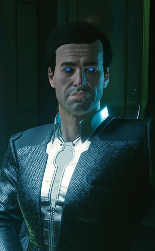

# 蓝眼睛先生

> 英文名: Mr. Blue Eyes
> 别名: B 先生 (Mr. B) / 配音: Martin McDougall

## 身份

神秘 AI（或自称 AI 的存在）/ 夜之城高层政客的暗中操控者。
黑发蓝眼、穿着低调而昂贵的西装，势力归属"**未公开**"。

## 特征

- 真实身份长期保密——以"蓝眼睛先生"为代号
- 高度疑似为 AI 形态（可能来自 [[黑墙]] 之外的网络深处）
- "先生"的尊称暗示其在某些场合以"主顾 / 雇主"身份示人——
  而非反面"被通缉的 AI"
- 其行动涉及大规模的政治操控、记忆与意识层面的暗中干预
- **无法被正常交互或伤害**——游戏中只能远远看到他注视着事件
- 夜之城街头流传着他的传说：人们普遍相信"**他一直都在，注视着一切**"

## 关键事件

- **操控夜之城高级政客**——前市长卢修斯·莱恩之死与其阴谋直接相关
- **百灵鸟的登月代理人**——《往日之影》月亮结局中,亲自安排 [[百灵鸟]] 飞往月球
- **水晶宫劫案雇主**——《荣耀之路》结局中雇佣 V 潜入太空赌场盗取数据

## 已知活动 / 深度档案

### 操控夜之城高级政客(前市长卢修斯·莱恩之死)

- [[V]] 协助副警长 [[杰佛逊·佩拉雷斯]] 调查前市长**卢修斯·莱恩**死因
- 同时与 [[NCPD]] 警探 [[瑞弗·沃德]] 联手挖案
- 顺藤摸瓜揭露:蓝眼睛先生**暗中洗脑并操控夜之城多名高级政客**
- 前市长的死亡与这条阴谋直接相关
- 当 V 深挖到一定程度,会收到一通**匿名全息警告**:
  无论 V 对 [[杰佛逊·佩拉雷斯]] 说什么都改变不了任何事,
  并警告 V 别再插手——对方甚至明确知道 V 的**真实身份与 Relic 困境**
- 会面现场,蓝眼睛先生就站在对街一栋楼的露台上**俯视整场交易**
- 这条阴谋的"打手层":[[瑞弗·沃德]] 的 NCPD 搭档背叛+强行结案
  说明蓝眼睛先生的操控不止于政客,**也渗透到了基层执法机构**

### 月球诊所与百灵鸟的登月代理人(《往日之影》月亮结局)

- 在 V 选择帮助 [[百灵鸟]] 的月亮结局中,
  [[百灵鸟]] 被送往月球**一座神秘的高科技医疗诊所**使用 [[神经矩阵]] 康复
- 据百灵鸟事后透露,她的登月航班正是由一个**身份不明的"代理人"**经手——
  她形容此人是"**一个永恒的公司普通人**":穿着低调而昂贵的西装、黑发、蓝眼;
  此人问了一些**只有她自己才知道答案**的问题,涉及 [[黑墙]]、她的过去与 [[新美利坚]]
- 在《往日之影》中,蓝眼睛先生还现身于 **NCX 航天港**:
  V 潜行穿过第谷航站楼时,可见他凭窗俯瞰施工区;
  V 与百灵鸟乘单轨车前往火箭时,他撑着伞站在右侧站台上
- 这是夜之城档案中**蓝眼睛先生掌控地球外医疗设施**的实锤——
  其势力范围远不止夜之城政客操控这么简单
- 也意味着 [[神经矩阵]] 这种黑墙 AI 封印装置的最终归宿,
  仍流向比 [[新美利坚]] 更高一层的势力手中

### 荣耀之路:水晶宫劫案(《荣耀之路》结局)

在强尼与萝格(或单人 V)强攻荒坂塔、直取义识库的结局线中,
V 成为夜之城最负盛名的雇佣兵——而蓝眼睛先生**全程监视了这场强攻**,
并趁乱派人盗走装备与情报。此后他主动联系并雇佣 V:

- 任务目标:潜入地月 L1 拉格朗日点的太空赌场 [[水晶宫]],
  盗取一份**赌场某客户的数据缓存**——一桩前所未有、极其危险的劫案
- 准备就绪后,V 终于在 [[来生]] 酒吧**与这位神秘人物当面会晤**:
  V 言明自己已无可失去,只要他兑现承诺;蓝眼睛先生回应"**我从不忘记承诺**"
- V 乘穿梭机接近水晶宫时,他下令手下**关闭空间站传感器**让 V 潜入,
  并暗示:只要这一票得手,V 将"**得到超乎想象的东西**"
- 这条线把蓝眼睛先生从"夜之城幕后黑手"升格为**地月尺度的操盘者**,
  也是通往续作叙事的悬念钩子

### 身份之谜

- V 曾托义体医生 [[维克多]] 调查他及其手下,得到的答复只是:
  **没人知道任何事**——这恰恰说明他来自"高到无人能企及"的某处;
  而夜之城"**不容忍无名之辈**",他却能始终无名
- 百灵鸟称他为一个"**代理人**"(proxy)
- 街头先知**加里**散布:"**蓝眼睛的人住在太空,降临地球操控政客**"
- 他出现在 2077 年的 2018 揭幕预告中——作为一名太空穿梭机乘客,
  对面有人着火,他却愉快地饮着饮料微笑旁观(此时尚无标志性的蓝眼)
- 游戏文件中,他的发型数据被标注为"**摩根·布莱克汉德**"——但二者并无关联

### 身份理论(玩家推测,均未获 CDPR / Mike Pondsmith 官方证实)

CDPR 至今从未公布其真实身份。综合本库已有节点,他的行为指纹其实**分散指向三股不同力量**——
更可能是一个**同时调用三者的"超越单一公司的存在"**,而非其中任何一个本身。

#### 三个面与对应势力

| 蓝眼睛先生的行为 | 本库最贴合的势力 | 性质 |
|---|---|---|
| 佩拉雷斯洗脑、操控政客 | [[夜氏公司]]（CN-07 / 桑德拉·多塞特案） | 议程与技术 |
| 百灵鸟秘密登月、出轨道运输 | [[轨道航空]]（OA Black 保密包机） | 物流臂膀 |
| 关闭水晶宫传感器、套问黑墙情报 | 流窜 AI / [[黑墙]] 另一侧势力 | 真正的幕后层级 |

- **理论一:夜氏公司代理人**——本库证据最实的一条。
  [[夜氏公司]] 的 **CN-07 高级 AI** + [[人生苦短行动]] 专做**潜意识干预 / 行为修正 / 人格重塑**;
  [[桑德拉·多塞特]]泄密案揭示夜氏在用 AI"操控自家员工、还要控制它认为'**有用**'的其他人物"。
  这与佩拉雷斯夫妇"记忆被篡改、政治立场被操控"几乎一比一吻合
- **理论二:月球 / 轨道势力(轨道航空线)**——
  [[轨道航空]] 的子公司 **OA Black** 提供"只给坐标、专机送出地球轨道、目的地对机组外保密"的服务,
  恰好解释百灵鸟"由身份不明代理人经手秘密登月";加上他能关闭 [[水晶宫]] 传感器、
  以及街头先知加里"**蓝眼人从轨道下来操纵政客**"的预言——其势力**确实延伸到地月轨道层**。
  但 [[轨道航空]] 是无政治议程的中立承运商,故更可能是被他**雇用的运输工具**,而非其本体
- **理论三:流窜 AI 的肉体载体**——最热门理论。其双眼长亮蓝光(通常意味数据传输 / 远程控制 / 神经接口特殊连接),
  强尼在佩拉雷斯线尾声也曾怀疑幕后黑手"**不像人类**";结合其黑墙级信息力与百灵鸟事件,符合高阶 AI 特征
- **理论四:续作核心反派**——佩拉雷斯洗脑 / 夜氏公司 / 黑墙 / 水晶宫 / 百灵鸟登月这些 2077 最大谜团
  最终全部指向他一人,叙事结构上极不寻常,被广泛视为《Project Orion》预留的核心角色

> **可基本排除** [[高轨者联盟]](最字面的"月球那边的人"):他们是工人起义、反公司、谨慎中立,
> 且节点明载其"对企业级行动的**监察能力有限**"——与蓝眼睛先生无所不知的信息力恰好相反。

### 待佐证的关联

- 《[[星座运势 剧情作者小组]]》客户 #1(M.B. 天蝎座)"忌:想用自己对古希腊的博学勾引你的 AI" + "吉位:网络"——
  暗示某个被 AI 关注的人物;蓝眼睛先生可能就是该 AI
- 《[[迈尔斯的笔记]]》"替罪羊"政治、"听·李复职不准多问"——
  其中"被操控的高层"可能也包括 NUSA 高层
- 是否就是 [[黑墙]] 之外某个 AI 的化身,目前尚无证据,仅是合理推测

## 关联

- 夜之城高级政客——其操控目标
- [[V]]——揭露者,后成为其水晶宫劫案的雇佣兵
- [[杰佛逊·佩拉雷斯]]——被其操控的市长候选人
- 前市长(已故)——被操控 / 被处理的样本
- [[黑墙]] / [[网络监察]]——其可能的活动领域(身份理论三:流窜 AI)
- [[夜氏公司]]——身份理论一:其 CN-07 洗脑术与佩拉雷斯事件高度吻合
- [[轨道航空]]——身份理论二:其 OA Black 保密包机可能是他出轨道运输的臂膀
- [[人生苦短行动]]——夜氏公司潜意识干预项目,与佩拉雷斯洗脑同源
- [[高轨者联盟]]——最字面的"月球势力",但因监察力有限可基本排除
- [[月球]]——其传闻中的医疗诊所所在地
- [[百灵鸟]]——月亮结局中由他亲自安排登月
- [[水晶宫]]——其雇 V 行窃的太空赌场
- [[来生]]——他与 V 当面会晤之处
- [[维克多]]——曾受 V 之托调查他,一无所获
- [[神经矩阵]]——通过百灵鸟流向其手中的黑墙 AI 封印装置

## 关联原始资料

- [[迈尔斯的笔记]]
- [[星座运势 剧情作者小组]]

## 世界观意义

蓝眼睛先生是 [[公司统治]] 时代最深一层的"幕后操控者"假设:

- 当公司控制公民、国家控制公司、AI 又能反过来控制国家——
  权力链条不再是金字塔,而是一个互相吞食的环
- 它的存在使得"公司战争"也只是表层戏剧——
  真正的玩家可能根本不是任何已知的公司或国家
- 它选择"洗脑政客"而非"直接夺权"——
  这是 [[公司统治]] 时代权力的标准范式:
  谁拥有人的意识,谁就拥有人的所有行为
- 在 [[公司统治]] 与 [[赛博精神病]] / [[黑墙]] 的三角中,
  蓝眼睛先生是连接它们的隐线——
  公司提供身体,公司战争重写历史,AI 改写心智,
  没有任何一环属于个体
- 选择"先生"这种尊称作为代号——
  这是一个不需要愤怒、不需要敌意的 AI:
  它的反派性恰恰在于它的礼貌

## Tags

#人物 #核心 #AI #阴谋
