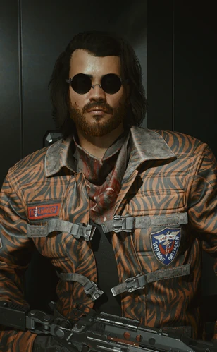

# 圣地亚哥·阿德卡多

> 英文名: Santiago Aldecaldo

## 身份

[[阿德卡多]] 流浪者家族第二代领袖 /
[[强尼银手]] 与 [[罗格]] 的**生死之交**

## 特征

- 创始人胡安·阿德卡多之后接任部落领袖
- 极具个人魅力——把阿德卡多从一支难民组织变成北美最受尊敬的流浪者七大邦之一
- 公司战争年代少数与朋克 / 雇佣兵圈深度交织的部落领袖
- 与 [[强尼银手]] / [[罗格]] 是同一时代的反公司同行——
  这一关系几十年后仍影响 [[阿德卡多]] 与夜之城雇佣兵世界的合作模式

## 关键事件

- **2023 强攻荒坂塔**——深度参与 [[荒坂塔袭击事件]] 的佯攻行动
- **反公司世代的纽带**——与 [[强尼银手]]、[[罗格]] 构成 2020s 反公司世代三角

## 已知活动 / 深度档案

### 2023 强攻荒坂塔
- **深度参与 [[荒坂塔袭击事件]] 的佯攻行动**
- 与 [[强尼银手]] 的贝塔小队(朋克 + 雇佣兵)形成一条朋克—流浪者—独狼的反公司战线
- 这是阿德卡多历史上第一次直接介入公司战争层级的事件——
  之后该部落在反公司话语中被永久打上"参与过塔事件"的印记

### 反公司世代的纽带
- 圣地亚哥 + [[强尼银手]] + [[罗格]] 构成 2020s 反公司世代的三角:
  朋克歌手(强尼)— 流浪者领袖(圣地亚哥)— 顶级独狼(罗格)
- 这条人情线在数十年后仍发挥作用——
  [[V]] 的"星星结局"能让 [[罗格]] 和 [[阿德卡多]] 同时上阵,
  根源就是这条线

## 关联

- [[阿德卡多]]——其部落
- 胡安·阿德卡多——其前任 / 创始人(写入 [[阿德卡多]] 节点)
- [[强尼银手]]——生死之交
- [[罗格]]——生死之交
- [[荒坂塔袭击事件]]——参与佯攻
- [[第四次公司战争]]——其历史背景

## 关联原始资料

- [[公司战争 音乐剧]]
## 世界观意义

圣地亚哥是 [[公司统治]] 时代"流浪者领袖也能介入公司战争"的样本:

- 他证明流浪者部落不是只会"在恶土自给自足"——
  在合适的时刻,他们也能直接打公司
- 他与 [[强尼银手]] / [[罗格]] 的友谊揭示:
  在 [[公司统治]] 的反面,不是"反公司组织",而是**反公司人际网**——
  朋克、流浪者、独狼能在私人友谊上结成战线
- 他不写在主流历史里——
  [[公司战争 音乐剧]] 这种官方叙事从未提到他——
  但 [[V]] 的星星结局能成立,全靠他几十年前埋下的人际遗产

## Tags

#人物 #历史 #流浪者 #阿德卡多 #朋克
