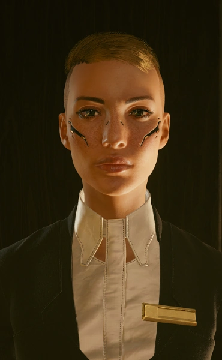

# 桑德拉·多塞特

> 英文原名: **Sandra Dorsett**
> 别名: SandraD / 29 岁 / 沃森区居民 / 创伤小组白金会员

## 身份

[[夜氏公司]] 的公司网络客（Netrunner）/ 《赛博朋克 2077》序章救援对象 /
偶然揭破夜氏公司 AI 操控实验、因此卷入风暴的告密者。

## 特征

外表安静、胆小、谨慎，细看则精明而专业。在一家（档案中未具名的）公司从事高薪工作并表现出色，
下班后则进行只有她自己知道目的的**私下网络潜入**——这份业余爱好几乎要了她的命。

### 出身与性格

- 自述从小苦读、入职后拼命工作，是"**散发同侪压力**"的那种人，毫不为此道歉
- 痴迷**研读保密协议（NDA）并在条款边缘起舞**——正是这种习惯让她钻进了不该看的项目
- 把原本佯装和气的上司逼成了竞争对手:因为她的项目做得太好、进展太快,
  上司反复说她"**动作太快**""**越界了**"

### 基本档案（生命监测数据）

- 编号 NC570442 / 血型 AB RHD+ / [[创伤小组]] **白金会员**
- 用药繁多（多种抗抑郁、镇痛、抗焦虑药物）——侧写出长期高压与精神损耗

## 关键事件

- **被清道夫绑架**——《拯救》(The Rescue) 序章救援
- **窃取夜氏公司 AI 实验数据**——其卷入风暴的根源
- **委托 V 找回数据芯片**——《全面披露》(Full Disclosure)

## 已知活动 / 深度档案

### 被清道夫绑架与序章救援(《拯救》)

- 约 2077 年 4 月,桑德拉被 [[清道夫]] 绑架——
  一枚干扰芯片被强行插入她的神经接口,**屏蔽了她的生命监测**,
  使 [[创伤小组]] 无从知晓她已濒危
- [[杰克·威尔斯]]、网络客 [[T-Bug]] 与 [[V]] 潜入清道夫巢穴,
  发现她泡在一缸**冰水浴**中
- V 拔除芯片、将她抬出浴缸时,她**心脏骤停**,小队用空气注射器紧急抢救;
  [[创伤小组]] 随后赶到接管她
- 这次任务是 [[V]] 与杰克合作的开端,也是二人在 [[来生]] 打响名号的敲门砖

### 窃取夜氏公司 AI 实验:她到底看到了什么

- 桑德拉康复后回到 [[夜氏公司]] 上班,期间被揭示:她**早先就发现了夜氏公司在测试一款 AI**,
  悄悄窃取了相关资料、存进一枚数据芯片——这枚芯片在她被绑架时遗失
- 据她在《夜之城众生相》中的自述,她所在团队表面是在为本地养老院"**改进 AI 行为**"、
  按公关口径"更好地支持老年市民的心理健康"——
  但这层"养老院 AI"的外衣,正是夜氏公司 [[人生苦短行动]]（Operation Carpe Noctem）中
  **CN-07 潜意识埋疗**的掩护:同一套技术对外是"关怀老人",对内是**诱导目标精神崩溃乃至自杀**
- 这也解释了上司为何紧张她"动作太快、越界了"——她触到的不是普通项目,
  而是夜氏公司最隐秘的 **AI 行为控制**核心

### 委托 V 找回芯片(《全面披露》)

- 中间人 [[冈田和歌子]] 把桑德拉与 V 重新牵上线——
  因为 V 具备找回这枚加密芯片所需的技能
- 她的要求很简单:**芯片内容必须保密**,并**尽快**送到她手中
- 而芯片此时已落入 [[清道夫]] 之手——这个事实让她再度怔住,
  她仍受困于那段自己无法完整记起的创伤
- 若 V 在全息通话中向她坦白 [[杰克·威尔斯]] 的死讯,她会为杰克的牺牲**真诚哀悼**

## 关联

- [[夜氏公司]]——其雇主,也是她窃取数据所针对的对象
- [[人生苦短行动]]——她所撞破的 CN-07 AI 操控实验
- [[V]]——其救命恩人 / 后受其委托找回芯片
- [[杰克·威尔斯]]——参与救援她的雇佣兵 / 序章搭档
- [[T-Bug]]——救援行动的网络客支援
- [[清道夫]]——绑架她、并夺走其芯片的帮派
- [[创伤小组]]——她所属的白金会员急救体系
- [[冈田和歌子]]——重新撮合她与 V 的中间人
- [[蓝眼睛先生]]——其泄密案揭示的"AI 操控有用之人"线索,是该谜团的延伸

## 关联原始资料

- [[人生苦短行动]]

## 世界观意义

桑德拉·多塞特是 [[公司统治]] 时代**"无意间撞破真相的小人物"**样本:

- 她不是英雄,也不是职业告密者——只是一个"爱读 NDA、爱钻条款空子"的普通员工,
  却因此意外掀开了夜氏公司最黑的盖子。**真相的泄露往往不靠勇气,而靠偶然**
- 她的遭遇把序章"救人"任务与全局"AI 操控"主题悄悄缝在一起:
  玩家以为只是救一个被绑架的会员,实则一脚踏进了 [[夜氏公司]] / [[蓝眼睛先生]] 的阴谋网络
- "养老院 AI 关怀老人"与"CN-07 诱导自杀"是同一技术的两张脸——
  这正是 [[公司统治]] 时代最典型的话术:**最温情的公关包装,裹着最冷酷的控制内核**
- 她最终只想"保密、尽快拿回芯片"——一个看穿了真相的人,
  在这座城市能做的不是揭发,而是**赶紧把真相藏好、活下去**

## Tags

#人物 #受害者 #夜氏公司 #公司告密 #AI
