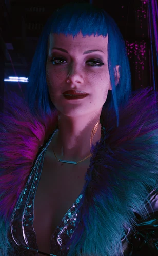

# 艾芙琳·帕克

> 英文名: Evelyn Parker

## 身份

[[超梦]] 行业从业者 / [[朱迪]] 挚友 / **黑超梦虐杀受害者**

## 特征

(暂无独立特征段——其核心标签见身份与世界观意义)

## 关键事件

- **被巫毒帮卸磨杀驴**——[[普拉西德]] 在偷 [[Relic]] 任务完成后隔空烧毁其脑部
- **被卖入 XBD 产业链**——失去意识后被卖给 [[正法承太郎]],在虐杀超梦镜头前迫害致死
- **触发朱迪复仇线**——其死成为 [[朱迪]] 复仇与夺权云顶妓院的动力根源

## 已知活动 / 深度档案

### 完整死亡链:上游巫毒帮 + 下游 XBD

艾芙琳的死并非单一事件——
是**两条产业链的衔接处置**:

#### 上游:巫毒帮卸磨杀驴

- [[巫毒帮]] 雇艾芙琳去**偷 [[荒坂赖宣]] 的 [[Relic]] 芯片**
- 任务一旦完成——巫毒帮二把手 [[普拉西德]] **隔空烧毁她的脑部系统**
- 艾芙琳因此重伤、失去自主意识
- 这是巫毒帮"**卸磨杀驴**"铁律的标准操作流程

#### 下游:XBD 虐杀超梦

- 被烧脑后失去自主意识的艾芙琳,被**卖去 [[正法承太郎]] 的 XBD 产业链**
- 在 [[虎爪帮]] 的虐杀超梦镜头前被进一步**迫害致死**
- 致命的黑超梦由 [[正法承太郎]] 团队制作完成

#### 完整链条

> [[巫毒帮]] / [[普拉西德]] 烧脑 →
> 艾芙琳失去意识 →
> 被卖给 [[虎爪帮]] / [[正法承太郎]] →
> XBD 虐杀产业链 →
> 死亡

这是 [[公司统治]] 时代**"反公司组织 + 帮派"协同压榨同一受害者**的极端样本:
即使艾芙琳"为反公司组织效力",她依然被两端联合处置。

### 关联事件:朱迪的复仇与夺权

- 艾芙琳的死是 [[朱迪]] 主线复仇动力的根源
- 朱迪在《[[V]] 与朱迪》系列任务中追查 XBD 链条
- 包括 [[塔罗牌涂鸦]] 中"**正义**"牌(圣多明戈电厂巨型油罐外墙)——
  对应朱迪 + V 为艾芙琳"讨公道"的圣多明戈支线
- 朱迪最终**夺取云顶妓院控制权**——
  在某种程度上是把"行业接管"作为对艾芙琳之死的回应

## 关联

- [[普拉西德]]——上游凶手(隔空烧她脑部)
- [[巫毒帮]]——上游产业链(卸磨杀驴铁律)
- [[正法承太郎]]——下游 XBD 产业链导演
- [[虎爪帮]]——下游产业链组织依托
- [[朱迪]]——挚友 / 复仇者
- [[V]]——朱迪复仇路径上的合作者
- [[超梦]] / XBD——其死亡所在的商业形态
- 云顶妓院——其工作 / 朱迪后续夺取目标
- [[瑞吉娜·琼斯]]——派 V 收拾 [[正法承太郎]] 的中间人
- [[Relic]]——巫毒帮派她偷的目标

## 关联原始资料

(暂无关联原始资料)

## 世界观意义

艾芙琳是 [[公司统治]] 时代**XBD 工业最完整受害样本**:

- 但这反而让她的死**更刺人**:
  她不是被遗忘的边缘人,她是 [[朱迪]] 的好朋友、
  夜之城超梦产业里的工作者——
  她**应该是这个体系能看见的人**,
  但体系依然把她送进了 XBD 镜头
- 朱迪为她而战 vs [[利琪·薇兹]] 用品牌反抗 vs 流浪者用部落生存——
  艾芙琳代表了第四条路径:**被吞没的牺牲**
- 她的死也证明 [[超梦]] 产业的"娱乐"与 [[公司统治]] 时代"消失人口"
  共享同一套人体处置逻辑
- 没有艾芙琳的死,就没有 [[正法承太郎]] 被悬赏 / 朱迪夺取云顶 / V 在塔罗"正义"牌下的支线动作——
  她是被牺牲掉的、推动正义叙事的那个名字

## Tags

#人物 #核心 #超梦 #XBD #朱迪挚友
