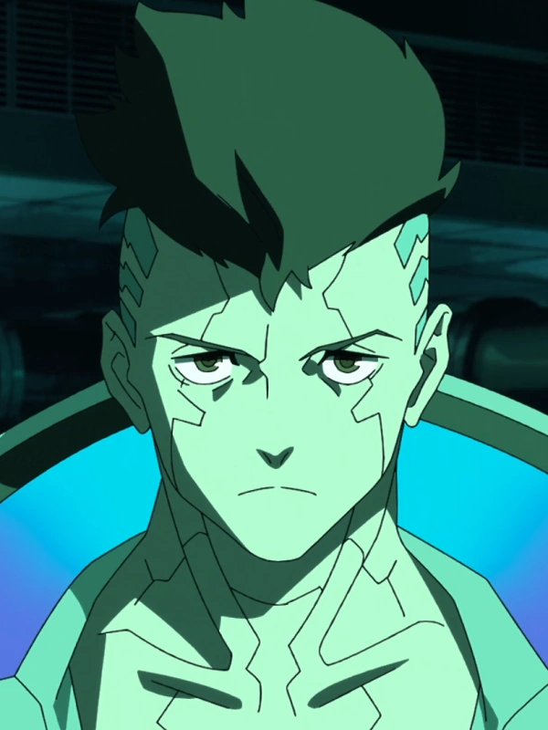

# 大卫·马丁内斯

> 英文原名: **David Martinez**
> 别名: Dee（母亲格洛丽亚的昵称）/ Davey（医生 Doc 的称呼）/ "圣多来的斯安威斯坦"
> 生卒: 2058 年生于 [[夜之城]]（救护车上）— 2076 年死于 纪念公园
> 配音: Zach Aguilar（英）/ 大桥贤一郎（日）

## 身份

网飞动画《赛博朋克：边缘行者》(Cyberpunk: Edgerunners) **主角**。
[[圣多明戈]] 街头出身的拉丁裔少年，
一路从 荒坂学院 学生 → 雇佣兵（独行客 Solo）→ 曼恩团队（Maine's crew）成员
→ 自立门户的团队首领，最终在与 [[亚当·重锤]] 的决战中身亡，
死后成为 [[夜之城]] 传奇。

## 特征

### 外观

- 拉丁裔美国少年，棕发棕眼，两侧剃短的蓬翘发型
- 起初是清瘦的运动型身材，随义体加装逐渐变得高大魁梧
- 标志装束：亡母的**黄色 EMT 急救夹克**（领口内衬蓝色荧光，背后绘亮绿色 Edgerunners 徽记）；
  后期常赤裸上身只披这件夹克

### 出身与性格

- 母亲 格洛丽亚·马丁内斯（Gloria Martinez）是 REO 肉车 的 EMT 急救员，独自把他养大
- 自幼觉得"自己注定要成就大事"，厌倦平庸、痴迷危险与义体，
  常缠着陌生的边缘行者攀谈、跑义体诊所看新货——由此结识义体医生 **Doc**
- **对义体的万中无一的超高耐受**：源于高"人性值"(Humanity) +
  相对安稳、被爱的成长环境，二者一度缓冲了 [[赛博精神病]] 的反噬

## 关键事件

- **母亲之死**——格洛丽亚在 [[动物帮]] 袭击荒坂车队的连环事故中重伤，
  [[创伤小组]] 因母子没保险而见死不救，最终不治
- 植入军用级 **斯安威斯坦**(Sandevistan，母亲从赛博精神病者身上取得的遗物)，
  回校一拳打爆嘲讽他的 胜雄·田中（Katsuo Tanaka）
- 地铁偶遇 [[露西]]，被其收为学徒（七三分账），就此踏入雇佣兵世界
- 加入 曼恩团队；曼恩与 多利欧（Dorio）相继身亡后，**接管团队**
- 义体加装越来越重，开始误杀平民、精神持续恶化，走上赛博精神病不归路
- **法拉第陷阱**——中间人 法拉第（Faraday）出卖团队，掳走露西，
  诱使大卫穿上**荒坂原型赛博骨骼**(cyberskeleton)
- 穿赛博骨骼横扫 [[军用科技]] 大军、强攻 [[荒坂]] 塔救露西
- **最终决战**：与 [[亚当·重锤]] 死战，赛博骨骼被徒手撕碎，被一枪爆头处决——
  死前确信露西能逃出生天、实现登月梦想

## 已知活动 / 深度档案

### 救护车上的出生

格洛丽亚在飞驰的救护车后厢、给一名中弹的边缘行者重接断臂时羊水破裂，
她缝完最后一针、亲手在担架上为自己接生，
同车雇佣兵用刚被她接好的那条**螳螂刀手臂**剪断脐带。
这则残酷又诗意的故事，奠定了母子"她愿为他做任何事，他绝不让她失望"的羁绊。

### 斯安威斯坦与神经链

- 大卫背上醒目的神经链是**重型设计**，专为驾驭军用级硬件而生，
  这正是普通民用植入体所没有的
- 斯安威斯坦让他"短时间内极速"，是他全部战斗风格的核心

### 赛博骨骼与失控

- 荒坂以原型 赛博骨骼 为诱饵，借军用科技与荒坂的冷战陷阱，
  对大卫做"实战数据采集"
- 大卫每用一次赛博骨骼，理智就被吞噬一分，最终彻底滑向 [[赛博精神病]]

### 传奇化与 [[V]] 线索

- 露西在 北橡树 骨灰堂 为他立碑
- 2076 年残存的时间里，大卫的事迹传遍夜之城；
  媒体把公司中心的破坏栽赃为"恐怖袭击"，街头传言却确信那是大卫的最后一战
- 2077 年雇佣兵 [[V]] 在 H4 巨型公寓 看到一段"警世故事"BD（诺里斯赛博精神病案），
  附言警告大卫没能引以为戒；V 经 [[穆阿迈尔·老船长·雷耶斯|雷耶斯]] 收到 法尔科（Falco）
  转交的**大卫的夹克**——一名边缘行者留给另一名边缘行者的临别礼物

### 老船长的街头记忆

V 拿一段黑超梦（暴恐机动队在大号全息金鱼下与"赛博疯子"交战、片尾跳出"大卫·马丁内斯"之名）向 [[穆阿迈尔·老船长·雷耶斯|老船长]] 打听其人，老船长的口述补全了大卫在街头视角下的形象（[[对话记录 老船长与V谈大卫·马丁内斯]]）：

- 大卫是**圣多明戈出身**，和老船长同乡，"不知从哪儿冒出来，下手狠辣"
- 很快就与 [[来生]] 那些大哥**平起平坐**，凡有上进心的混混都想跟他干
- 约**一年前"捅了马蜂窝"**——惹上了 [[荒坂]] 反情报部，被其"成天盯着一举一动"
- 老船长虽没接触过相关卷宗，但凭荒坂的上心程度判断此人非同小可，答应替 V 查其下落

这段对话把动画《边缘行者》主角与游戏本篇的街头传说网络正式接驳：在圣多明戈的口碑里，大卫是与来生传奇并列、被荒坂忌惮的名字。

## 关联

- [[露西]]——女友 / 同为边缘行者，他用生命换她登月
- [[亚当·重锤]]——亲手处决他的荒坂改造兵
- 曼恩团队（Maine's crew）——他先加入、后接管的雇佣兵团队；
  核心成员 [[曼恩]]（精神原型）/ [[多利欧]] / [[瑞贝卡]]（暗恋他）/ [[琦薇]]（叛徒）
- [[冈田和歌子]]——给他派活的 [[日本街]] 中间人
- [[荒坂]] / [[军用科技]]——赛博骨骼陷阱的两方
- [[圣多明戈]] / [[阿罗约]]——他的成长地（H4 巨型公寓）
- [[赛博精神病]]——他死亡的根本机理
- [[月球]]——露西的梦想，也是他临终托付
- [[V]] / [[穆阿迈尔·老船长·雷耶斯]]——后续承接其遗物与传奇的人
- [[夜之城]]——把他造就成传奇、也吞噬了他的城市

## 关联原始资料

- [[对话记录 老船长与V谈大卫·马丁内斯]]——老船长讲述大卫的圣多明戈出身、崛起与遭荒坂反情报部盯梢

## 世界观意义

大卫·马丁内斯是 [[赛博精神病]] 与 [[公司统治]] 的**双重活体教科书**：

- **飞得太高的伊卡洛斯**：他从圣多明戈贫民窟一路爬到边缘行者食物链顶端，
  靠的是义体；而把他推下深渊的，也正是义体——
  力量与毁灭是同一件东西
- **赛博精神病的人格化**：他万中无一的高耐受，本是"被爱缓冲了反噬"的证明；
  当母亲死去、关系崩坏、屠杀累积，缓冲耗尽，神话也就走到尽头——
  说明赛博精神病从来不只是硬件问题，而是**人被掏空之后**的结果
- **公司冷战的耗材**：他横扫军用科技、强攻荒坂，看似主宰战场，
  实则始终是荒坂"实战数据采集"的小白鼠——
  在 [[公司统治]] 的逻辑里，再耀眼的个体也只是一组可回收的测试数据
- **夜之城吞噬梦想**：他活成了传奇，代价是死亡；
  正应了那句"没人能活着离开夜之城，除非装在尸袋里"

## Tags

#人物 #边缘行者 #雇佣兵 #赛博精神病 #圣多明戈
